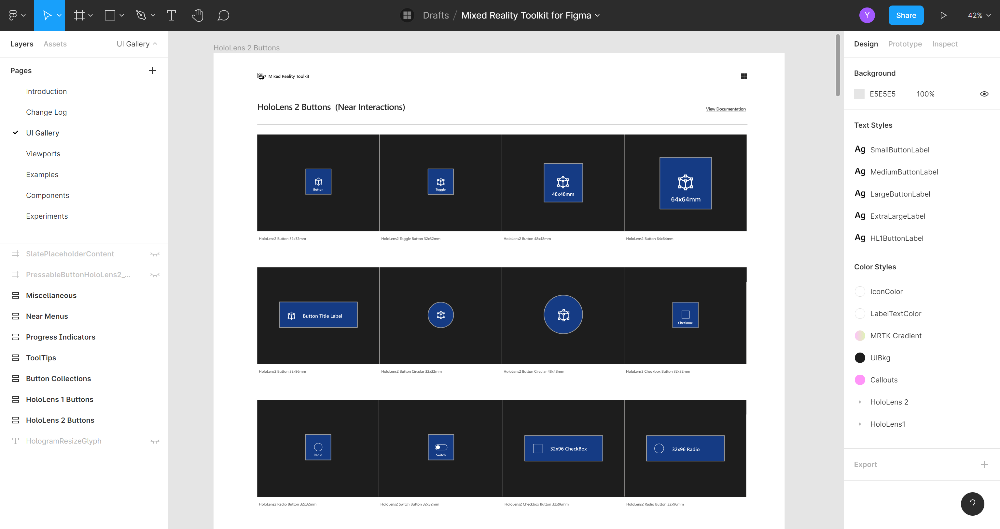
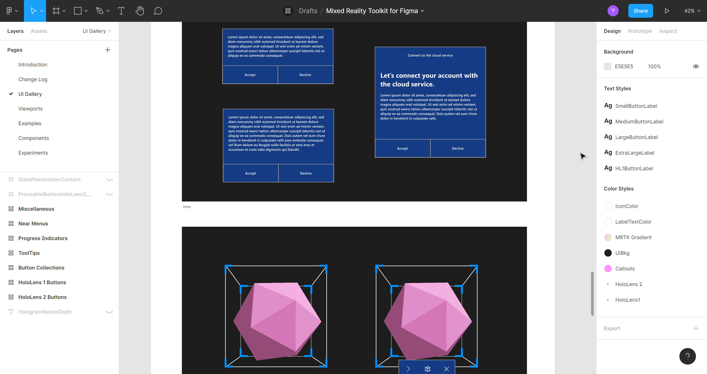

# MRTK Figma Toolkit

> [!VIDEO https://www.microsoft.com/en-us/videoplayer/embed/RWGqke]

MRTK Figma Toolkit provides 2D versions of the HoloLens 2 style UI controls that you can find in the MRTK for Unity or MRTK for Unreal. You can use this in the design process for creating UI layouts and storyboards.

> [!div class="nextstepaction"]
> [View MRTK Figma Toolkit](https://www.figma.com/file/zeGez3Phuzel9JrU1o20nn/Figma-Toolkit-for-MRTK-HoloLens-Windows-Mixed-Reality?node-id=116%3A4)

## How to use Figma Toolkit
Use **Duplicate to your drafts** menu to make a copy.

 

Click **Back to files** to see duplicated copy. You can use this copy for your own creation.

 

 

To download and work locally, use **File > save local copy** menu. Import downloaded file (.fig) into Figma using the **Import** button on the upper right corner.

 

You can use the **Pages** menus on the left to open different pages included in the file.

 

Open **Introduction** page to learn about how to use components and states.

## UI Gallery & Components
UI Gallery and Components page show all available components for your design.

 

 

 

Using **Assets** tab, you can browse these components and drag into your page.

 

## Examples

Figma Toolkit could be useful to sketch menu UI. 

 

Assets could be used for storyboarding.

 

## See also

* [Cursors](cursors.md)
* [Hand ray](point-and-commit.md)
* [Button](button.md)
* [Interactable object](interactable-object.md)
* [Bounding box and App bar](app-bar-and-bounding-box.md)
* [Manipulation](direct-manipulation.md)
* [Hand menu](hand-menu.md)
* [Near menu](near-menu.md)
* [Object collection](object-collection.md)
* [Voice command](voice-input.md)
* [Keyboard](keyboard.md)
* [Tooltip](tooltip.md)
* [Slate](slate.md)
* [Slider](slider.md)
* [Shader](shader.md)
* [Billboarding and tag-along](billboarding-and-tag-along.md)
* [Displaying progress](progress.md)
* [Surface magnetism](surface-magnetism.md)
