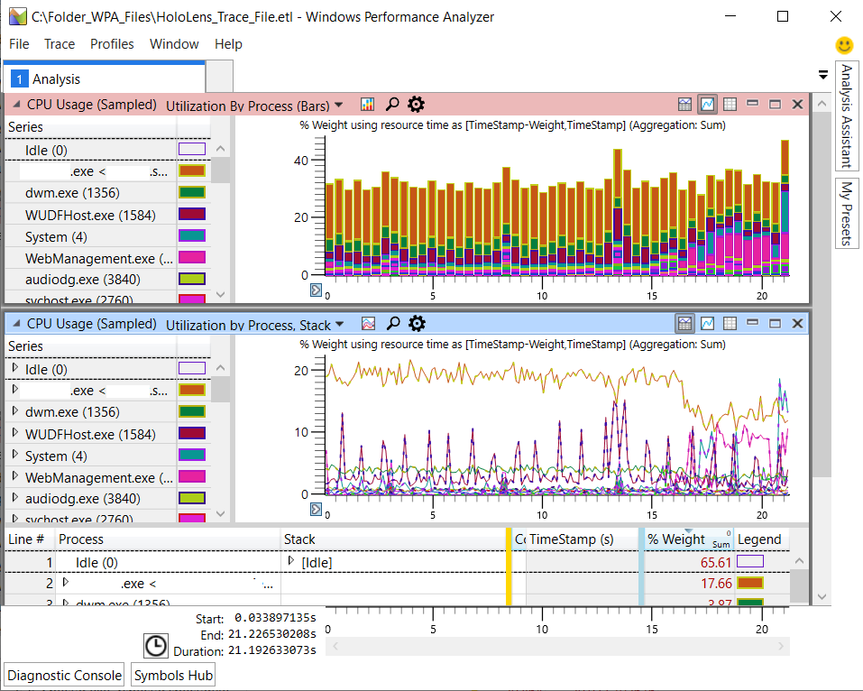

# Performance tracing with HoloLens

## Use WPA to analyze performance traces

<br>
*Performance Trace Analysis in WPA*

To get a detailed understanding of system and application behavior and resource usage for HoloLens, you can use the performance tracing feature.
This feature captures [Windows Performance Recorder](/previous-versions/windows/it-pro/windows-8.1-and-8/hh448205(v=win.10)) traces in the form an event trace log (ETL) file for use in the [Windows Performance Analyzer](/previous-versions/windows/it-pro/windows-8.1-and-8/hh448170(v=win.10)) (WPA).

### Installation

To analyze a trace file, download [WPA from the Microsoft Store](https://www.microsoft.com/en-us/p/windows-performance-analyzer/9n0w1b2bxgnz).

For more general purpose debugging tools, you can also use the [Windows Performance Toolkit](https://docs.microsoft.com/en-us/windows-hardware/test/wpt/). To get this toolkit, download the [Windows Assessment and Deployment Kit](/windows-hardware/get-started/adk-install).

### Terminology

When searching for information about performance traces, you will inevitably come across a range of terms. The most important ones are:


|Term  |Definition  |
|---------|---------|
|**ETW**     |  [Event Tracing for Windows](/windows/win32/etw/about-event-tracing) is an overarching name for kernel-level tracing facility that is built into Windows.       |
|**ETL**    |  [Event Trace Log](/windows-hardware/drivers/devtest/trace-log) is a file extension for files that store the tracing data. Thus, when you do a trace, you typically will have an `*.etl` file afterwards.       |
|**WPR**    | [Windows Performance Recorder](/windows-hardware/test/wpt/windows-performance-recorder) is the name of the application that starts and stops the recording of event traces. WPR takes a profile file `(*.wprp)` that configures which exact events to log. Below, you’ll learn how to do a trace for HoloLens through the Windows Device Portal.        |
|**WPA**    |  [Windows Performance Analyzer](/windows-hardware/test/wpt/windows-performance-analyzer) is the name of the GUI application that is used to open `*.etl` files and sift through the data to identify performance issues. WPA allows you to sort data by various criteria, display the data in several ways, dig down into details, and correlate information.       |

## Recording a trace on HoloLens

Generate an ETL file using the Device Portal in your HoloLens.

<br>
*Performance tracing page in Device Portal for HoloLens 2*

### Perform a trace

1. On the left, navigate to **Performance** > **Performance Tracing**.
2. Select **Custom profiles**
3. Click **Browse...**
4. Select from the available profiles, use your own profile, use an [example profile to analyze CPU performance](https://aka.ms/CPUProfileforDevicePortal) , or [create your own custom profile](/windows-hardware/test/wpt/authoring-recording-profiles/).
5. Click **Start Trace**.
6. The HoloLens is now recording a trace. Make sure to trigger the performance issues that you want to investigate. Then select **Stop Trace**.
7. The trace will be listed at the bottom of the webpage. Select the disk icon at the right-hand side to download the ETL file.

You now have an ETL file that you can either open directly in WPA or send to someone else.

## Analyzing traces with WPA

Windows Performance Analyzer is the standard tool to visualize traces as graphs and tables to allow you to analyze system and application performance. An explanation of how WPA works is out of scope for this article. For more detail, use the [Step-by-step guide to use Windows Performance Analyzer](/windows-hardware/test/wpt/wpa-step-by-step-guide).


To get started, have a look at these resources:

* Watch the [introductory videos](/windows-hardware/test/wpt/windows-performance-analyzer) for a first overview.
* WPA itself has a [Getting Started](/windows-hardware/test/wpt/wpa-in-product-getting-started-help) tab, which explains common steps.
* Learn about the [WPA User Interface](/windows-hardware/test/wpt/introduction-to-the-wpa-user-interface).
* There is excellent information on this website, however, not all of it is relevant for bgiteginners.

**Files you need for analysis**

There are several files you'll need to analyze your trace file in WPA. We've included an example WPA profile to help get started.

* HoloLens trace file `(*.elt)`
* Symbol file `(*.pdb)`. Make sure it's extracted (not zipped).
* WPA profile `(*.wpaProfile)`. Use this [example WPA Profile for CPU analysis](https://aka.ms/CPUProfileforWPA).

### Analyze HoloLens trace file

1. Set up your files in a folder for WPA to access them.

    **Example**

    ```text
    Folder_for_WPA_files
      ├─ HoloLens_trace_file.elt - # HoloLens trace file (*.elt)
      ├─ CPU_analysis.wpaProfile - # WPA Profile (*.wpaProfile)
      └─ Symbols - # Make sure it's extracted (not zipped).
        ├─ *.pdb
        ├─ *.pdb
        └─ ...
    ```

2. Launch the [Windows Performance Analyzer](https://www.microsoft.com/store/productId/9N0W1B2BXGNZ) (WPA).
3. Open the ETL trace file by selecting **File** > **Open** > select the `.etl` in your file browser.
:::image type="content" source="images/WPA-open-trace-ETL-file-red-highlight.png" alt-text="no":::
4. Load symbol file into WPA by selecting **Trace** > **Load Symbols**.
    :::image type="content" source="images/WPA-load-symbols-better-folder.png" alt-text="no":::
    > [!TIP]
    > Configure extra symbol paths by selecting **Trace** > **Configure Symbol Paths**.

    :::image type="content" source="images/WPA-configure-symbols-extra-symbols.jpg" alt-text="no":::
5. Apply WPA profile to generate graphs for analysis. In your WPA folder, select **Profiles** > **Apply** > **Browse** > choose the `*.wpaProfile` file > **Apply**.
6. Once graphs are selected, WPA will display them in the Analysis tab.
    :::image type="content" source="images/WPA-show-graphs-in-analysis-tab.PNG" alt-text="no":::

**Dive Deeper**

To learn more about WPA, see the [WPA documentation](/windows-hardware/test/wpt/windows-performance-analyzer).

## Next steps
Dive deeper into WPA or learn more about performance tracing.
- [Step-by-step guide to use Windows Performance Analyzer](/windows-hardware/test/wpt/wpa-step-by-step-guide.md)
- [Authoring Recording Profiles](/windows-hardware/test/wpt/authoring-recording-profiles)
