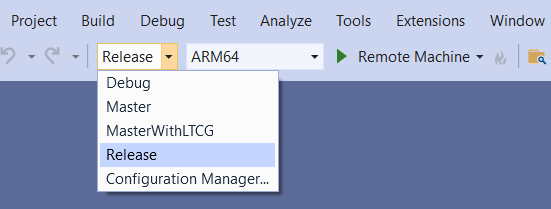
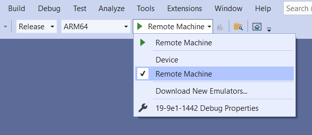
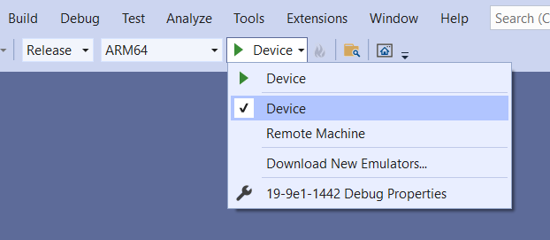
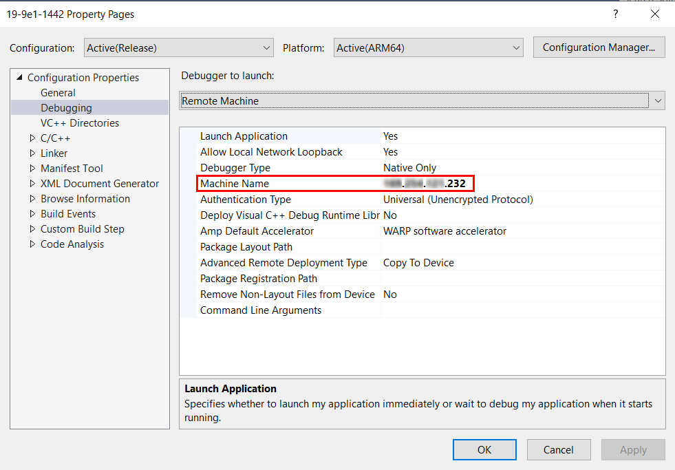
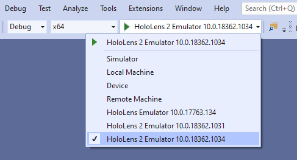

# Using Visual Studio to deploy and debug

Whether you're using DirectX or Unity to develop your mixed reality app, Visual Studio is your go-to tool for debugging and deployment. In this section, you'll learn how to:
* Deploy applications to your HoloLens or Windows Mixed Reality immersive headset through Visual Studio.
* Use the HoloLens emulator that's built into Visual Studio.
* Debug mixed reality apps.

## Prerequisites

1. See [Install the Tools](../../develop/install-the-tools.md#installation-checklist) for installation instructions.
2. Create a new mixed reality project in [Unity](../unity/unity-development-overview.md) or [Visual Studio](../../develop/native/directx-development-overview.md).

## Enabling Developer Mode

Start by enabling **Developer Mode** on your device so Visual Studio can connect to it.

### Developer mode on HoloLens

1. Turn on your HoloLens and put on the device.
2. Use the [start gesture](../../design/system-gesture.md) to launch the main menu.
3. Select the **Settings** tile to launch the app in your environment.
4. Select the **Update** menu item.
5. Select the **For developers** menu item.
6. Enable **Use developer features** to deploy apps from Visual Studio to your HoloLens. If your device is running Windows Holographic version 21H1 or newer, also enable **Device discovery**.
7. Optional: Scroll down and also enable **Device Portal**, which lets you connect to the [Windows Device Portal](using-the-windows-device-portal.md) on your HoloLens from a web browser.

### Developer mode on a Windows PC

If you're working with a Windows Mixed Reality headset connected to your PC, you must enable **Developer Mode** on the PC.
1. Go to **Settings**.
2. Select **Update and Security**.
3. Select **For developers**.
4. Enable **Developer Mode**, read the disclaimer for the setting you chose, and then select **Yes** to accept the change.

## Deploying a HoloLens app over Wi-Fi or USB

>[!VIDEO https://docs.microsoft.com/en-us/shows/Docs-Mixed-Reality/Deploying-your-HoloLens-2-application/player?format=ny]

### Compilation options

1. Open your project in Visual Studio
1. Click the Compilation Options drop down and then do one of the following:

    * For Unity projects, choose either **Release** or **Master** 
    * For all other projects, choose **Release**

    Here are definitions for the compilation options

|  Configuration  |  Explanation | 
|----------|----------|
|  Debug  |  All optimizations off and the profiler is enabled. Used to debug scripts. | 
|  Master  |  All optimizations are turned on and the profiler is disabled. Used to submit apps to the Store. | 
|  Release  |  All optimizations are turned on and the profiler is enabled. Used to evaluate app performance. | 

### Build configuration

1. Select your build configuration based on your device.

[!INCLUDE]

    To learn more about the build configurations, see the "Types of build configurations" table in the [Unity documentation](https://docs.unity3d.com/Manual/VisualStudioprojectgenerationWindows.html).

    > [!NOTES]
    > -For HoloLens, you'll typically build for the ARM architecture. However, there's a known issue in Unity 2019.3 that causes errors when selecting ARM as the build architecture in Visual Studio. The recommended workaround is to build for ARM64. If that isn't an option, for a Unity project, follow this step before you generate your Unity build: go to **Edit** > **Project Settings** > **Player** > **Other Settings** and then disable **Graphics Jobs**.
    -If you don't see Device as a target option, you may need to change the startup project for the Visual Studio solution from the IL2CPP project to the UWP project. To do this, in the **Solution Explorer**, right-click your project, and then select **Set as StartUp Project**.

1. Click the deployment target drop-down and then do one of the following:

    -If you're building and deploying via Wi-Fi, select **Remote Machine**.

    

    -If you're building and deploying via USB, select **Device**.

    

### Remote connection

To set your remote connection:

1. On the menu bar, select **Project > Properties > Configuration Properties > Debugging**.

    > [!NOTE]
    > For a C# project**, a dialog should automatically appear.

1. Click the **Debugger to launch** drop down and then select **Remote Machine.**
1. In the **Machine Name** field, enter the IP address of your device.

  

    -You can find the IP address on your HoloLens under **Settings > Network & Internet > Advanced Options**.
    -We recommend that you manually enter your IP address rather than depend on the "Auto Detected" feature.

1. Set the **Authentication Mode** to **Universal (Unencrypted protocol)**.
1. Build, deploy, and debug your app based on your needs:
    * To build, deploy and start debugging, select **Debug > Start debugging** 
    * To build and deploy without debugging, select **Build > Deploy Solution**.

1. The first time you deploy an app to your HoloLens from your PC, you'll be prompted for a PIN. Follow the **Pairing your device** instructions below.

## Deploying an app to the HoloLens (1st gen) Emulator

1. Make sure you've **[installed the HoloLens Emulator](../install-the-tools.md)**.
2. Select an **x86** build configuration for your app. 
 
3. Select **HoloLens Emulator** in the deployment target drop-down menu 
 
4. Select **Debug > Start debugging** to deploy your app and start debugging 
 

## Deploying an app to the HoloLens 2 Emulator

1. Make sure you've **[installed the HoloLens Emulator](../install-the-tools.md)**.
2. Select an **x86** or **x64** build configuration for your app. 
 
3. Select **HoloLens 2 Emulator** in the deployment target drop-down menu 
 
4. Select **Debug > Start debugging** to deploy your app and start debugging 
 

## Deploying a VR app to your Local PC 

To use a Windows Mixed Reality immersive headset that connects to your PC or the [Mixed Reality simulator](using-the-windows-mixed-reality-simulator.md):
1. Select an **x86** or **x64** build configuration for your app
2. Select **Local Machine** in the deployment target drop-down menu
3. Build, deploy, and debug your app based on your needs
    * Select **Debug > Start debugging** to deploy your app and start debugging
    * Select **Build > Deploy** to build and deploy without debugging

## Pairing your device

The first time you deploy an app from Visual Studio to your HoloLens, you'll be prompted for a PIN. On the HoloLens, generate a PIN by launching the Settings app, go to **Update > For Developers**, and tap on **Pair**. When the PIN is displayed on your HoloLens, type it into Visual Studio. After pairing is complete, tap **Done** on your HoloLens to dismiss the dialog. This PC is now paired with the HoloLens and you can deploy apps automatically. Repeat these steps for every PC that's used to deploy apps to your HoloLens.

To unpair your HoloLens from all paired computers:
* Launch the **Settings** app, go to **Update > For Developers**, and tap on **Clear**.

## Graphics Debugger for HoloLens (1st gen)

The Visual Studio Graphics Diagnostics tools are helpful when writing and optimizing a Holographic app. See [Visual Studio Graphics Diagnostics on MSDN](/previous-versions/visualstudio/visual-studio-2015/debugger/visual-studio-graphics-diagnostics) for full details.

**To Start the Graphics Debugger**
1. Follow the instructions above to target a device or emulator
2. Go to **Debug > Graphics > Start Diagnostics**
3. The first time you start diagnostics with a HoloLens, you may get an "access denied" error. Reboot your HoloLens to let the updated permissions take effect and try again.

## Profiling

The Visual Studio profiling tools allow you to analyze your app's performance and resource use. This includes tools to optimize CPU, memory, graphics, and network use. See [Run diagnostic tools without debugging on MSDN](/previous-versions/visualstudio/visual-studio-2015/profiling/profiling-tools) for full details.

**To Start the Profiling Tools with HoloLens**
1. Follow the instructions above to target a device or emulator
2. Go to **Debug > Start Diagnostic Tools Without Debugging...**
3. Select the tools you want to use
4. Select **Start**
5. The first time you start diagnostics without debugging with a HoloLens, you may get an "access denied" error. Reboot your HoloLens to let the updated permissions take effect and try again.

## Debugging an installed or running app

You can use Visual Studio to debug an installed Universal Windows app without deploying from a Visual Studio project. This is useful if you want to debug an installed app package or debug an app that's already running.
1. Go to **Debug -> Other Debug Targets -> Debug Installed App Package**
2. Select the **Remote Machine** target for HoloLens or **Local Machine** for immersive headsets.
3. Enter your device’s **IP address**
4. Choose the **Universal** Authentication Mode
5. The window shows both running and inactive apps. Pick the one what you’d like to debug.
6. Choose the type of code to debug (Managed, Native, Mixed)
7. Select **Attach** or **Start**

## Next Development Checkpoint

If you're following the Unity development checkpoint journey we've laid out, you're in the midst of the deployment stage. From here, you can continue to the next topic:

> [!div class="nextstepaction"]
> [Deploying to HoloLens emulator](using-the-hololens-emulator.md)

Or jump directly to adding advanced services:

> [!div class="nextstepaction"]
> [Advanced services](../../develop/unity/unity-development-overview.md#5-adding-services)

You can always go back to the [Unity development checkpoints](../../develop/unity/unity-development-overview.md#4-deploying-to-a-device-or-emulator) at any time.

## See also
* [Install the tools](../install-the-tools.md)
* [Using the HoloLens emulator](using-the-hololens-emulator.md)
* [Deploying and debugging Universal Windows Platform (UWP) apps](/windows/uwp/debug-test-perf/deploying-and-debugging-uwp-apps)
* [Enable your device for development](/windows/uwp/get-started/enable-your-device-for-development)
