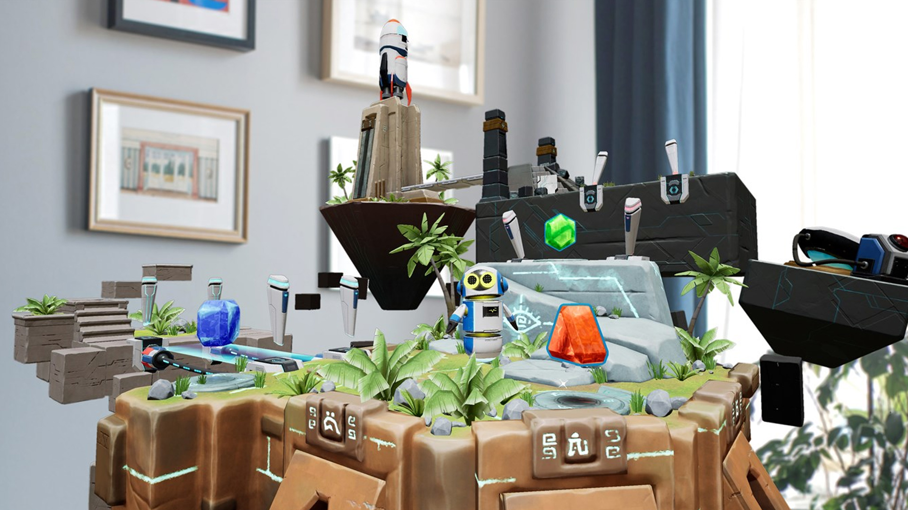
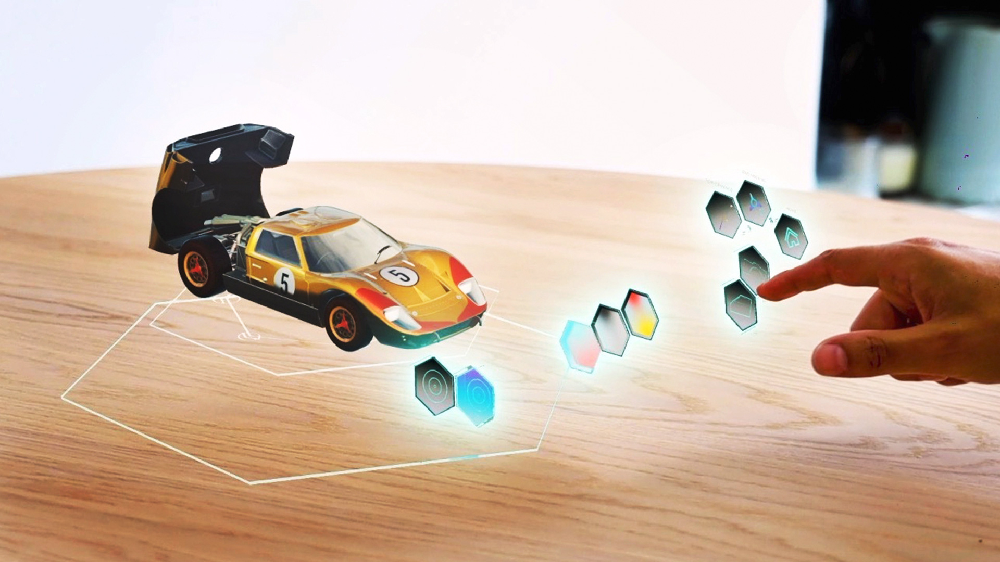

# [Unity](#tab/unity)

The open source sample apps were created by our teams to help you get a handle on Mixed Reality development first-hand. We've provided the projects and full source code as a learning reference.

### HoloLens 2 open source sample apps

These samples demonstrate how to use Mixed Reality Toolkit's (MRTK) building blocks to build full end-to-end app experiences.

:::row:::
    :::column:::
       
        **[Periodic Table of the Elements 2.0](../unity/periodic-table-of-the-elements-2.md)**
    :::column-end:::
    :::column:::
       
        **[MRTK Examples Hub](/windows/mixed-reality/mrtk-unity/features/example-scenes/example-hub)**
    :::column-end:::
:::row-end:::

:::row:::
    :::column:::
       
        **[Surfaces](../unity/sampleapp-surfaces.md)**
    :::column-end:::
    :::column:::
       
        **[Galaxy Explorer 2.0](../unity/galaxy-explorer-update.md)**
    :::column-end:::
:::row-end:::

### HoloLens (1st gen) open source sample apps

* [Periodic Table of the Elements 1.0](../unity/periodic-table-of-the-elements.md)
* [Galaxy Explorer 1.0](../unity/galaxy-explorer.md)
* [Lunar Module](../unity/lunar-module.md)

### Unity feature samples

Unity specific feature samples are listed below.

#### Camera captures

Unstructured environment sensor data that your Mixed Reality device captures are converted into a powerful abstract or holographic representations of the physical world around us. 

##### Scene understanding

Scene understanding provides Mixed Reality developers with a structured, high-level environment representation designed to make developing for environmentally aware applications intuitive. Scene understanding does this by combining the power of existing mixed reality runtimes, like the highly accurate but less structured spatial mapping and new AI driven runtimes.

 

| Reference article | Sample |
| --- | --- |
| [Scene understanding](../../design/scene-understanding.md) | [Mixed Reality Scene Understanding samples](https://github.com/microsoft/MixedReality-SceneUnderstanding-Samples) |

##### Spectator view

Spectator view renders holograms from Unity over a color frame from a capture card. This sample uses the calibration data from the calibration app to render the holograms at the correct size and orientation.  

 

| Reference article | Sample application |
| --- | --- |
| N/A | [Spectator view mobile setup](https://github.com/microsoft/MixedReality-SpectatorView/blob/master/doc/SpectatorView.Setup.md#spectator-view-mobile-setup) |

#### Contextual data overlays

Contextual data is the background information that provides a broader understanding of an event, person, or item.  With Augmented Reality (AR), this information can be displayed and precisedly aligned with physical objects to provide insights, instructions, service records, and other important data.

##### QR codes

HoloLens 2 can detect QR codes in the environment around the headset, establishing a coordinate system at each code's real-world location.

 

| Reference article | Sample |
| --- | --- |
| [QR codes](../platform-capabilities-and-apis/qr-code-tracking.md) | [QR code tracking in Unity](https://github.com/microsoft/MixedReality-QRCode-Sample) |

##### Poster tracker sample

It is often helpful to be able to align a hologram to a real world object, or be able to align multiple HoloLens devices to a common set of world coordinates (so everyone sees the same holograms in the same place). For instance, in your Unity scene, you can add a "poster" to which you want to anchor your scene (perhaps a gameboard) – adding holograms on/around it. Then you can print out the poster, lay it on a table and run the calibration/alignment tool. This will move the holographic version of the poster to align with the physical version of the poster - moving all of the linked holograms to the correct alignment.

 

| Reference article | Sample |
| --- | --- |
| N/A | [Poster calibration sample](https://github.com/microsoft/MixedRealityCompanionKit/tree/master/PosterCalibrationSample) |

#### Collabration in mixed reality

In mixed reality, people come together vitually to share experiences and collaborate.  Samples listed here demonstrate some features that make collaboration possible in mixed reality.

##### Identity 

This sample sets up your HoloLens 2 device using Azure Active Directory (AAD) credentials, and then configures the device to use iris login.

 

| Reference article | Sample |
| --- | --- |
| [Overview of Microsoft identity platform](/azure/active-directory/develop/v2-overview) | [AAD Login on HoloLens 2](https://github.com/peted70/aad-hololens) |

##### WebRTC

The MixedReality-WebRTC project is a collection of components to help mixed reality app developers to integrate peer-to-peer audio, video, and data real-time communication into their applications WebRTC components are based on the WebRTC protocol for Real-Time Communication (RTC), which is supported by most modern web browsers.

 

| Reference article | Sample |
| --- | --- |
| [WebRTC](https://microsoft.github.io/MixedReality-WebRTC) | [WebRTC sample apps](https://github.com/microsoft/MixedReality-WebRTC/tree/master/examples) |

# [Unreal](#tab/unreal)

Most of the open source sample apps made by our team can be found in the Unreal Mixed Reality Samples [repository](https://github.com/microsoft/MixedReality-Unreal-Samples) on GitHub. We've provided the source code so that developers can look at, learn from, and reuse our projects.

### HoloLens 2 open source sample apps

* [HoloLens2Example](https://github.com/microsoft/MixedReality-Unreal-Samples/tree/master/HoloLens2Example)
* [HoloPipes](https://github.com/microsoft/MixedReality-Unreal-HoloPipes) - Download from the [Microsoft Store](https://www.microsoft.com/p/holopipes/9mszb3nnrxn9) in HoloLens 2

### Made with the Mixed Reality Toolkit for Unreal

A subset of the samples use interactive UX components such as buttons and sliders, which are provided by the [UX Tools plugin](https://aka.ms/uxt-unreal) as part of the [Mixed Reality Toolkit for Unreal](https://aka.ms/mrtk-unreal).

:::row:::
    :::column:::
       
        **[Kippy's Escape](../unreal/unreal-kippys-escape.md)**
    :::column-end:::
    :::column:::
       
        **[Ford GT40](../unreal/unreal-ford-gt40.md)**
    :::column-end:::
:::row-end:::

:::row:::
    :::column:::
       
        **[Chess App](https://github.com/microsoft/MixedReality-Unreal-Samples/tree/master/ChessApp)**
    :::column-end:::
    :::column:::

    :::column-end:::
:::row-end:::

### Made by Epic Games

Our partners at Epic Games have released an excellent HoloLens 2 sample project on the Unreal Marketplace.

> [!NOTE]
> This experience must be streamed from a high-end PC to the headset.

* [Mission AR](https://docs.unrealengine.com/Resources/Showcases/MissionAR/index.html)
