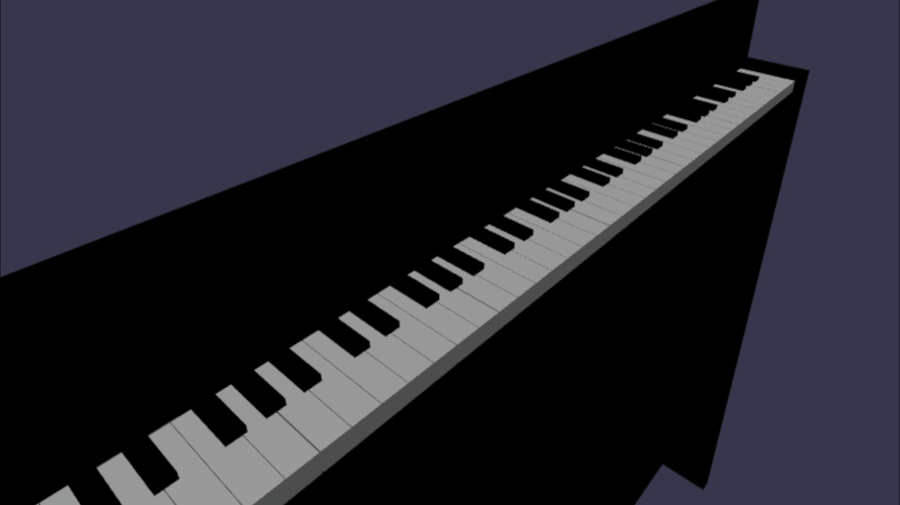
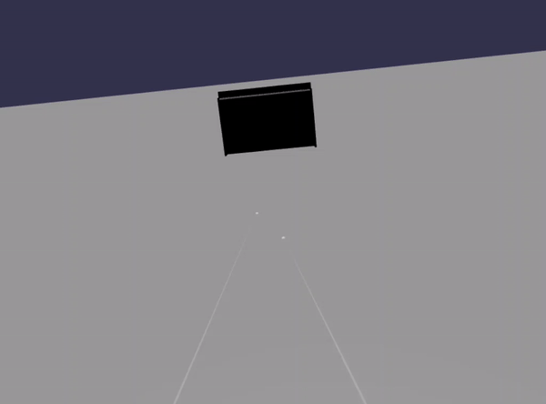
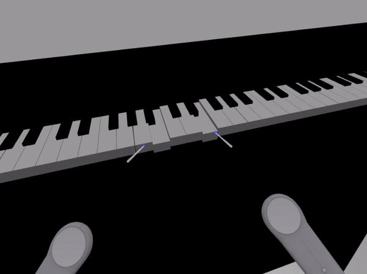

# Tutorial: Play the 3D piano

In the previous tutorial, we have successfully created a model of a full 88-key piano keyboard. Now let's make it playable in the XR space.

In this tutorial, you will learn how to:

> [!div class="checklist"]
> * Add interactive piano features using pointer events
> * Scale meshes to a different size
> * Enable teleportation and multi-pointer support in XR

## Before you begin

Make sure that you have gone through the [previous tutorial in the series](keyboard-model-02.md) are ready to continue adding to the code.

*index.html*

```html
<html>
    <head>
        <title>Piano in BabylonJS</title>
        <script src="https://cdn.babylonjs.com/babylon.js"></script>
        <script src="scene.js"></script>
        <style>
            body,#renderCanvas { width: 100%; height: 100%;}
        </style>
    </head>
    <body>
        <canvas id="renderCanvas"></canvas>
        <script type="text/javascript">
            const canvas = document.getElementById("renderCanvas");
            const engine = new BABYLON.Engine(canvas, true); 

            createScene(engine).then(sceneToRender => {
                engine.runRenderLoop(() => sceneToRender.render());
            });
            
            // Watch for browser/canvas resize events
            window.addEventListener("resize", function () {
                engine.resize();
            });
        </script>
    </body>
</html>
```

*scene.js*

```javascript
const buildKey = function (scene, parent, props) {
    if (props.type === "white") {
        /*
        Props for building a white key should contain: 
        note, topWidth, bottomWidth, topPositionX, wholePositionX, register, referencePositionX

        As an example, the props for building the middle C white key would be
        {type: "white", note: "C", topWidth: 1.4, bottomWidth: 2.3, topPositionX: -0.45, wholePositionX: -14.4, register: 4, referencePositionX: 0}
        */

        // Create bottom part
        const bottom = BABYLON.MeshBuilder.CreateBox("whiteKeyBottom", {width: props.bottomWidth, height: 1.5, depth: 4.5}, scene);

        // Create top part
        const top = BABYLON.MeshBuilder.CreateBox("whiteKeyTop", {width: props.topWidth, height: 1.5, depth: 5}, scene);
        top.position.z =  4.75;
        top.position.x += props.topPositionX;

        // Merge bottom and top parts
        // Parameters of BABYLON.Mesh.MergeMeshes: (arrayOfMeshes, disposeSource, allow32BitsIndices, meshSubclass, subdivideWithSubMeshes, multiMultiMaterials)
        const key = BABYLON.Mesh.MergeMeshes([bottom, top], true, false, null, false, false);
        key.position.x = props.referencePositionX + props.wholePositionX;
        key.name = props.note + props.register;
        key.parent = parent;

        return key;
    }
    else if (props.type === "black") {
        /*
        Props for building a black key should contain: 
        note, wholePositionX, register, referencePositionX

        As an example, the props for building the C#4 black key would be
        {type: "black", note: "C#", wholePositionX: -13.45, register: 4, referencePositionX: 0}
        */

        // Create black color material
        const blackMat = new BABYLON.StandardMaterial("black");
        blackMat.diffuseColor = new BABYLON.Color3(0, 0, 0);

        // Create black key
        const key = BABYLON.MeshBuilder.CreateBox(props.note + props.register, {width: 1.4, height: 2, depth: 5}, scene);
        key.position.z += 4.75;
        key.position.y += 0.25;
        key.position.x = props.referencePositionX + props.wholePositionX;
        key.material = blackMat;
        key.parent = parent;

        return key;
    }
}

const createScene = async function(engine) {
    const scene = new BABYLON.Scene(engine);

    const alpha =  3*Math.PI/2;
    const beta = Math.PI/50;
    const radius = 220;
    const target = new BABYLON.Vector3(0, 0, 0);
    
    const camera = new BABYLON.ArcRotateCamera("Camera", alpha, beta, radius, target, scene);
    camera.attachControl(canvas, true);
    
    const light = new BABYLON.HemisphericLight("light", new BABYLON.Vector3(0, 1, 0), scene);
    light.intensity = 0.6;

    const keyParams = [
        {type: "white", note: "C", topWidth: 1.4, bottomWidth: 2.3, topPositionX: -0.45, wholePositionX: -14.4},
        {type: "black", note: "C#", wholePositionX: -13.45},
        {type: "white", note: "D", topWidth: 1.4, bottomWidth: 2.4, topPositionX: 0, wholePositionX: -12},
        {type: "black", note: "D#", wholePositionX: -10.6},
        {type: "white", note: "E", topWidth: 1.4, bottomWidth: 2.3, topPositionX: 0.45, wholePositionX: -9.6},
        {type: "white", note: "F", topWidth: 1.3, bottomWidth: 2.4, topPositionX: -0.55, wholePositionX: -7.2},
        {type: "black", note: "F#", wholePositionX: -6.35},
        {type: "white", note: "G", topWidth: 1.3, bottomWidth: 2.3, topPositionX: -0.2, wholePositionX: -4.8},
        {type: "black", note: "G#", wholePositionX: -3.6},
        {type: "white", note: "A", topWidth: 1.3, bottomWidth: 2.3, topPositionX: 0.2, wholePositionX: -2.4},
        {type: "black", note: "A#", wholePositionX: -0.85},
        {type: "white", note: "B", topWidth: 1.3, bottomWidth: 2.4, topPositionX: 0.55, wholePositionX: 0},
    ]

    // Transform Node that acts as the parent of all piano keys
    const keyboard = new BABYLON.TransformNode("keyboard");

    // Register 1 through 7
    var referencePositionX = -2.4*14;
    for (let register = 1; register <= 7; register++) {
        keyParams.forEach(key => {
            buildKey(scene, keyboard, Object.assign({register: register, referencePositionX: referencePositionX}, key));
        })
        referencePositionX += 2.4*7;
    }

    // Register 0
    buildKey(scene, keyboard, {type: "white", note: "A", topWidth: 1.9, bottomWidth: 2.3, topPositionX: -0.20, wholePositionX: -2.4, register: 0, referencePositionX: -2.4*21});
    keyParams.slice(10, 12).forEach(key => {
        buildKey(scene, keyboard, Object.assign({register: 0, referencePositionX: -2.4*21}, key));
    })

    // Register 8
    buildKey(scene, keyboard, {type: "white", note: "C", topWidth: 2.3, bottomWidth: 2.3, topPositionX: 0, wholePositionX: -2.4*6, register: 8, referencePositionX: 84});

    // Transform node that acts as the parent of all piano components
    const piano = new BABYLON.TransformNode("piano");
    keyboard.parent = piano;

    // Import and scale piano frame
    BABYLON.SceneLoader.ImportMesh("frame", "https://docs.microsoft.com/windows/mixed-reality/develop/javascript/tutorials/babylonjs-webxr-piano/files", "pianoFrame.babylon", scene, function(meshes) {
        const frame = meshes[0];
        frame.parent = piano;
    });

    // Lift the piano keyboard
    keyboard.position.y += 80;

    const xrHelper = await scene.createDefaultXRExperienceAsync();

    return scene;
}
```

## Making the piano keyboard playable

Right now, the piano keyboard we have created is a static model that does not respond to any user interactions. In this section, we will program the keys to move downward and play a sound when someone presses on them.

1. Babylon.js provides different kinds of events, or [observables](https://doc.babylonjs.com/divingDeeper/events/observables), that we can interact with. In our case, we will be dealing with the `onPointerObservable` since we want to program the keys to perform actions when someone press on them through a pointer, which can be a mouse click, touch, XR controller button click, etc.

    Here is the basic structure of how we can add any behavior to an `onPointerObservable`:

    ```javascript
    scene.onPointerObservable.add((pointerInfo) => {
        // do something
    });
    ```

1. While Babylon.js provides [many different types of pointer events](https://doc.babylonjs.com/typedoc/classes/babylon.pointereventtypes), we will only be using the `POINTERDOWN` and `POINTERUP` events to program the behavior of the piano keys, using the structure below:

    ```javascript
    scene.onPointerObservable.add((pointerInfo) => {
        switch (pointerInfo.type) {
            case BABYLON.PointerEventTypes.POINTERDOWN:
                // When the pointer is down on a piano key,
                // move the piano key downward (to show that it is pressed)
                // and play the sound of the note
                break;
            case BABYLON.PointerEventTypes.POINTERUP:
                // When the pointer is released,
                // move the piano key upward to its original position
                // and stop the sound of the note of the key that is released
                break;
        }
    });
    ```

1. Let's first work on moving the piano key downward and upward when we press and release the key.

    At the pointer down event, we need to detect the mesh that is being clicked, make sure that it is a piano key, and change the mesh's y-coordinate negatively by a small amount to make it look like the key was pressed down.

    For the pointer up event, it is a little more complicated because the pointer which pressed on the key might not be released on the key. For example, someone might click down on key C4, drag their mouse to E4, and then release their click. In this case, we still want to release the key that was pressed (C4) instead of where the `pointerUp` event occurs (E4).

    Let's look at how the following code achieves what we want:

    ```javascript
    const pointerToKey = new Map();
    scene.onPointerObservable.add((pointerInfo) => {
        switch (pointerInfo.type) {
            case BABYLON.PointerEventTypes.POINTERDOWN:
                if(pointerInfo.pickInfo.hit) {
                    const pickedMesh = pointerInfo.pickInfo.pickedMesh;
                    const pointerId = pointerInfo.event.pointerId;
                    if (pickedMesh.parent === keyboard) {
                        pickedMesh.position.y -= 0.5;
                        // play the sound of the note
                        pointerToKey.set(pointerId, {
                            mesh: pickedMesh
                        });
                    }
                }
                break;
            case BABYLON.PointerEventTypes.POINTERUP:
                const pointerId = pointerInfo.event.pointerId;
                if (pointerToKey.has(pointerId)) {
                    pointerToKey.get(pointerId).mesh.position.y += 0.5;
                    // stop the sound of the note of the key that is released
                    pointerToKey.delete(pointerId);
                }
                break;
        }
    });
    ```

    The `pointerId` is unique to every pointer and can help us identify a pointer when we have multiple controllers or if we are using a touch screen. Here we initialized a `Map` object named `pointerToKey` to store the relationship of which pointer pressed on which key, so that we know which key to release when the pointer is released, regardless of where the release happens.

1. Here's what the interaction would look like with the code above:

    

1. Now let's work on playing and stopping a sound when a key is pressed and released. To achieve this, we will be utilizing a Javascript library named **soundfont-player**, which allows us to easily play MIDI sounds of an instrument we choose.

    [Download the minified code of the library](./files/soundfont-player.min.js), save it in the same folder as *index.html*, and include it in the `<header>` tag in *index.html*:

    ```html
    <head>
        <title>Babylon Template</title>
        <script src="https://cdn.babylonjs.com/babylon.js"></script>
        <script src="scene.js"></script>
        <script src="soundfont-player.min.js"></script>
        <style>
                body,#renderCanvas { width: 100%; height: 100%;}
        </style>
    </head>
    ```

    Once the library is imported, here is how we can initialize an instrument and play/stop MIDI sounds using the library:

    ```javascript
    const pianoSound = await Soundfont.instrument(new AudioContext(), 'acoustic_grand_piano');
    const C4 = piano.play("C4"); // Play note C4
    C4.stop(); // Stop note C4
    ```

1. Now let's incorporate this into the pointer events and finalize the code for this section:

    ```javascript
    const pointerToKey = new Map()
    const piano = await Soundfont.instrument(new AudioContext(), 'acoustic_grand_piano');

    scene.onPointerObservable.add((pointerInfo) => {
        switch (pointerInfo.type) {
            case BABYLON.PointerEventTypes.POINTERDOWN:
                if(pointerInfo.pickInfo.hit) {
                    let pickedMesh = pointerInfo.pickInfo.pickedMesh;
                    let pointerId = pointerInfo.event.pointerId;
                    if (keys.has(pickedMesh)) {
                        pickedMesh.position.y -= 0.5; // Move the key downward
                        pointerToKey.set(pointerId, {
                            mesh: pickedMesh,
                            note: pianoSound.play(pointerInfo.pickInfo.pickedMesh.name) // Play the sound of the note
                        });
                    }
                }
                break;
            case BABYLON.PointerEventTypes.POINTERUP:
                let pointerId = pointerInfo.event.pointerId;
                if (pointerToKey.has(pointerId)) {
                    pointerToKey.get(pointerId).mesh.position.y += 0.5; // Move the key upward
                    pointerToKey.get(pointerId).note.stop(); // Stop the sound of the note
                    pointerToKey.delete(pointerId);
                }
                break;
        }
    });
    ```

    Since we named each key's mesh by the note that it represents, we can easily indicate which note to play by passing in the mesh's name to the `pianoSound.play()` function. Also note that we are storing the sound into the `pointerToKey` map so that we know what sound to stop when a key is released.

## Scaling the piano for immersive VR mode

By now, you have probably already played with the piano with your mouse (or even with a touch screen) as you added the interactive functionalities. In this section, we will be moving into the immersive VR space.

1. In order to open the page in your immersive VR headset, you must first connect your headset to your developer machine and make sure that it is [set up for use in the Windows Mixed Reality App](/windows/mixed-reality/enthusiast-guide/set-up-windows-mixed-reality). If you're using the Windows Mixed Reality Simulator, [make sure that it is enabled](../../../advanced-concepts/using-the-windows-mixed-reality-simulator.md).

1. You will now see a Immersive VR button at the bottom right of the web page. Click on it and you will be able to see the piano in the XR device you are connected to.

    

1. Once you are in the virtual space, you might notice that the piano we have built is extremely huge. In the VR world, we can only standing at the bottom of it and play it by pointing the pointer to the keys in the distance.

    

1. Let's scale down the piano so that its size is more like a normal standup piano in real life. To do so, we will need to use a utility function that allows us to [scale a mesh relative to a point in the space](https://doc.babylonjs.com/toolsAndResources/utilities/Pivot#enlargement). Add this function to *scene.js* (outside of `createScene()`):

    ```javascript
    const scaleFromPivot = function(transformNode, pivotPoint, scale) {
        const _sx = scale / transformNode.scaling.x;
        const _sy = scale / transformNode.scaling.y;
        const _sz = scale / transformNode.scaling.z;
        transformNode.scaling = new BABYLON.Vector3(_sx, _sy, _sz); 
        transformNode.position = new BABYLON.Vector3(pivotPoint.x + _sx * (transformNode.position.x - pivotPoint.x), pivotPoint.y + _sy * (transformNode.position.y - pivotPoint.y), pivotPoint.z + _sz * (transformNode.position.z - pivotPoint.z));
    }
    ```

    This function takes in 3 parameters:
    * **transformNode**: the `TransformNode` to be scaled
    * **pivotPoint**: a `Vector3` object which indicates the point that the scaling is relative to
    * **scale**: the scale factor

1. We will use this function to scale the piano frame and keys by a factor of 0.015, with a pivot point at the origin. Append the function call to the `createScene()` function by placing it after `keyboard.position.y += 80;`:

    ```javascript
    // Put this line at the beginning of createScene()
    const scale = 0.015;
    ```

    ```javascript
    // Put this function call after keyboard.position.y += 80;

    // Scale the entire piano
    scaleFromPivot(piano, new BABYLON.Vector3(0, 0, 0), scale);
    ```

1. Let's not forget to scale camera position as well:

    ```javascript
    const alpha =  3*Math.PI/2;
    const beta = Math.PI/50;
    const radius = 220*scale; // scale the radius
    const target = new BABYLON.Vector3(0, 0, 0);
    
    const camera = new BABYLON.ArcRotateCamera("Camera", alpha, beta, radius, target, scene);
    camera.attachControl(canvas, true);
    ```

1. Now when we enter the VR space again, the piano would be of the size of an ordinary standup piano.

    

## Enabling WebXR features

Now that we have scaled the piano to the right size in the VR space, let's enable some cool WebXR features to improve our piano-playing experience in the space.

1. If you have been playing the piano using your immersive VR controllers, you might have noticed that you can only use one controller at a time. Let's enable the [multi-pointer support](https://doc.babylonjs.com/typedoc/interfaces/babylon.iwebxrcontrollerpointerselectionoptions) in the XR space by using Babylon.js's [WebXR features manager](https://doc.babylonjs.com/divingDeeper/webXR/webXRFeaturesManager).

    Add the following code into the `createScene()` function, after the `xrHelper` initialization line:

    ```javascript
    const featuresManager = xrHelper.baseExperience.featuresManager;

    const pointerSelection = featuresManager.enableFeature(BABYLON.WebXRFeatureName.POINTER_SELECTION, "stable", {
        xrInput: xrHelper.input,
        enablePointerSelectionOnAllControllers: true        
    });
    ```

1. Additionally, depending on where your starting point is, you might find it a little difficult to position yourself in front of the piano. If you are familiar with the immersive VR environment, you might already know about **teleportation**, which is a feature that allows you to move to another spot in the space instantly by pointing at it.

1. In order to use Babylon.js's [teleportation feature](https://doc.babylonjs.com/divingDeeper/webXR/WebXRSelectedFeatures#teleportation-module), we first need to have a ground mesh that we can "stand on" in the VR space. Add the following code to the `createScene()` function to create a ground:

    ```javascript
    const ground = BABYLON.MeshBuilder.CreateGround("ground", {width: 400, height: 400});
    ```

1. The teleportation support also comes with a very useful feature called [snap-to positions](https://doc.babylonjs.com/divingDeeper/webXR/WebXRSelectedFeatures#snap-to-hotspots). In short, snap-to positions are specific positions that we want users to land at.

    For example, we can set a snap-to position in front of the piano so that users can easily teleport to that location when they point their pointers close to the piano.

    Append the code below to enable the teleportation feature and specify a snap-to point:

    ```javascript
    const teleportation = featuresManager.enableFeature(BABYLON.WebXRFeatureName.TELEPORTATION, "stable", {
        xrInput: xrHelper.input,
        floorMeshes: [ground],
        snapPositions: [new BABYLON.Vector3(2.4*3.5*scale, 0, -10*scale)],
    });
    ```

1. Now, you should be able to easily position yourself in front of the piano by teleporting to the snap-to point in front of the piano, and you should be able to play two keys at a time using both controllers.

    

    

## Summary

Congratulations! You've completed our series of the Babylon.js piano-building tutorial and learned how to:

> [!div class="checklist"]
> * Create, position, and merge meshes to build a model of a piano keyboard
> * Import a Babylon.js model of a standup piano frame
> * Add pointer interactions to each piano key
> * Scale the size of meshes based on a pivot point
> * Enable key WebXR features such as teleportation and multipointer support

Here is the final code for *scene.js* and *index.html*:

*scene.js*

```javascript
const buildKey = function (scene, parent, props) {
    if (props.type === "white") {
        /*
        Props for building a white key should contain: 
        note, topWidth, bottomWidth, topPositionX, wholePositionX, register, referencePositionX

        As an example, the props for building the middle C white key would be
        {type: "white", note: "C", topWidth: 1.4, bottomWidth: 2.3, topPositionX: -0.45, wholePositionX: -14.4, register: 4, referencePositionX: 0}
        */

        // Create bottom part
        const bottom = BABYLON.MeshBuilder.CreateBox("whiteKeyBottom", {width: props.bottomWidth, height: 1.5, depth: 4.5}, scene);

        // Create top part
        const top = BABYLON.MeshBuilder.CreateBox("whiteKeyTop", {width: props.topWidth, height: 1.5, depth: 5}, scene);
        top.position.z =  4.75;
        top.position.x += props.topPositionX;

        // Merge bottom and top parts
        // Parameters of BABYLON.Mesh.MergeMeshes: (arrayOfMeshes, disposeSource, allow32BitsIndices, meshSubclass, subdivideWithSubMeshes, multiMultiMaterials)
        const key = BABYLON.Mesh.MergeMeshes([bottom, top], true, false, null, false, false);
        key.position.x = props.referencePositionX + props.wholePositionX;
        key.name = props.note + props.register;
        key.parent = parent;

        return key;
    }
    else if (props.type === "black") {
        /*
        Props for building a black key should contain: 
        note, wholePositionX, register, referencePositionX

        As an example, the props for building the C#4 black key would be
        {type: "black", note: "C#", wholePositionX: -13.45, register: 4, referencePositionX: 0}
        */

        // Create black color material
        const blackMat = new BABYLON.StandardMaterial("black");
        blackMat.diffuseColor = new BABYLON.Color3(0, 0, 0);

        // Create black key
        const key = BABYLON.MeshBuilder.CreateBox(props.note + props.register, {width: 1.4, height: 2, depth: 5}, scene);
        key.position.z += 4.75;
        key.position.y += 0.25;
        key.position.x = props.referencePositionX + props.wholePositionX;
        key.material = blackMat;
        key.parent = parent;

        return key;
    }
}

const scaleFromPivot = function(transformNode, pivotPoint, scale) {
    const _sx = scale / transformNode.scaling.x;
    const _sy = scale / transformNode.scaling.y;
    const _sz = scale / transformNode.scaling.z;
    transformNode.scaling = new BABYLON.Vector3(_sx, _sy, _sz); 
    transformNode.position = new BABYLON.Vector3(pivotPoint.x + _sx * (transformNode.position.x - pivotPoint.x), pivotPoint.y + _sy * (transformNode.position.y - pivotPoint.y), pivotPoint.z + _sz * (transformNode.position.z - pivotPoint.z));
}

const createScene = async function(engine) {
    const scale = 0.015;
    const scene = new BABYLON.Scene(engine);

    const alpha =  3*Math.PI/2;
    const beta = Math.PI/50;
    const radius = 220*scale;
    const target = new BABYLON.Vector3(0, 0, 0);

    const camera = new BABYLON.ArcRotateCamera("Camera", alpha, beta, radius, target, scene);
    camera.attachControl(canvas, true);

    const light = new BABYLON.HemisphericLight("light", new BABYLON.Vector3(0, 1, 0), scene);
    light.intensity = 0.6;

    const keyParams = [
        {type: "white", note: "C", topWidth: 1.4, bottomWidth: 2.3, topPositionX: -0.45, wholePositionX: -14.4},
        {type: "black", note: "C#", wholePositionX: -13.45},
        {type: "white", note: "D", topWidth: 1.4, bottomWidth: 2.4, topPositionX: 0, wholePositionX: -12},
        {type: "black", note: "D#", wholePositionX: -10.6},
        {type: "white", note: "E", topWidth: 1.4, bottomWidth: 2.3, topPositionX: 0.45, wholePositionX: -9.6},
        {type: "white", note: "F", topWidth: 1.3, bottomWidth: 2.4, topPositionX: -0.55, wholePositionX: -7.2},
        {type: "black", note: "F#", wholePositionX: -6.35},
        {type: "white", note: "G", topWidth: 1.3, bottomWidth: 2.3, topPositionX: -0.2, wholePositionX: -4.8},
        {type: "black", note: "G#", wholePositionX: -3.6},
        {type: "white", note: "A", topWidth: 1.3, bottomWidth: 2.3, topPositionX: 0.2, wholePositionX: -2.4},
        {type: "black", note: "A#", wholePositionX: -0.85},
        {type: "white", note: "B", topWidth: 1.3, bottomWidth: 2.4, topPositionX: 0.55, wholePositionX: 0},
    ]

    // Transform Node that acts as the parent of all piano keys
    const keyboard = new BABYLON.TransformNode("keyboard");

    // Register 1 through 7
    var referencePositionX = -2.4*14;
    for (let register = 1; register <= 7; register++) {
        keyParams.forEach(key => {
            buildKey(scene, keyboard, Object.assign({register: register, referencePositionX: referencePositionX}, key));
        })
        referencePositionX += 2.4*7;
    }

    // Register 0
    buildKey(scene, keyboard, {type: "white", note: "A", topWidth: 1.9, bottomWidth: 2.3, topPositionX: -0.20, wholePositionX: -2.4, register: 0, referencePositionX: -2.4*21});
    keyParams.slice(10, 12).forEach(key => {
        buildKey(scene, keyboard, Object.assign({register: 0, referencePositionX: -2.4*21}, key));
    })

    // Register 8
    buildKey(scene, keyboard, {type: "white", note: "C", topWidth: 2.3, bottomWidth: 2.3, topPositionX: 0, wholePositionX: -2.4*6, register: 8, referencePositionX: 84});

    // Transform node that acts as the parent of all piano components
    const piano = new BABYLON.TransformNode("piano");
    keyboard.parent = piano;

    // Import and scale piano frame
    BABYLON.SceneLoader.ImportMesh("frame", "https://docs.microsoft.com/windows/mixed-reality/develop/javascript/tutorials/babylonjs-webxr-piano/files", "pianoFrame.babylon", scene, function(meshes) {
        const frame = meshes[0];
        frame.parent = piano;
    });

    // Lift the piano keyboard
    keyboard.position.y += 80;

    // Scale the entire piano
    scaleFromPivot(piano, new BABYLON.Vector3(0, 0, 0), scale);

    const pointerToKey = new Map()
    const pianoSound = await Soundfont.instrument(new AudioContext(), 'acoustic_grand_piano');

    scene.onPointerObservable.add((pointerInfo) => {
        switch (pointerInfo.type) {
            case BABYLON.PointerEventTypes.POINTERDOWN:
                // Only take action if the pointer is down on a mesh
                if(pointerInfo.pickInfo.hit) {
                    let pickedMesh = pointerInfo.pickInfo.pickedMesh;
                    let pointerId = pointerInfo.event.pointerId;
                    if (pickedMesh.parent === keyboard) {
                        pickedMesh.position.y -= 0.5; // Move the key downward
                        pointerToKey.set(pointerId, {
                            mesh: pickedMesh,
                            note: pianoSound.play(pointerInfo.pickInfo.pickedMesh.name) // Play the sound of the note
                        });
                    }
                }
                break;
            case BABYLON.PointerEventTypes.POINTERUP:
                let pointerId = pointerInfo.event.pointerId;
                // Only take action if the released pointer was recorded in pointerToKey
                if (pointerToKey.has(pointerId)) {
                    pointerToKey.get(pointerId).mesh.position.y += 0.5; // Move the key upward
                    pointerToKey.get(pointerId).note.stop(); // Stop the sound of the note
                    pointerToKey.delete(pointerId);
                }
                break;
        }
    });

    const xrHelper = await scene.createDefaultXRExperienceAsync();

    const featuresManager = xrHelper.baseExperience.featuresManager;

    featuresManager.enableFeature(BABYLON.WebXRFeatureName.POINTER_SELECTION, "stable", {
        xrInput: xrHelper.input,
        enablePointerSelectionOnAllControllers: true        
    });

    const ground = BABYLON.MeshBuilder.CreateGround("ground", {width: 400, height: 400});

    featuresManager.enableFeature(BABYLON.WebXRFeatureName.TELEPORTATION, "stable", {
        xrInput: xrHelper.input,
        floorMeshes: [ground],
        snapPositions: [new BABYLON.Vector3(2.4*3.5*scale, 0, -10*scale)],
    });

    return scene;
}
```

*index.html*

```html
<html>
    <head>
        <title>Babylon Template</title>
        <script src="https://cdn.babylonjs.com/babylon.js"></script>
        <script src="scene.js"></script>
        <script src="soundfont-player.min.js"></script>
        <style>
            body,#renderCanvas { width: 100%; height: 100%;}
        </style>
    </head>
   <body>
    <canvas id="renderCanvas"></canvas>
    <script>
        const canvas = document.getElementById("renderCanvas"); // Get the canvas element
        const engine = new BABYLON.Engine(canvas, true); // Generate the BABYLON 3D engine

        // Register a render loop to repeatedly render the scene
        createScene(engine).then(sceneToRender => {
            engine.runRenderLoop(() => sceneToRender.render());
        });

        // Watch for browser/canvas resize events
        window.addEventListener("resize", function () {
                engine.resize();
        });
    </script>
   </body>
</html>
```

## Next steps

For more information on Mixed Reality JavaScript development see [JavaScript development overview](/windows/mixed-reality/develop/javascript/javascript-development-overview).
