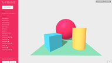
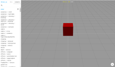

# JavaScript development with WebXR

JavaScript is one of the most popular programming languages in the world! It's simple, lightweight, and widely used on the Web. Leverage the power of your JavaScript and Web skills to create more engaging Mixed Reality experiences.

## Mixed Reality applications on the web

Mixed Reality features are available on the Web through [WebXR](webxr-overview.md). You can see virtual reality (VR) and augmented reality (AR) content in a compatible WebXR-enabled browser without installing any additional software or plugins. You can use that same browser with a physical device like the HoloLens 2.

The [**WebXR Device API**](https://www.w3.org/TR/webxr/) is for accessing virtual reality (VR) and augmented reality (AR) devices, including sensors and head-mounted displays, on the Web. The WebXR Device API is available on Microsoft Edge and Chrome version 79, and later versions support WebXR as a default. You can check the latest browser support status for WebXR at [caniuse.com](https://caniuse.com/#search=webxr).

> [!NOTE]
> **WebVR** is deprecated and is not available in current browsers, so it should not be used for any new development. You'll need to migrate any existing **WebVR** implementations forward to **WebXR**.

| WebXR feature | Availability |
|---------|---------|
|[WebXR Device API (w3.org)](https://www.w3.org/TR/webxr/) | Edge 87 on Windows Desktop  Edge 91 on Hololens 2|
|[WebXR Augmented Reality Module - Level 1 (w3.org)](https://www.w3.org/TR/webxr-ar-module-1/)|Edge 91. Hololens 2 only|
|[WebXR Hand Input Module - Level 1 (w3.org)](https://www.w3.org/TR/webxr-hand-input-1/)|Edge 93. Hololens 2 only|
|[WebXR Anchors Module (immersive-web.github.io)](https://immersive-web.github.io/anchors/)|Edge 93. Hololens 2 only|
|[WebXR Hit Test Module (immersive-web.github.io)](https://immersive-web.github.io/hit-test/)|Edge 93. Hololens 2 only |

### Viewing WebXR

You can view WebXR experiences in Windows Mixed Reality with [the new Microsoft Edge](../../whats-new/new-microsoft-edge.md) and [Firefox Reality](https://mixedreality.mozilla.org/firefox-reality/) browsers.
To test if your browser supports WebXR, you can navigate to [WebXR Samples](https://immersive-web.github.io/webxr-samples/) in your browser.

## What can I use to develop immersive Web experiences?

The following list shows the JavaScript frameworks and APIs for building immersive experiences that currently dominate the market and are widely accepted and adopted by mixed reality JavaScript developers:

|  |  |
| --- | --- |
|[**Babylon.js**](https://doc.babylonjs.com/)   Babylon is a JavaScript 3D engine that makes developing 3D content and immersive applications easy. Before getting started with immersive applications, we recommend that you  learn the basics of Babylon.js development.  - Learn how to build 3D applications with babylon.js: [Getting started](https://doc.babylonjs.com/start) - Play with 3D examples and their source code using babylon.js: [Playground](https://doc.babylonjs.com/examples/) - Dive deeper into [WebXR](https://doc.babylonjs.com/divingDeeper/webXR) - Learn how to get started with our tutorials: [Create your first "Hello World!" app](tutorials/babylonjs-webxr-helloworld/introduction-01.md)| |
|[**A-Frame**](https://aframe.io/)   A-frame is a declarative JavaScript framework that you can use to get started with Virtual Reality on the Web. To learn more, check out the [A-Frame documentation](https://aframe.io/docs/1.2.0/introduction/) |  |
|[**Three.js**](https://threejs.org)   Three.js is a popular 3D library for creating immersive experiences. Learn more about [three.js](https://threejs.org/docs/index.html#manual/en/introduction/Creating-a-scene) and [explore examples](https://threejs.org/examples/#webgl_animation_cloth). |  |
|[**WebGL**](https://developer.mozilla.org/en-US/docs/Web/API/WebGL_API)    You can access the WebXR Device APIs directly by using WebGL APIs. WebGL (Web Graphics Library) is a JavaScript API for rendering high-performance interactive 3D and 2D graphics within any compatible Web browser without the use of plug-ins. |  |

## See Also

* [WebXR Device API specification](https://immersive-web.github.io/webxr/)
* [WebXR Device API documentation](https://developer.mozilla.org/en-US/docs/Web/API/WebXR_Device_API)
* [WebXR Samples](https://immersive-web.github.io/webxr-samples/)
* [Immersiveweb.dev](https://immersiveweb.dev/)
* [Using Babylon.js to create WebXR experiences](https://doc.babylonjs.com/how_to/introduction_to_webxr)
* [WebGL API](/previous-versions/windows/internet-explorer/ie-developer/dev-guides/bg182648(v=vs.85))
* [Gamepad API](https://msdn.microsoft.com/library/dn743630(v=vs.85).aspx) and [Gamepad Extensions](https://w3c.github.io/gamepad/extensions.html)
* [Windows Mixed Reality and the new Microsoft Edge](../../whats-new/new-microsoft-edge.md)
* [Handling Lost Context in WebGL](https://www.khronos.org/webgl/wiki/HandlingContextLost)
* [Pointerlock](https://www.w3.org/TR/pointerlock/)
* [glTF](https://www.khronos.org/gltf)
* [Immersive web community group](https://www.w3.org/community/immersive-web/)
* [Immersive Web W3C Github](https://github.com/immersive-web)

## Next steps--Tutorials

> [!div class="nextstepaction"]
> [Create your first WebXR application using Babylon.js](tutorials/babylonjs-webxr-helloworld/introduction-01.md)

> [!div class="nextstepaction"]
> [Build a piano in WebXR using Babylon.js](tutorials/babylonjs-webxr-piano/introduction-01.md)
