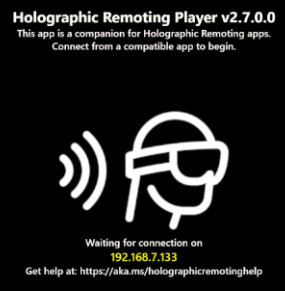

# Preview and debug your app using Holographic Remoting and Play mode

This article explains the following use case for Holographic Remoting: 

- **You want to preview and debug your app during the development process**: You can run your app locally in the Unity editor on your PC in Play Mode and stream the experience to your HoloLens. This provides a way to quickly debug your app without building and deploying a full project. We call this type of app a _Holographic Remoting Play Mode Preview app_. Inputs from the HoloLens--gaze, gesture, voice, and spatial mapping--are sent to the PC, where content is rendered in a virtual immersive view. The rendered frames are then sent to the HoloLens. 

To learn more about Holographic Remoting, see [Holographic Remoting Overview](../native/holographic-remoting-overview.md)

Note that you can also use Holographic Remoting if [you want the resources of a PC to power your app](use-pc-resources.md) instead of relying on the HoloLens on-board resources.

## Set up Holographic Remoting

To use Holographic Remoting, you need to install the [Holographic Remoting Player](../native/holographic-remoting-player.md) app from the Microsoft Store on your HoloLens. As explained below, after you download and run the app, you'll see the version number and IP address to connect to. **You'll need v2.4 or later in order to work with the OpenXR plugin**.

Holographic Remoting requires a fast PC and Wi-Fi connection. You can find more details in the Holographic Remoting Player article linked above.

[!INCLUDE]

## See Also
* [Holographic Remoting Player](../native/holographic-remoting-player.md)
* [Tutorial: Getting started with PC Holographic Remoting](/training/modules/pc-holographic-remoting-tutorials/)
* [Tutorial: Creating a Holographic Remoting PC application](/training/modules/pc-holographic-remoting-tutorials/4-create-holographic-remoting-pc-application)
