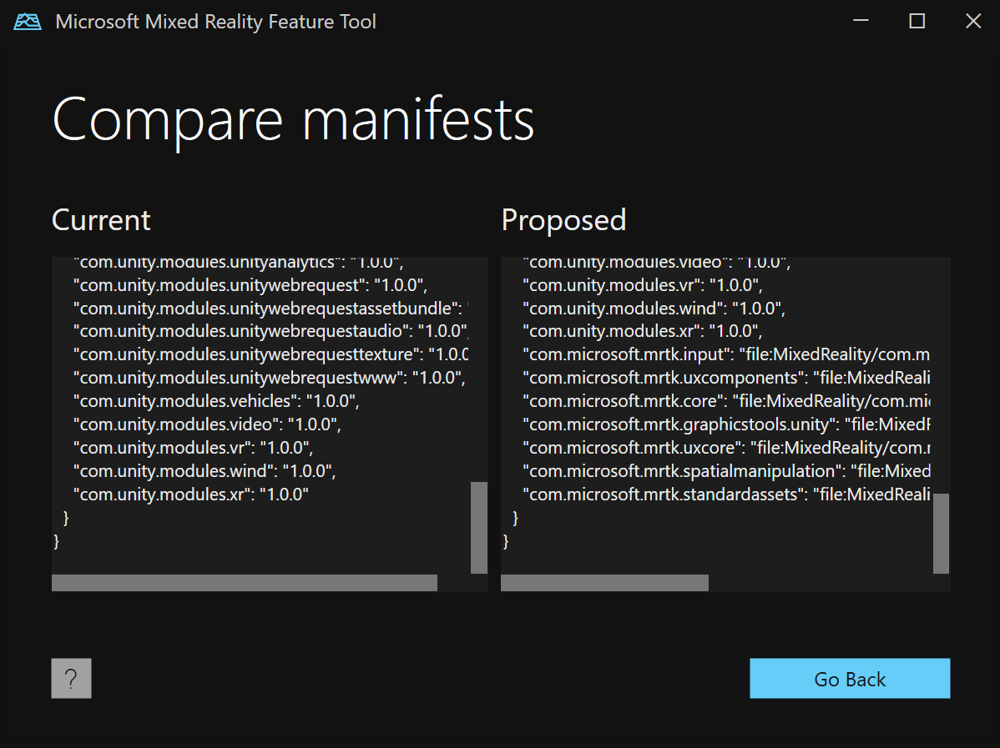

# Authorize project changes

To modify a Unity project, you must first review and approve changes to the manifest and project files.

On the **Review and Approve** screen:

- The **Manifest** column on the left shows the proposed manifest changes. The contents show exactly what to write to the project manifest, *Packages/manifest.json*.

- The **Files to be copied into the project** section on the right lists the specific feature package files to copy into the Unity project.

## Compare manifests

Select **Compare** to see a detailed side-by-side comparison of all proposed changes.

Either scroll bar scrolls both manifests, making it easier to spot the differences between the two files.

## Approve changes

On the **Review and Approve** screen, select **Approve** to copy the listed files into the Unity project and update the manifest with references to these files.

- As part of the modifications, the current *manifest.json* file is backed up. When you view manifest backups, the oldest backup is called *manifest.json.backup*. Newer backups are annotated with a numeric value, beginning with *0*.

- Add the feature package *.tgz* files to source control. Reference the files with relative paths to help development teams easily share features and manifest changes.

- If you need to make changes to your feature selections, select **Go Back** on the **Review and Approve** screen to return to the [import features](importing-features.md) step.

## See also

- [Welcome to the Mixed Reality Feature Tool](welcome-to-mr-feature-tool.md)
- [Configure the feature tool](configuring-feature-tool.md)
- [Discovery and acquisition](discovering-features.md)
- [View feature package details](viewing-package-details.md)
- [Import selected packages](importing-features.md)
