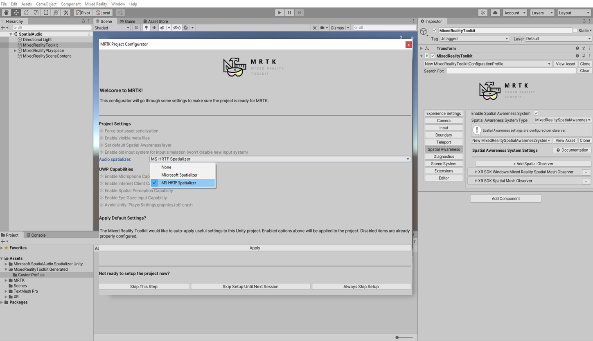

# 1. Adding Spatial audio to your Unity project

## Overview

Welcome to the spatial audio tutorial for Unity on HoloLens2. Through this tutorial series, you will learn how to use head-related transfer function (HRTF) offload on HoloLens 2 and How to enable reverb when using HRTF offload.

The [Microsoft Spatializer GitHub repository](https://github.com/microsoft/spatialaudio-unity) has a completed Unity project of this tutorial sequence.

For an understanding of what it means to spatialize sounds using HRTF-based spatialization technologies and recommendations for when it can be helpful, see [spatial sound design](/windows/mixed-reality/spatial-sound-design).

## What is HRTF offload?

Processing audio using HRTF-based algorithms requires a large amount of specialized computation. HoloLens 2 includes dedicated hardware that can be utilized to avoid burdening the application processor, thus "offloading" the processing of HRTF-based algorithms.  The Microsoft spatializer plugin provides an easy way for your application to take advantage of the dedicated HRTF hardware so your application can use more of the application processor for operations other than spatial audio.

## Objectives

* Importing and Enabling Microsoft spatializer plugin
* Enabling Spatial audio on your developer workstation

## Prerequisites

* A Windows 10 PC configured with the correct [tools installed](../../install-the-tools.md)
* Basic c# programming knowledge
* A HoloLens 2 device [configured for development](../../platform-capabilities-and-apis/using-visual-studio.md#enabling-developer-mode)
* <a href="https://docs.unity3d.com/Manual/GettingStartedInstallingHub.html" target="_blank">Unity Hub</a> with Unity 2020/2019 LTS mounted, and the Universal Windows Platform Build Support module added

We **strongly recommend** completing the [Getting started](mr-learning-base-01.md) tutorials series or having some basic prior experience with Unity and MRTK before continuing.

> [!Important]
> This tutorial series supports Unity 2020 LTS(currently 2020.3.x) if you are using Open XR or Windows XR Plugin and also Unity 2019 LTS (currently 2019.4.x) if you are using Legacy WSA or Windows XR Plugin. This supersedes any Unity version requirements stated in the prerequisites linked above.

## Creating and preparing the Unity project

In this section, you will create a new Unity project and get it ready for MRTK development.

For this, first follow the [Initializing your project and first application](mr-learning-base-02.md), excluding the [Build your application to your device](mr-learning-base-02.md#building-your-application-to-your-hololens-2) instructions, which includes the following steps:

1. [Creating the Unity project](mr-learning-base-02.md#creating-the-unity-project) and give it a suitable name, for example, *MRTK Tutorials*

1. [Switching the build platform](mr-learning-base-02.md#configuring-the-unity-project)

1. [Importing the TextMeshPro Essential Resources](mr-learning-base-02.md#importing-the-textmeshpro-essential-resources)

1. [Importing the Mixed Reality Toolkit and Configuring the Unity project](mr-learning-base-02.md#importing-the-mixed-reality-toolkit-and-configuring-the-unity-project)

1. [Creating and configuring the scene](mr-learning-base-02.md#creating-the-scene-and-configuring-mrtk) and give the scene a suitable name, for example, *SpatialAudio*

Then follow the [Changing the Spatial Awareness Display Option](mr-learning-base-03.md#changing-the-spatial-awareness-display-option) instructions to ensure the MRTK configuration profile for your scene is **DefaultHoloLens2ConfigurationProfile** and change the display options for the spatial awareness mesh to **Occlusion**.

## Adding Microsoft Spatializer to the Project

Download and import the Microsoft Spatializer  <a href="https://github.com/microsoft/spatialaudio-unity/releases/download/v1.0.18/Microsoft.SpatialAudio.Spatializer.Unity.1.0.18.unitypackage" target="_blank">Microsoft.SpatialAudio.Spatializer.Unity.1.0.18.unitypackage
</a>

>[!TIP]
> For a reminder on how to import a Unity custom package, you can refer to the [Importing the tutorial assets](mr-learning-base-02.md#importing-the-tutorial-assets) instructions.

## Enable the Microsoft Spatializer plugin

Once you import the Microsoft Spatializer into your unity project, **MRTK Project Configurator** window will appear, use the **Audio spatializer** dropdown to select the **Microsoft Spatializer**, then click the Apply button to apply the setting:

you can also manually enable the Microsoft Spatializer: Open **Edit -> Project Settings -> Audio**, and change **Spatializer Plugin** to "Microsoft Spatializer".

## Enable spatial audio on your workstation

On desktop versions of Windows, spatial audio is disabled by default. Enable it by right-clicking on the volume icon in the task bar. To get the best representation of what you'll hear on HoloLens 2, choose **Spatial sound -> Windows Sonic for Headphones**.

> [!NOTE]
> This setting is only required if you plan to test your project in the Unity editor.

## Congratulations

In this tutorial you have learnt how to Import and enable the Microsoft Spatializer plugin and also to enable the spatial audio on your workstation.
In the next tutorial you will learn how to add spatial audio in the unity project.

> [!div class="nextstepaction"]
> [Next Tutorial: 2. Spatializing button interaction sounds](unity-spatial-audio-ch2.md)
