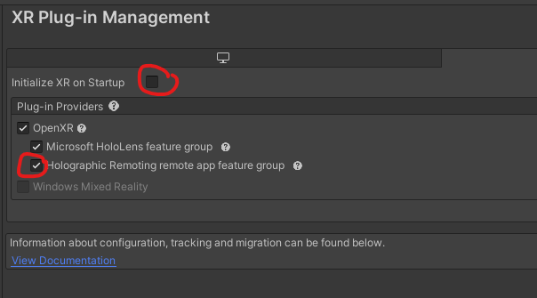
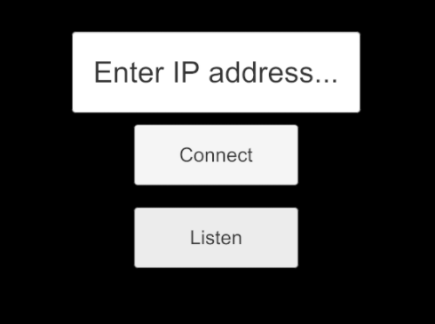

# Use PC resources to power your app with Holographic Remoting remote app

This article explains the following use case for Holographic Remoting:

-  **You want the resources of a PC to power your app instead of relying on the HoloLens on-board resources**: You can create and build an app that has Holographic Remoting capability. The user experiences the app on the HoloLens, but the app actually runs on a PC, which allows the app to take advantage of the PC's more powerful resources. This can be especially helpful if your app has high-resolution assets or models and you don't want the frame rate to suffer. We call this a _Holographic Remoting remote app_. Inputs from the HoloLens--gaze, gesture, voice, and spatial mapping--are sent to the PC, where the content is rendered in a virtual immersive view. The rendered frames are then sent to the HoloLens.

This type of Holographic Remoting is also available for Windows Mixed Reality (WMR) immersive headsets. This could be useful if, for example, your WMR headset is connected to a backpack PC and you wish to stream your app from a more powerful PC to the backpack PC.

To learn more about Holographic Remoting, see [Holographic Remoting overview](../advanced-concepts/holographic-remoting-overview.md)

Note that you can also use Holographic Remoting if [you want to preview and debug your app during the development process](preview-and-debug-your-app.md).

## Two modes in Holographic Remoting are available

|Mode   |Remote App running on PC        | Holographic Remoting player app running on HoloLens 2|
|-------|--------------------------------|------------------------------------------------------|
|Mode 1 |Connect mode                    |   Listen mode                                        |
|Mode 2 |Listen mode                     |   Connect mode                                       |


## Set up the Holographic Remoting Player app

To use Holographic Remoting in Mode 1 alone, install the [Holographic Remoting Player](../advanced-concepts/holographic-remoting-player.md) app from the Microsoft Store on your HoloLens 2. As explained below, after you download and run the app, you'll see the version number and IP address to connect to. **We recommend using the latest version of Holographic Remoting Player available**.

Holographic Remoting requires a fast PC and Wi-Fi connection. You can find more details in the Holographic Remoting Player article linked above.


To use Holographic Remoting in both modes specified above, you need to clone [Holographic Remoting Sample player](https://github.com/microsoft/MixedReality-HolographicRemoting-Samples/blob/main/player/sample/SamplePlayer.sln) and deploy it to Hololens 2 using Visual Studio.

## Build remote app running on PC for Holographic Remoting using Unity

1. On the menu bar, select **Edit > Project Settings**.
1. In the left-side column, select **XR plug-in Management**.
1. In the **XR Plug-in Management** section, select **Microsoft HoloLens feature group** and **Holographic Remoting remote app feature group**.
1. Unselect **Initialize XR on Startup**:

    

1. Write some code to set the remoting configuration and trigger XR initialization. The sample app distributed with the [Mixed Reality OpenXR Plugin](./xr-project-setup.md#unity-sample-projects-for-openxr-and-hololens-2) contains AppRemoting.cs, which shows an example scenario for connecting to a specific IP address at runtime or listening to a connection from the Holographic Remoting Sample Player. Deploying the sample app to a local machine at this point will display an IP address input field with a **Connect** button and a **Listen** button. To initialize XR and attempt to connect to the target device in Mode 1, type an IP address and then click **Connect**. To start listening to the incoming connection, click **Listen**.

    

1. To write custom connection code, call `Microsoft.MixedReality.OpenXR.Remoting.AppRemoting.Connect` with a filled-in `RemotingConfiguration`. The sample app exposes this in the inspector and shows how to fill in the IP address from a text field. Calling `Connect` will set the configuration and automatically initialize XR, which is why it must be called as a coroutine:

    ``` cs
    StartCoroutine(Remoting.AppRemoting.Connect(remotingConfiguration));
    ```
1. To write custom listen code, call `Microsoft.MixedReality.OpenXR.Remoting.AppRemoting.Listen` with a filled-in `RemotingListenConfiguration`. The sample app exposes this in the **Inspector**. Calling `Listen` will set the configuration and wait for a connection from the Holographic Remoting sample player, which is why it must be called as a coroutine:

    ``` cs
    StartCoroutine(Remoting.AppRemoting.Listen(remotingListenConfiguration));
    ```
1. While running, you can obtain the current connection state with the `AppRemoting.TryGetConnectionState` API, and optionally disconnect and de-initialize XR using `AppRemoting.Disconnect()`. This could be used to disconnect and reconnect to a different device within the same app session. The sample app provides a tappable cube which will disconnect the remoting session if tapped.


## Running the sample app and Holographic Remoting Player app in the modes described above

### Mode 1: Run the remote app on PC in Connect Mode and the Holographic Remoting player app in Listen Mode:

- If the Holographic Remoting Player app is already installed from the store on the Hololens 2, skip the three steps below and run the app.

- Open the Holographic Remoting Sample Player app using VS 2019. In order to run on a Hololens 2 that's attached to your PC using a USB cable, configure as follows:


- Open the **Properties** page for your project, navigate to **Configuration Properties** > **Debugging** > **Remote Machine**, and then, in the **Command Line Arguments** field, add "-listen".


- To deploy the SamplePlayer solution on Hololens 2, press the play button in the VS solution. You'll be able to see the HAR Sample player running on Hololens 2, displaying that it is "waiting for a connection on IP address of Hololens 2."

- In the remote app running on the host PC, add the IP address of Hololens 2 displayed above and then select **Connect**.


- After the connection is established, the Holographic Remoting Player app running on Hololens 2 will start "Receiving".

### Mode 2: Run the remote app on your PC in Listen Mode and the HAR player app in Connect Mode:

- On the 2D UI screen in the remote app running on PC, click **Listen**.


- Open the Holographic Remoting Sample Player app using VS 2019. In order to run on a Hololens 2 that's attached to your PC using a USB cable, configure as follows:


- Give in the IP address of the host PC as command line argument to the SamplePlayer app. Right click on SamplePlayer project → Properties→ Configuration Properties → Debugging → Command Line Arguments


- To deploy the SamplePlayer solution on Hololens 2, press the play button in the VS solution. You'll be able to see the HAR Sample player running on Hololens 2, displaying that it is "waiting for a connection on IP address of Hololens 2."

- Once the connection is established, the Holographic Remoting Sample Player app running on Hololens 2 will start "Receiving".


## Migrate from previous Holographic Remoting APIs

To learn more about Holographic Remoting, see [Holographic Remoting overview](../advanced-concepts/holographic-remoting-overview.md)

#### UnityEngine.XR.WSA.HolographicRemoting

From the sample code on [Unity's docs](https://docs.unity3d.com/2018.4/Documentation/ScriptReference/XR.WSA.HolographicRemoting.html):

| XR.WSA.HolographicRemoting | OpenXR.Remoting.AppRemoting |
| ---- | ---- |
| `HolographicRemoting.Connect(String)` | `AppRemoting.Connect(RemotingConfiguration)` |
| `HolographicRemoting.ConnectionState` | `AppRemoting.TryGetConnectionState(out ConnectionState, out DisconnectReason)`|
| `StartCoroutine(LoadDevice("WindowsMR"))`| [N/A: Automatically happens when calling `AppRemoting.Connect`]  |

#### Unity​Engine.​XR.​Windows​MR.WindowsMRRemoting

| XR.​Windows​MR.WindowsMRRemoting | OpenXR.Remoting.AppRemoting |
| ---- | ---- |
| `WindowsMRRemoting.Connect()` | `AppRemoting.Connect(RemotingConfiguration)` |
| `WindowsMRRemoting.Disconnect()` | `AppRemoting.Disconnect()` |
| `WindowsMRRemoting.TryGetConnectionState(out ConnectionState)` and `WindowsMRRemoting.TryGetConnectionFailureReason(out ConnectionFailureReason)`| `AppRemoting.TryGetConnectionState(out ConnectionState, out DisconnectReason)`|
| `WindowsMRRemoting.isAudioEnabled`, `WindowsMRRemoting.maxBitRateKbps`, `WindowsMRRemoting.remoteMachineName` | Passed into `AppRemoting.Connect` via the `RemotingConfiguration` struct |
| `WindowsMRRemoting.isConnected` | `AppRemoting.TryGetConnectionState(out ConnectionState state, out _) && state == ConnectionState.Connected`

## See Also

* [Holographic Remoting Player](../advanced-concepts/holographic-remoting-player.md)
* [Preview and debug your app with Holographic Remoting and Play mode](preview-and-debug-your-app.md)
* [Tutorial: Getting started with PC Holographic Remoting](../unity/tutorials/mr-learning-pc-holographic-remoting-01.md)
* [Tutorial: Creating a Holographic Remoting PC application](../unity/tutorials/mr-learning-pc-holographic-remoting-02.md)
