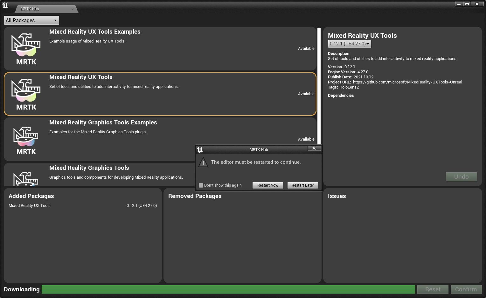

# Setting up your Unreal project

We recommend installing [Unreal Engine version 4.25](https://docs.unrealengine.com//GettingStarted/Installation/index.html) or later to take full advantage of built-in HoloLens support.

Go to the **Library** tab in the Epic Games Launcher, select the dropdown arrow next to **Launch** and click **Options**. Under **Target Platforms**, select **HoloLens 2** and click **Apply**.

## Import Mixed Reality Toolkit for Unreal

Mixed Reality Toolkit (MRTK) is an open-source, cross-platform development kit for mixed reality applications. MRTK provides a cross-platform input system, foundational components, and common building blocks for spatial interactions. The toolkit is intended to accelerate the development of applications targeting Microsoft HoloLens, Windows Mixed Reality immersive (VR) headsets, and the OpenVR platform.

If you don't already have a mixed reality project, follow the first three sections of the [HoloLens 2 Getting Started tutorials](tutorials/unreal-uxt-ch1.md) to get a project ready for the MRTK.

### Introducing the MRTK Hub for Unreal

We recommend that you use the MRTK Hub to acquire MRTK plugins. It's a new way for developers to discover and update Microsoft Mixed Reality plugins and add them to their Unreal projects. You can view plugins, see their dependencies and install them into your project without leaving the Unreal Editor.

- Discover new Microsoft Mixed Reality plugins and install them and their dependencies into your Unreal project.
- Keep your Microsoft Mixed Reality plugins up to date.
- Remove Microsoft Mixed Reality plugins from your project if you no longer need them.

> [!NOTE]
> The MRTK Hub for Unreal is only available for Unreal Engine version 4.26 or later. For Unreal Engine version 4.25, you can get MRTK plugins from the Unreal Engine Marketplace or GitHub as described in the [Getting Started section](unreal-development-overview.md#1-getting-started).

#### Installing the MRTK Hub

Download the plugin from the [Unreal Engine Marketplace](https://www.unrealengine.com/marketplace/en-US/product/mixed-reality-toolkit-hub), then open your project, and then enable the plugin from the _Mixed Reality_ section of the _Plugins_ menu. When prompted, restart the editor.

Once the plugin is enabled for your project, you can access the Hub from the toolbar button.

#### Installing mixed reality plugins

To install a plugin using the Hub, select the plugin you want to add to your project and then press the _Install_ button. To download the plugin, verify that there are no conflicts in the _Issues_ box and press _Confirm_. Once the plugin is downloaded, you'll be prompted to restart the editor.

Once the editor has restarted, your can continue on your [mixed reality development journey](unreal-quickstart.md).

> [!IMPORTANT]
> Once the plugin is installed, it must be checked into source control like any other project-level plugin.

#### Updating mixed reality plugins

To update a plugin using the Hub, select the plugin you want to update from the list and press the _Install_ button. To download the updated plugin, verify that there are no conflicts in the _Issues_ box and press _Confirm_. You'll be prompted to restart the editor to complete the update. Note that this restart may take some time as the plugins are updated.

#### Removing mixed reality plugins

To uninstall a plugin using the Hub, select the plugin you want to remove, and then select the version you have installed from the dropdown. To remove the plugin, verify that there are no conflicts in the _Issues_ box and press _Confirm_. You'll be prompted to restart the editor to complete the removal. Note that this restart may take some time as the plugins are removed.

#### Reviewing changes and detecting incompatibilities

You can view the exact changes that will be made to your project in the bottom section of the Hub's window. From here you can see the plugins that will be added or removed from your project alongside any potential incompatibilities that might cause issues when the changes have been made.

> [!NOTE]
> The _Issues_ list will surface incompatibilities in the Unreal engine version and plugin dependency versions but it doesn't automatically fix or suggest fixes to issues.

:::row:::
    :::column:::
        <a href="https://github.com/Microsoft/MixedRealityToolkit-Unreal" target="_blank"> **Mixed Reality Toolkit-Unreal (GitHub)**</a> 
    :::column-end:::
:::row-end:::

> [!NOTE]
> If you don't want to use MRTK for Unreal, you'll need to script all interactions and behaviors yourself.