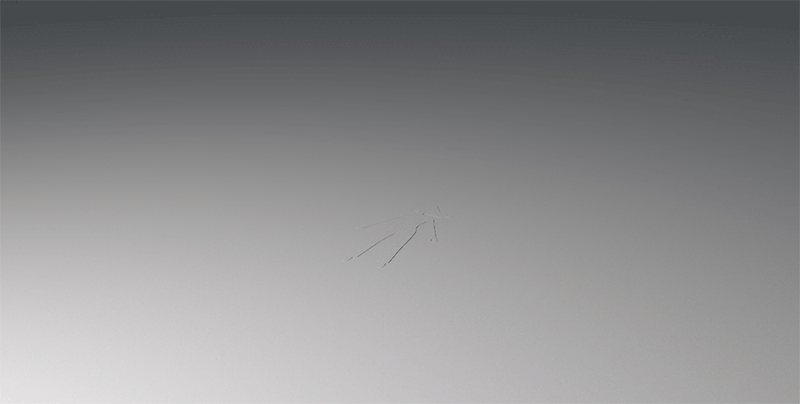
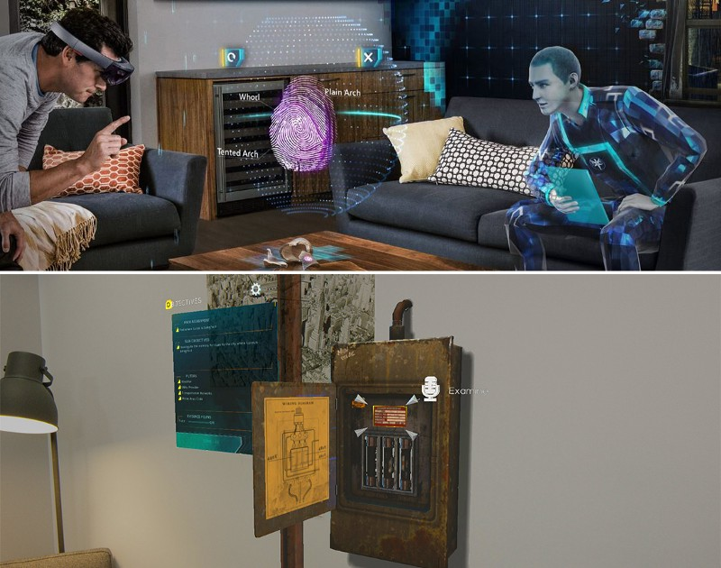
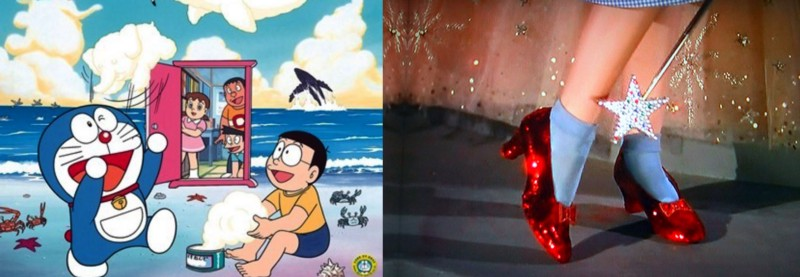

# Case study - My first year on the HoloLens design team

My journey from a 2D flatland to the 3D world started when I joined the HoloLens design team in January, 2016. Before joining the team, I had very little experience in 3D design. It was like the Chinese proverb about a journey of a thousand miles beginning with a single step, except in my case that first step was a leap!

 
*Taking the leap from 2D to 3D*

> *“I felt as though I had jumped into the driver’s seat without knowing how to drive the car. I was overwhelmed and scared, yet very focused.”* 
> — Hae Jin Lee

During the past year, I picked up skills and knowledge as fast as I could, but I still have a lot to learn. Here, I’ve written up 4 observations with a video tutorial documenting my transition from a 2D to 3D interaction designer. I hope my experience will inspire other designers to take the leap to 3D.

## Good-bye frame. Hello spatial / diegetic UI

Whenever I designed posters, magazines, websites, or app screens, a defined frame (usually a rectangle) was a constant for every problem. Unless you are reading this post in a HoloLens or other VR device, you are *looking at this from the outside* through 2D screen safely guarded within a frame. Content is external to you. However, Mixed Reality headset *eliminates the frame*, so you are within the content space, looking and walking through the content from inside-out.

I understood this conceptually, but in the beginning I made the mistake of simply transferring 2D thinking into 3D space. That obviously didn’t work well because 3D space has its own unique properties such as a view change (based on user’s head movement) and [different requirement for user comfort](https://www.youtube.com/watch?v=-606oZKLa_s/) (based on the properties of the devices and the humans using them). For example, in a 2D UI design space, locking UI elements into the corner of a screen is a very common pattern, but this HUD (Head Up Display) style UI does not feel natural in MR/VR experiences; it hinders user’s immersion into the space and causes user discomfort. It’s like having an annoying dust particle on your glasses that you are dying to get rid of. Over time, I learned that it feels more natural to position content in 3D space and add body-locked behavior that makes the content follow the user at a relative fixed distance.

 
*Body-locked*

 

 
*World-locked*

### Fragments: An example of great Diegetic UI

[Fragments](https://www.microsoft.com/p/fragments/9nblggh5ggm8), a first-person crime thriller developed by [Asobo Studio](https://www.asobostudio.com/) for HoloLens demonstrates a great Diegetic UI. In this game, the user becomes a main character, a detective who tries to solve a mystery. The pivotal clues to solve this mystery get sprinkled in the user’s physical room and are often times embedded inside a fictional object rather than existing on their own. This diegetic UI tends to be less discoverable than body-locked UI, so the Asobo team cleverly used many cues including virtual characters’ gaze direction, sound, light, and guides (e.g., arrow pointing the location of the clue) to grab user’s attention.

 
*Fragments - Diegetic UI examples*

### Observations about diegetic UI

Spatial UI (both body-locked and world-locked) and diegetic UI have their own strengths and weaknesses. I encourage designers to try out as many MR/VR apps as possible, and to develop their own understanding and sensibility for various UI positioning methods.

## The return of skeuomorphism and magical interaction

Skeuomorphism, a digital interface that mimics the shape of real world objects has been “uncool” for the last 5–7 years in the design industry. When Apple finally gave way to flat design in iOS 7, it seemed like Skeuomorphism was finally dead as an interface design methodology. But then, a new medium, MR/VR headset arrived to the market and it seems like Skeuomorphism returned again. : )

### Job Simulator: An example of skeuomorphic VR design

[Job Simulator](https://jobsimulatorgame.com/), a whimsical game developed by [Owlchemy Labs](https://owlchemylabs.com/) is one of the most popular example for skeuomorphic VR design. Within this game, players are transported into future where robots replace humans and humans visit a museum to experience what it feels like to perform mundane tasks at one of four different jobs: Auto Mechanic, Gourmet Chef, Store Clerk, or Office Worker.

The benefit of Skeuomorphism is clear. Familiar environments and objects within this game help new VR users feel more comfortable and present in virtual space. It also makes them feel like they are in control by associating familiar knowledge and behaviors with objects and their corresponding physical reactions. For example, to drink a cup of coffee, people simply need to walk to the coffee machine, press a button, grab the cup handle and tilt it towards their mouth as they would do in the real world.

 
*Job Simulator*

Because MR/VR is still a developing medium, using a certain degree of skeuomorphism is necessary to demystify MR/VR technology and to introduce it to larger audiences around the world. Additionally, using skeuomorphism or realistic representation could be beneficial for specific types of applications like surgery or flight simulation. Since the goal of these apps is to develop and refine specific skills that can be directly applied in the real world, the closer the simulation is to the real world, the more transferable the knowledge is.

Remember that skeuomorphism is only one approach. The potential of the MR/VR world is far greater than that, and designers should strive to create magical hyper-natural interactions — new affordances that are uniquely possible in MR/VR world. As a start, consider adding magical powers to ordinary objects to enable users to fulfill their fundamental desires—including teleportation and omniscience.

 
*Doraemon’s magical door (left) and ruby slippers(right)*

### Observations about skeuomorphism in VR

From “Anywhere door” in Doraemon, “Ruby Slippers” in The Wizard of Oz to “Maurader’s map” in Harry Potter, examples of ordinary objects with magical power abound in popular fiction. These magical objects help us visualize a connection between the real-world and the fantastic, between what is and what could be. Keep in mind that when designing the magical or surreal object one needs to strike a balance between functionality and entertainment. Beware of the temptation to create something purely magical just for novelty’s sake.

## Understanding different input methods

When I designed for the 2D medium, I had to focus on touch, mouse, and keyboard interactions for inputs. In the MR/VR design space, our body becomes the interface and users are able to use a broader selection of input methods: including speech, gaze, gesture, [6-dof controllers](https://en.wikipedia.org/wiki/Six_degrees_of_freedom), and gloves that afford more intuitive and direct connection with virtual objects.

 
*Available inputs in HoloLens*

> *“Everything is best for something, and worst for something else.”* 
> — [Bill Buxton](https://www.billbuxton.com/)

For example, gesture input using bare hand and camera sensors on an HMD device frees users hand from holding controllers or wearing sweaty gloves, but frequent use can cause physical fatigue (a.k.a gorilla arm). Also, users have to keep their hands within the line of sight; if the camera cannot see the hands, the hands cannot be used.

Speech input is good at traversing complex tasks because it allows users to cut through nested menus with one command (e.g., “Show me the movies made by Laika studio.”) and also very economical when coupled with other modality (e.g., “Face me” command orients the hologram a user is looking at towards the user). However, speech input may not work well in noisy environment or may not appropriate in a very quiet space.

Besides gesture and speech, hand-held tracked controllers (e.g., Oculus touch, Vive, etc.) are very popular input methods because they are easy to use, accurate, leverage people’s [proprioception](https://en.wikipedia.org/wiki/Proprioception), and provide passive haptic cues. However, these benefits come at the cost of not being able to be bare-hands and use full finger tracking.

 
*Senso (Left) and Manus VR (Right)*

While not as popular as controllers, gloves are gaining momentum again thanks to the MR/VR wave. Most recently, brain/mind input have started to gain traction as an interface for virtual environments by integrating EEG or EMG sensor to headset (e.g., [MindMaze VR](https://www.mindmaze.com/)).

### Observations about input methods

These are a just a sample of input devices available in the market for MR/VR. They will continue to proliferate until the industry matures and agrees upon best practices. Until then, designers should remain aware of new input devices and be well-versed in the specific input methods for their particular project. Designers need to look for creative solutions inside of limitations, while also playing to a device’s strengths.

## Sketch the scene and test in the headset

When I worked in 2D, I mostly sketched just the content. However, in mixed reality space that wasn’t sufficient. I had to sketch out the entire scene to better imagine the relationships between the user and virtual objects. To help my spatial thinking, I started to sketch scenes in [Cinema 4D](https://www.maxon.net/en/products/cinema-4d/overview/) and sometimes create simple assets for prototyping in [Maya](https://www.autodesk.com/products/maya/overview/). I had never used either program before joining the HoloLens team and I am still a newbie, but working with these 3D programs definitely helped me get comfortable with new terminology, such as [shader](https://en.wikipedia.org/wiki/Shader) and [IK (inverse kinematics)](https://knowledge.autodesk.com/support/maya/learn-explore/caas/CloudHelp/cloudhelp/2016/ENU/Maya/files/GUID-07C3BA47-32BB-477B-B6C5-1090E5C9B81C-htm.html/).

**“No matter how closely I sketched out the scene in 3D, the actual experience in headset was almost never the same as the sketch. That’s why it’s important to test out the scene in the target headsets.”
— Hae Jin Lee**

For HoloLens prototyping, I tried out all the tutorials at [Mixed Reality tutorials](../develop/unity/tutorials.md) to start. Then I began to play with [HoloToolkit.Unity](https://github.com/Microsoft/HoloToolkit-Unity/) that Microsoft provides to developers to accelerate development of holographic applications. When I got stuck with something, I posted my question to [HoloLens Question & Answer Forum](https://forums.hololens.com/categories/questions-and-answers/).

After acquiring basic understanding of HoloLens prototyping, I wanted to empower other non-coders to prototype on their own. So I made a video tutorial that teaches how to develop a simple projectile using HoloLens. I briefly explain the basic concepts, so even if you have zero experience in HoloLens development, you should be able to follow along.

 

>[!VIDEO https://www.youtube.com/embed/58612RT2CT8]
*I made this simple tutorial for non-programmers like myself.*

For VR prototyping, I took courses at [VR Dev School](https://learn.vrdev.school/) and also took [3D Content Creation for Virtual Reality](https://www.lynda.com/Unreal-Engine-tutorials/3D-Content-Creation-Virtual-Reality/482055-2.html?srchtrk=index%3a1%0alinktypeid%3a2%0aq%3aVirtual+Reality+%0apage%3a1%0as%3arelevance%0asa%3atrue%0aproducttypeid%3a2/) at Lynda.com. VR Dev school provided me more in depth knowledge in coding and the Lynda course offered me a nice short introduction to creating assets for VR.

## Take the leap

A year ago, I felt like all of this was a bit overwhelming. Now I can tell you that it was 100% worth the effort. MR/VR is still very young medium and there are so many interesting possibilities waiting to be realized. I feel inspired and fortunate be able to play one small part in designing the future. I hope you will join me on the journey into 3D space!

## About the author

<table style="border-collapse:collapse" padding-left="0px">
<tr>
<td style="border-style: none" width="60"></td>
<td style="border-style: none"><b>Hae Jin Lee</b> UX Designer @Microsoft</td>
</tr>
</table>

 
