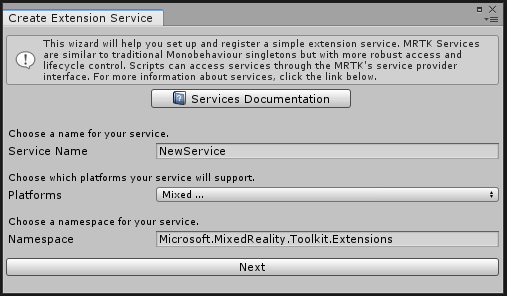
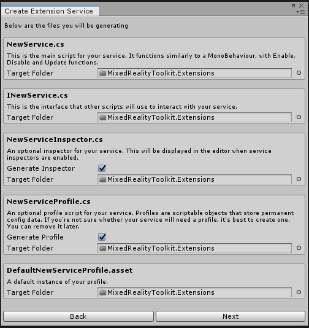

# Extension services

Extension services are components that extend the functionality of the Mixed Reality Toolkit. These services may be provided
by the MRTK or by other parties.

## Creating an extension service

The most efficient way to create an extension service is to use the [extension service creation wizard](../tools/extension-service-creation-wizard.md).
To start the extension service creation wizard, select **Mixed Reality Toolkit > Utilities > Create Extension Service**.



The wizard automates the creation of the service components and ensures the proper interface inheritance.



> [!Note]
> In MRTK version 2.0.0, there is an issue in the extension service wizard where the service inspector
and service profile are required to be generated. Please see issue [5654](https://github.com/microsoft/MixedRealityToolkit-Unity/issues/5654) for more information.

When the wizard completes, the service functionality can be implemented.

## Registering an extension service

To be accessible by an application, the new extension service needs to be registered with the Mixed Reality Toolkit.

The extension service creation wizard can be used to register the service.


The service can also be manually registered using the Mixed Reality Toolkit configuration inspector.


If the extension service uses a profile, please ensure that it is specified in the inspector.


The component name and priority can also be adjusted.

## Accessing an extension service

Extension services are accessed, in code, using the [`MixedRealityServiceRegistry`](xref:Microsoft.MixedReality.Toolkit.MixedRealityServiceRegistry)
as shown in the example below.

```c#
INewService service = null;
if (MixedRealityServiceRegistry.TryGetService<INewService>(out service))
{
    // Succeeded in getting the service,  perform any desired tasks.
}
```

## See also

- [Systems, extension services and data providers](../../architecture/systems-extensions-providers.md)
- [Extension service creation wizard](../tools/extension-service-creation-wizard.md)
- [IMixedRealityExtensionService](xref:Microsoft.MixedReality.Toolkit.IMixedRealityExtensionService)
- [MixedRealityServiceRegistry](xref:Microsoft.MixedReality.Toolkit.MixedRealityServiceRegistry)
