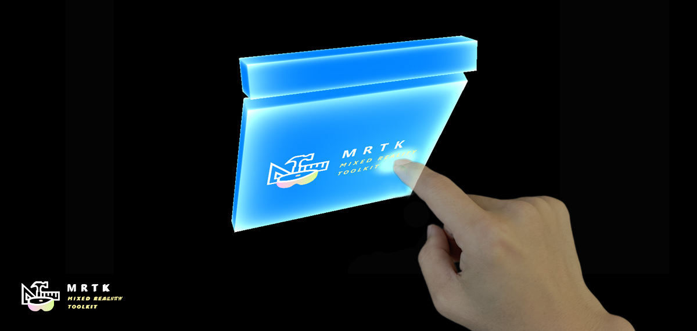

# Hand physics service

The hand physics service enables rigid body collision events and interactions with articulated hands.

## Enabling the extension

To enable the extension, open your RegisteredServiceProvider profile. Click `Register a new Service Provider` to add a new configuration. In the component type field, select HandPhysicsService. In the configuration Profile field, select the default hand physics profile included with the extension.

## Profile options

### Hand physics layer

Controls the layer the instantiated hand joints will go to.

While the service defaults to the "default" layer (0), it is recommended to use a separate layer for hand physics objects. Otherwise there may be unwanted collisions and/or inaccurate raycasts.

### Finger tip kinematic body prefab

Controls which prefab is instantiated on fingertips. In order for the service to work as expected, the prefab requires:

- A rigidbody component, with isKinematic enabled
- A collider
- `JointKinematicBody` component

### Use palm kinematic body

Controls whether the service will attempt to instantiate a prefab on the palm joint.

### Palm kinematic body prefab

When `UsePalmKinematicBody` is enabled, this is the prefab it will instantiate. Just like `FingerTipKinematicBodyPrefab`, this prefab requires:

- A rigidbody component, with isKinematic enabled
- A collider
- `JointKinematicBody` component

## How to use the service

Once enabled, use any collider's `IsTrigger` property to receive collision events from all 10 digits (and palms if they're enabled).
