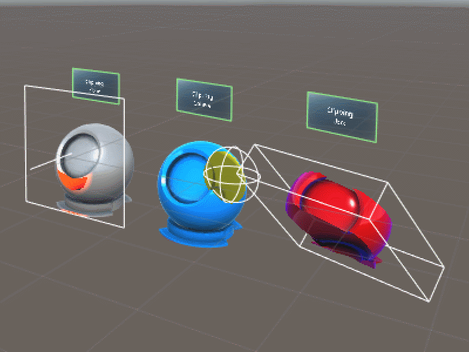

# Clipping primitive -- MRTK2

The [`ClippingPrimitive`](xref:Microsoft.MixedReality.Toolkit.Utilities.ClippingPrimitive) behaviors allow for performant [`plane`](xref:Microsoft.MixedReality.Toolkit.Utilities.ClippingPlane), [`sphere`](xref:Microsoft.MixedReality.Toolkit.Utilities.ClippingSphere), and [`box`](xref:Microsoft.MixedReality.Toolkit.Utilities.ClippingBox) shape clipping with the ability to specify which side of the primitive to clip against (inside or outside) when used with MRTK shaders.



> [!NOTE]
> [`ClippingPrimitives`](xref:Microsoft.MixedReality.Toolkit.Utilities.ClippingPrimitive) utilize [clip/discard](https://developer.download.nvidia.com/cg/clip.html) instructions within shaders and disable Unity's ability to batch clipped renderers. Take these performance implications in mind when utilizing clipping primitives.

[`ClippingPlane.cs`](xref:Microsoft.MixedReality.Toolkit.Utilities.ClippingPlane), [`ClippingSphere.cs`](xref:Microsoft.MixedReality.Toolkit.Utilities.ClippingSphere), and [`ClippingBox.cs`](xref:Microsoft.MixedReality.Toolkit.Utilities.ClippingBox) can be used to easily control clipping primitive properties. Use these components with the following shaders to leverage clipping scenarios.

- *Mixed Reality Toolkit/Standard*
- *Mixed Reality Toolkit/TextMeshPro*
- *Mixed Reality Toolkit/Text3DShader*

## Examples

The **ClippingExamples** and **MaterialGallery** scenes demonstrate usage of the [`ClippingPrimitive`](xref:Microsoft.MixedReality.Toolkit.Utilities.ClippingPrimitive) behaviors, and can be found at: MRTK/Examples/Demos/StandardShader/Scenes/

## Advanced Usage

By default only one [`ClippingPrimitive`](xref:Microsoft.MixedReality.Toolkit.Utilities.ClippingPrimitive) can clip a [renderer](https://docs.unity3d.com/ScriptReference/Renderer.html) at a time. If your project requires more than one [`ClippingPrimitive`](xref:Microsoft.MixedReality.Toolkit.Utilities.ClippingPrimitive) to influence a [renderer](https://docs.unity3d.com/ScriptReference/Renderer.html)  the sample code below demonstrates how to achieve this.

> [!NOTE]
> Having multiple [`ClippingPrimitives`](xref:Microsoft.MixedReality.Toolkit.Utilities.ClippingPrimitive) clip a [renderer](https://docs.unity3d.com/ScriptReference/Renderer.html) will increase pixel shader instructions and will impact performance. Please profile these changes within your project.

*How to have two different [`ClippingPrimitives`](xref:Microsoft.MixedReality.Toolkit.Utilities.ClippingPrimitive) clip a render. For example a [`ClippingSphere`](xref:Microsoft.MixedReality.Toolkit.Utilities.ClippingSphere) and [`ClippingBox`](xref:Microsoft.MixedReality.Toolkit.Utilities.ClippingBox) at the same time:*

```C#
// Within MRTK/Core/StandardAssets/Shaders/MixedRealityStandard.shader (or another MRTK shader) change:

#pragma multi_compile _ _CLIPPING_PLANE _CLIPPING_SPHERE _CLIPPING_BOX

// to:

#pragma multi_compile _ _CLIPPING_PLANE
#pragma multi_compile _ _CLIPPING_SPHERE
#pragma multi_compile _ _CLIPPING_BOX
```

> [!NOTE]
> The above change will incur additional shader compilation time.

*How to have two of the same [`ClippingPrimitives`](xref:Microsoft.MixedReality.Toolkit.Utilities.ClippingPrimitive) clip a render. For example two [`ClippingBoxes`](xref:Microsoft.MixedReality.Toolkit.Utilities.ClippingBox) at the same time:*

```C#
// 1) Add the below MonoBehaviour to your project:

[ExecuteInEditMode]
public class SecondClippingBox : ClippingBox
{
    /// <inheritdoc />
    protected override string Keyword
    {
        get { return "_CLIPPING_BOX2"; }
    }

    /// <inheritdoc />
    protected override string ClippingSideProperty
    {
        get { return "_ClipBoxSide2"; }
    }

    /// <inheritdoc />
    protected override void Initialize()
    {
        base.Initialize();

        clipBoxSizeID = Shader.PropertyToID("_ClipBoxSize2");
        clipBoxInverseTransformID = Shader.PropertyToID("_ClipBoxInverseTransform2");
    }
}

// 2) Within MRTK/Core/StandardAssets/Shaders/MixedRealityStandard.shader (or another MRTK shader) add the following multi_compile pragma:

#pragma multi_compile _ _CLIPPING_BOX2

// 3) In the same shader change:

#if defined(_CLIPPING_PLANE) || defined(_CLIPPING_SPHERE) || defined(_CLIPPING_BOX)

// to:

#if defined(_CLIPPING_PLANE) || defined(_CLIPPING_SPHERE) || defined(_CLIPPING_BOX) || defined(_CLIPPING_BOX2)

// 4) In the same shader add the following shader variables:

#if defined(_CLIPPING_BOX2)
    fixed _ClipBoxSide2;
    float4 _ClipBoxSize2;
    float4x4 _ClipBoxInverseTransform2;
#endif

// 5) In the same shader change:

#if defined(_CLIPPING_BOX)
    primitiveDistance = min(primitiveDistance, PointVsBox(i.worldPosition.xyz, _ClipBoxSize.xyz, _ClipBoxInverseTransform) * _ClipBoxSide);
#endif

// to:

#if defined(_CLIPPING_BOX)
    primitiveDistance = min(primitiveDistance, PointVsBox(i.worldPosition.xyz, _ClipBoxSize.xyz, _ClipBoxInverseTransform) * _ClipBoxSide);
#endif
#if defined(_CLIPPING_BOX2)
    primitiveDistance = min(primitiveDistance, PointVsBox(i.worldPosition.xyz, _ClipBoxSize2.xyz, _ClipBoxInverseTransform2) * _ClipBoxSide2);
#endif
```

Finally, add a [`ClippingBox`](xref:Microsoft.MixedReality.Toolkit.Utilities.ClippingBox) and SecondClippingBox component to your scene and specify the same renderer for both boxes. The renderer should now be clipped by both boxes simultaneously.

## See also

- [MRTK Standard Shader](mrtk-standard-shader.md)
