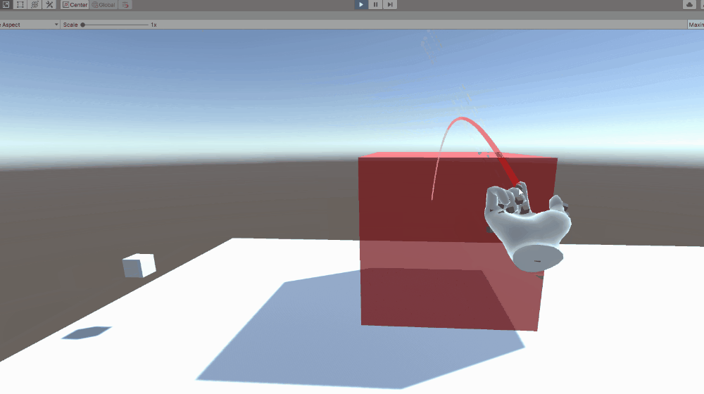

# Teleport system &#8212; MRTK2

The teleport system is a sub-system of MRTK that handles teleporting the user when the
application is using an opaque display. For AR experiences (like HoloLens), the teleportation
system is not active. For immersive HMD experiences (OpenVR, WMR) the teleport system can
be enabled.

## Enabling and disabling

The teleport system can be enabled or disabled by toggling the checkbox in its profile.
This can be done by selecting the MixedRealityToolkit object in the scene, clicking
"Teleport" and then toggling the "Enable Teleport System" checkbox.

This can also be done at runtime:

```c#
void DisableTeleportSystem()
{
    CoreServices.TeleportSystem.Disable();
}

void EnableTeleportSystem()
{
    CoreServices.TeleportSystem.Enable();
}
```

## Events

The teleport system exposes events through the [`IMixedRealityTeleportHandler`](xref:Microsoft.MixedReality.Toolkit.Teleport.IMixedRealityTeleportHandler)
interface to provide signals on when teleport actions begin, end, or get cancelled.
See the linked API documentation for more details on the mechanics of the events
and their associated payload.

## Usage

### How to register for teleportation events

The code below shows how to create a MonoBehaviour that will listen for teleportation
events. This code assumes that the teleport system is enabled.

```c#
using Microsoft.MixedReality.Toolkit;
using Microsoft.MixedReality.Toolkit.Teleport;
using UnityEngine;

public class TeleportHandlerExample : MonoBehaviour, IMixedRealityTeleportHandler
{
    public void OnTeleportCanceled(TeleportEventData eventData)
    {
        Debug.Log("Teleport Cancelled");
    }

    public void OnTeleportCompleted(TeleportEventData eventData)
    {
        Debug.Log("Teleport Completed");
    }

    public void OnTeleportRequest(TeleportEventData eventData)
    {
        Debug.Log("Teleport Request");
    }

    public void OnTeleportStarted(TeleportEventData eventData)
    {
        Debug.Log("Teleport Started");
    }

    void OnEnable()
    {
        // This is the critical call that registers this class for events. Without this
        // class's IMixedRealityTeleportHandler interface will not be called.
        CoreServices.TeleportSystem.RegisterHandler<IMixedRealityTeleportHandler>(this);
    }

    void OnDisable()
    {
        // Unregistering when disabled is important, otherwise this class will continue
        // to receive teleportation events.
        CoreServices.TeleportSystem.UnregisterHandler<IMixedRealityTeleportHandler>(this);
    }
}
```

## Teleporting on MRTK

To teleport with a controller on MR devices with default configurations, use the thumbstick. To teleport with
articulated hands, make a gesture with your palm facing up with the index and thumb sticking outwards, completing the teleport by curling the index finger. To teleport with input simulation, please
see our updated [Input Simulation Service documentation](../input-simulation/input-simulation-service.md).

  
