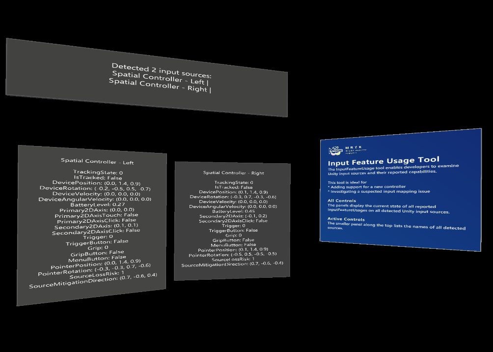

# Input feature usage tool -- MRTK2

The InputFeatureUsage tool is a runtime (on device or in the editor) tool that enables developers to quickly determine the available Unity InputFeatureUsages for a detected input source (ex: motion controller or articulated hand).

> [!NOTE]
> This scene only works on Unity 2019.3 or later.

This tool is very useful when developing support for a new hardware controller. It can also help to confirm a suspected control mapping issue in the support class for an existing controller.

## Using the InputFeatureUsage tool

To get started with the InputFeatureUsage tool, navigate to **MRTK/Tools/RuntimeTools/Tools/InputFeatureUsageTool** and open the **InputFeatureUsageTool** scene. Once the scene has been loaded, the project can either be run in the editor, using play mode, or built and run on a device.

To examine Unity's mappings for a controller:

- Connect the controller
- Press each button and move each axis
- Note the feature usages in the display
- Update the control mappings in the input system data provider for the controller

> [!NOTE]
> The InputFeatureUsage tool does not make use of Microsoft Mixed Reality Toolkit components. It directly communicates with Unity to determine and display the feature usages.

### Panels

The panels display the current state of all reported InputFeatureUsages on all detected Unity input sources.

The smaller panel along the top lists the names of all detected sources.

## See also

- [Creating an input system data provider](../input/create-data-provider.md)
- [Controller mapping tool](controller-mapping-tool.md)
