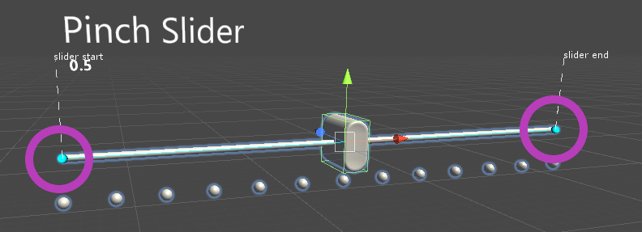

# Sliders

Sliders are UI components that allow you to continuously change a value by moving a slider on a track. Currently the Pinch Slider can be moved by directly grabbing the slider, either directly or at a distance. Sliders work on AR and VR, using motion controllers, hands, or Gesture + Voice.

## Example scene

You can find examples in the **SliderExample** scene under `MRTK/Examples/Demos/UX/Slider/Scenes/`.

## How to use sliders

Drag and drop the **PinchSlider** prefab into the scene hierarchy. If you want to modify or create your own slider, remember to do the following:

- Make sure your that your thumb object has a collider on it. In the PinchSlider prefab, the collider is on `SliderThumb/Button_AnimationContainer/Slider_Button`
- Make sure that the object containing the collider also has a Near Interaction Grabbable component on it, if you want to be able to grab the slider near.

We also recommend using the following hierarchy

- PinchSlider - Contains the sliderComponent
  - TouchCollider - Collider containing the entire selectable area of the slider. Enables the Snap To Position behavior.
  - SliderThumb - Contains the movable thumb
  - TrackVisuals - Containing the track and any other visuals
  - OtherVisuals - Containing any other visuals

## Slider events

Sliders expose the following events:

- OnValueUpdated - Called whenever the slider value changes
- OnInteractionStarted - Called when the user grabs the slider
- OnInteractionEnded - Called when the user releases the slider
- OnHoverEntered - Called when the user's hand / controller hovers over the slider, using either near or far interaction.
- OnHoverExited - Called when the user's hand / controller is no longer near the slider.

## Configuring slider bound and axis

You can directly move the starting and end points of the slider by moving the handles in the Scene:

You can also specify the axis (in local space) of the slider via the _Slider Axis_ field

If you cannot use the handles, you can instead specify the start and end points of the slider via the _Slider Start Distance_ and _Slider End Distance_ fields. These specify start / end position of slider as a distance from the slider's center, in local coordinates. This means that once you set the slider start and end distances as you want them, you can scale the slider to be smaller or larger without needing to update the start and end distances.

## Inspector properties

**Thumb Root** The gameobject that contains the slider thumb.

**Snap To Position** Whether or not this slider snaps to the designated position on the slider

**Is Touchable** Whether or not this slider is controllable via touch events

**Thumb Collider** The collider that controls the slider thumb

**Touchable Collider** The area of the slider that can be touched or selected when Snap To Position is true.

**Slider Value** The value of the slider.

**Use Slider Step Divisions** Controls whether this slider is increments in steps or continuously.

**Slider Step Divisions** Number of subdivisions the slider is split into when Use Slider Step Divisions is enabled.

**Track Visuals** The gameobject that contains the desired track visuals that goes along the slider.

**Tick Marks** The gameobject that contains the desired tick marks that goes along the slider.

**Thumb Visuals** The gameobject that contains the desired thumb visual that goes along the slider.

**Slider Axis** The axis the slider moves along.

**Slider Start Distance** Where the slider track starts, as distance from center along slider axis, in local space units.

**Slider End Distance** Where the slider track ends, as distance from center along slider axis, in local space units.

When user updates the slider axis value in editor then if Track Visuals or Tick Visuals are specified then their transform is updated.
Specifically, their local position is reset and their local rotation is set to match the Slider Axis orientation.
Their scale isn't modified.
If Tick Marks have a Grid Object Collection component then the Layout and CellWidth or CellHeight is updated accordingly to match the Slider Axis.

## Example Slider Configurations

Continuous Sliders with Snap To Position

Step Sliders with Snap To Position

Touch Sliders

