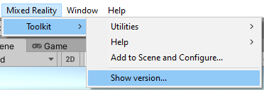
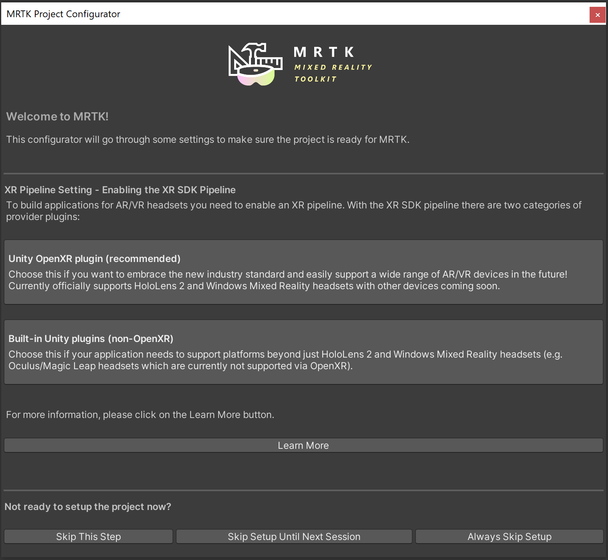
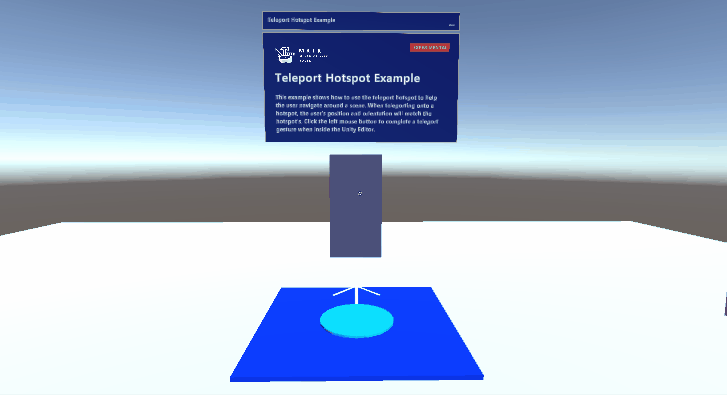

# Microsoft Mixed Reality Toolkit 2.7 Release Notes

## What's new in 2.7.3

### A special thanks from Redmond

The MRTK team would like to extend a warm thanks to you, the MRTK community. Your contributions, feedback, and votes have helped MRTK win the [2021 Auggie Award for Best Developer Tool](https://www.awexr.com/usa-2021/auggie-winners)! Without your support, we wouldn't be where we are today. Whether it's adding new platform support, new features, bug fixes, suggestions, questions, or any of the other numerous ways you might have contributed: Thank you!


### Unity 2021 support

We've made it easier to build on Unity 2021 with the release of 2.7.3! If you find any issues while using MRTK with Unity 2021, [file an issue](https://github.com/microsoft/MixedRealityToolkit-Unity/issues/) on our GitHub repository.

### Scene Understanding via Remoting support (OpenXR Only)

Scene Understanding is now available during remoting on the HoloLens 2 with OpenXR platform.

### MRTK 2.7.3 Bugfixes and Changes

- Stopped the creation of a `CustomProfiles` folder unless a profile has been cloned to that folder [#9916](https://github.com/microsoft/MixedRealityToolkit-Unity/pull/9916)
- Removed calls to `.gameObject` on GameObjects [#9939](https://github.com/microsoft/MixedRealityToolkit-Unity/pull/9939)
- Fixed a bug where objects with disabled components could cause pointers to become focus locked [#9945](https://github.com/microsoft/MixedRealityToolkit-Unity/pull/9945)
- Updated deprecated methods and fixed compiler errors for Unity 2021 [#9938](https://github.com/microsoft/MixedRealityToolkit-Unity/pull/9938)
- Fixed `link.xml` for Unity 2021 [#9942](https://github.com/microsoft/MixedRealityToolkit-Unity/pull/9942)
- Updated button config inspector to show icon names [#9972](https://github.com/microsoft/MixedRealityToolkit-Unity/pull/9972)
- Updated controller mapping list's header and alignment [#9976](https://github.com/microsoft/MixedRealityToolkit-Unity/pull/9976)
- Assorted Unity improvements for MRTK [#9940](https://github.com/microsoft/MixedRealityToolkit-Unity/pull/9940)
- Fixed _BoundsControl_ collider issues and inconsistency [#9973](https://github.com/microsoft/MixedRealityToolkit-Unity/pull/9973)
- Fixed the button icon set inspectors [#9999](https://github.com/microsoft/MixedRealityToolkit-Unity/pull/9999)
- Fixed _BoundsControl_ scale handle collider alignment [#10007](https://github.com/microsoft/MixedRealityToolkit-Unity/pull/10007)
- Fixed SDF font texture categorizing [#10006](https://github.com/microsoft/MixedRealityToolkit-Unity/pull/10006)
- Fixed _BoundsControl_ auto-flatten and scale handle orientation [#10013](https://github.com/microsoft/MixedRealityToolkit-Unity/pull/10013)
- Added feedback for _BoundsControl_ flattening fix [#10016](https://github.com/microsoft/MixedRealityToolkit-Unity/pull/10016)
- Fixed strange deformations with hand mesh during animation playback [#10024](https://github.com/microsoft/MixedRealityToolkit-Unity/pull/10024)
- Fixed logging and `SpatialAwarenessSurfaceTypes` for Scene Understanding [#10026](https://github.com/microsoft/MixedRealityToolkit-Unity/pull/10026)
- Added a Standalone define directive to Leap example scene script [#10036](https://github.com/microsoft/MixedRealityToolkit-Unity/pull/10036)
- Fixed _BoundsControl_ `OnEnable` issue when non-default activation type specified in-editor [#10039](https://github.com/microsoft/MixedRealityToolkit-Unity/pull/10039)
- Fixed invalid shader bytecode errors for OpenGL ES and Metal [#10041](https://github.com/microsoft/MixedRealityToolkit-Unity/pull/10041)
- Added `ClearProgressBar` call to fix Build Window freeze on Unity 2020 [#10046](https://github.com/microsoft/MixedRealityToolkit-Unity/pull/10046)
- Updated serialization for font assets [#10047](https://github.com/microsoft/MixedRealityToolkit-Unity/pull/10047)
- Fixed hand interaction scene to have proper pinch slider colliders [#10060](https://github.com/microsoft/MixedRealityToolkit-Unity/pull/10060)
- Fixed Surface Magnetism quaternion math [#10074](https://github.com/microsoft/MixedRealityToolkit-Unity/pull/10074)
- Improved PV camera version messages [#10077](https://github.com/microsoft/MixedRealityToolkit-Unity/pull/10077)
- Fixed `BoundingBoxHelper.GetRawBoundsCorners` protection level [#10093](https://github.com/microsoft/MixedRealityToolkit-Unity/pull/10093)
- Updated gLTF import logs to be one log instead of multiple [#10090](https://github.com/microsoft/MixedRealityToolkit-Unity/pull/10090)
- Removed `MRSceneContent` script from scenes that don't have MRTK in them [#10091](https://github.com/microsoft/MixedRealityToolkit-Unity/pull/10091)
- Removed package-based event systems from example scenes for Unity 2018 compatibility [#10092](https://github.com/microsoft/MixedRealityToolkit-Unity/pull/10092)
- Removed support for preview Microsoft OpenXR packages [#10119](https://github.com/microsoft/MixedRealityToolkit-Unity/pull/10119)
- Fixed apps freezing when receiving data [#10033](https://github.com/microsoft/MixedRealityToolkit-Unity/pull/10033)
- Fixed `EyeTrackingTarget` not triggering OnLookAway when passing from collider with `EyeTrackingTarget` to collider without [#10127](https://github.com/microsoft/MixedRealityToolkit-Unity/pull/10127)
- Changed default pointer extent to make mouse pointer behavior more intuitive [#10075](https://github.com/microsoft/MixedRealityToolkit-Unity/pull/10075)
- Updated summary to clarify when Initialize runs [#10177](https://github.com/microsoft/MixedRealityToolkit-Unity/pull/10177)
- Fixed a `NullReferenceException` issue in `LinePointer` [#10190](https://github.com/microsoft/MixedRealityToolkit-Unity/pull/10190)
- Fixed _BoundsControl_ with non-uniform scale issues [#10133](https://github.com/microsoft/MixedRealityToolkit-Unity/pull/10133)
- Fixed handling of `IOSMinOSVersion` in different cultures [#10178](https://github.com/microsoft/MixedRealityToolkit-Unity/pull/10178)
- Removed extra raycasts from eye gaze enabled objects [#10162](https://github.com/microsoft/MixedRealityToolkit-Unity/pull/10162)
- Added tooltips when hovering over the various profiles in the Editor Inspector for the MixedRealityToolkit prefab [#10180](https://github.com/microsoft/MixedRealityToolkit-Unity/pull/10162)
- Fixed speech command dropdown and update commands in EyeTrackingExample [#10197](https://github.com/microsoft/MixedRealityToolkit-Unity/pull/10197)
- Fixed 'gLTF' objects appearing black when loaded with Unity's standard shader [#10209](https://github.com/microsoft/MixedRealityToolkit-Unity/pull/10209)
- Fixed`UnityTouchDeviceManager` updating itself when the `IsEnabled` property is false [#10203](https://github.com/microsoft/MixedRealityToolkit-Unity/pull/10203)
- Updated a property name in the button config helper [#10221](https://github.com/microsoft/MixedRealityToolkit-Unity/pull/10221)
- Fixed coordinate space, winding order, and culture formatting in object exporter [#10208](https://github.com/microsoft/MixedRealityToolkit-Unity/pull/10208)
- Added option to move grasp point to fingertip [#10206](https://github.com/microsoft/MixedRealityToolkit-Unity/pull/10206)
- Added support for Leap UnityModules 4.9.1 [#10282](https://github.com/microsoft/MixedRealityToolkit-Unity/pull/10282)
- Backported some minor changes to `ReserializeAssetsUtility.cs` [#10280](https://github.com/microsoft/MixedRealityToolkit-Unity/pull/10280)
- Converted incorrect usages of `enumValueIndex` to `intValue` [#10274](https://github.com/microsoft/MixedRealityToolkit-Unity/pull/10274)
- Fixed objects drifting during Near Manipulation [#10294](https://github.com/microsoft/MixedRealityToolkit-Unity/pull/10294)
- Fixed cases where bounds control would aggressively remove other components [#10296](https://github.com/microsoft/MixedRealityToolkit-Unity/pull/10296)
- Fixed flickering Proximity lighting [#10325](https://github.com/microsoft/MixedRealityToolkit-Unity/pull/10325)
- Added check to see if anything is hooked into events before determining to fire those events [#10330](https://github.com/microsoft/MixedRealityToolkit-Unity/pull/10330)
- Changed an assortment of minor things [#10316](https://github.com/microsoft/MixedRealityToolkit-Unity/pull/10316)
- Introduced an alternative to HasFlag [#10319](https://github.com/microsoft/MixedRealityToolkit-Unity/pull/10319)
- Reduce `HandConstraint` solver debug log spam [#10331](https://github.com/microsoft/MixedRealityToolkit-Unity/pull/10331)
- Fixed log spam that is coming from `HandConstraintPalmUp.cs` [#10326](https://github.com/microsoft/MixedRealityToolkit-Unity/pull/10326)
- Enabled Scene Understanding for Holographic Remoting via OpenXR [#10338](https://github.com/microsoft/MixedRealityToolkit-Unity/pull/10338)
- Added a parameter-less constructor to InteractableOnClickReceiver [#10353](https://github.com/microsoft/MixedRealityToolkit-Unity/pull/10353)
- Moved the _FingerChaser_ prefab to the Common folder in the Examples package [#10358](https://github.com/microsoft/MixedRealityToolkit-Unity/pull/10358)
- Added fallback case for articulated hand select on OpenXR [#10359](https://github.com/microsoft/MixedRealityToolkit-Unity/pull/10359)
- Fixed a Windows Mic Stream demo UPM import issue [#10362](https://github.com/microsoft/MixedRealityToolkit-Unity/pull/10362)
- Renamed OpenXR profiles [#10363](https://github.com/microsoft/MixedRealityToolkit-Unity/pull/10363)
- Improved raycast hit log output with Unity 2021 and fixed a crash when using AssetBundles [#10370](https://github.com/microsoft/MixedRealityToolkit-Unity/pull/10370)
- Updated strings to const and cache type to reduce allocs [#10369](https://github.com/microsoft/MixedRealityToolkit-Unity/pull/10369)
- Fixed XRSDK based mesh observers when using app-based Holographic Remoting [#10366](https://github.com/microsoft/MixedRealityToolkit-Unity/pull/10366)
- Integrated Oculus Visualization [#10067](https://github.com/microsoft/MixedRealityToolkit-Unity/pull/10067)
- Added documentation for _BoundsControl_ properties [#10361](https://github.com/microsoft/MixedRealityToolkit-Unity/pull/10361)
- Fixed Hand Joint Chaser prefab [#10377](https://github.com/microsoft/MixedRealityToolkit-Unity/pull/10377)
- Fixed deployment errors for Oculus Quest [10374](https://github.com/microsoft/MixedRealityToolkit-Unity/pull/10374)
- Fixed issue with Scene Understanding example scene profile [#10368](https://github.com/microsoft/MixedRealityToolkit-Unity/pull/10368)
- Fixed MRTK console errors when imported in latest versions of Unity 2021.2 [#10182](https://github.com/microsoft/MixedRealityToolkit-Unity/issues/10182)
- Added missing documentation on how to change cursors [#4934](https://github.com/microsoft/MixedRealityToolkit-Unity/issues/4934)
- Improved instructions on the MRTK Unity package release page to make them clearer [#9575](https://github.com/microsoft/MixedRealityToolkit-Unity/issues/9575)
- Fixed issue where _MicStream_ selection demo scene didn't process voice (UPM package) [#9908](https://github.com/microsoft/MixedRealityToolkit-Unity/issues/9908)
- Fixed issue where samples couldn't be individually imported in MRTK Examples package [#10216](https://github.com/microsoft/MixedRealityToolkit-Unity/issues/10216)
- Added _BoundsControl_ missing documentation for some properties [#10346](https://github.com/microsoft/MixedRealityToolkit-Unity/issues/10346)
- Fixed a bug where _InteractableOnClickReceiver_ couldn't be added to a game object with an interactable component [#10341](https://github.com/microsoft/MixedRealityToolkit-Unity/issues/10341)

## What's new in 2.7.2

### Fixed a UPM package dependency issue

There has been an issue with MRTK 2.7.1 UPM packages where the dependencies aren't set up correctly. The issue causes the Mixed Reality Feature Tool to fail to import MRTK 2.7.1 packages properly. The issue is now resolved in 2.7.2. There's no code change in this version compared to 2.7.1.

## What's new in 2.7.1

### Show version

The **Mixed Reality > Toolkit** menu now contains a **Show version...** entry that examines the Mixed Reality Toolkit Foundation package to determine the version of MRTK that is being used by the project.




> [!NOTE]
> If MRTK is cloned from the [GitHub repository](../index.md), the version information won't be set.
>
> 

### Authors list

Starting with MRTK 2.7.1, the authors list file is included in the Mixed Reality Toolkit Foundation package.

### Integrated OpenXR project setup into the Configurator setup flow

Starting with MRTK 2.7.1, users of the Mixed Reality OpenXR plugin will receive instructions on how to set up that plugin with MRTK. There's an option for users targeting HoloLens 2 to apply recommended settings automatically.


### Notable Bugfixes and Changes

- Marked Unity Joystick Manager as supported on XR SDK pipeline [#9954](https://github.com/microsoft/MixedRealityToolkit-Unity/pull/9954), [#9994](https://github.com/microsoft/MixedRealityToolkit-Unity/pull/9994)
- Added checks to interactable inspector code to prevent null errors [#9943](https://github.com/microsoft/MixedRealityToolkit-Unity/pull/9943)
- Add OpenXR mesh provider to pulse shader example scene [#9902](https://github.com/microsoft/MixedRealityToolkit-Unity/pull/9902)
- Restore hand physics profile to example scene [#9915](https://github.com/microsoft/MixedRealityToolkit-Unity/pull/9915)
- Some cleanup to the `HandConstraint` scripts [#9935](https://github.com/microsoft/MixedRealityToolkit-Unity/pull/9935)
- Fixed some bugs affecting creating and cloning profiles [#9982](https://github.com/microsoft/MixedRealityToolkit-Unity/pull/9982)

## What's new in 2.7.0

### OpenXR is now officially supported in MRTK

As the new OpenXR plugins are becoming more mature, MRTK now officially supports OpenXR. Compared to previous releases we added the following capabilities to projects using OpenXR:

- [Support for the system-provided motion controller model](#support-for-the-system-provided-motion-controller-model-on-openxr)
- Support for WinMR gestures (select, hold, manipulation and navigation) [#9843](https://github.com/microsoft/MixedRealityToolkit-Unity/pull/9843)
- [Support for controller haptics](#support-for-controller-haptics-across-legacy-wmr-windows-xr-plugin-and-openxr)
- [Support for articulated hand mesh on HoloLens 2](#support-for-hololens-2-articulated-hand-mesh-on-openxr)
- Support for Spatial Mapping on HoloLens 2 [#9567](https://github.com/microsoft/MixedRealityToolkit-Unity/pull/9567), [#9827](https://github.com/microsoft/MixedRealityToolkit-Unity/pull/9827)
- Support for Scene Understanding on HoloLens 2 [#9744](https://github.com/microsoft/MixedRealityToolkit-Unity/pull/9744)

If you're targeting HoloLens 2 or Windows Mixed Reality headsets via OpenXR, make sure to install/update to **Mixed Reality OpenXR plugin version 0.9.5 or later** via [Mixed Reality Feature Tool](https://aka.ms/MRFeatureTool), otherwise you might miss some of the improvements above.

### Legacy XR and XR SDK Data Providers can now be used within the same profile

Data providers will now also only be loaded when the appropriate pipeline is selected, allowing both Legacy XR and XR SDK data providers to co-exist within
the same profile. To accommodate this, Legacy XR and XR SDK Data Providers are now organized under different tabs within the profile view. This organization
should help determine whether the correct profile is selected for the targeted XR pipeline.


To accommodate this, null data providers will now no longer be loaded and displayed in the profile inspector. Users can toggle `Show null data providers in the profile inspector`
under **Edit -> Project Settings -> Mixed Reality Toolkit** to debug unexpected behaviors with missing data providers.


### Added Experience Settings and an associated Mixed Reality Scene Content behavior

Users can now configure [Experience Settings](../features/experience-settings/experience-settings.md), which will allow MRTK to display [Mixed Reality Scene Content](../features/experience-settings/scene-content.md)
appropriately based on the targeted experience.

If user's previous Experience Scale settings don't match the new Experience Settings Profile, they'll be prompted to correct it in the inspector.


### The Redesigned Configurator now guides the user through the setup process

The new MRTK configurator provides users step-by-step guidance to properly configure the project for XR development and use with MRTK. It covers the selection of XR pipeline, getting the platform specific plugins, importing TextMeshPro, displaying the examples (when using UPM), and other previously included recommended settings for the project.



### Graduated Teleport Hotspot

A new [teleport hotspot component](../features/teleport-system/teleport-hotspot.md) has been graduated. You can add a teleport hotspot to your `GameObject` to ensure that the user is in a certain position and orientation when they teleport to that location.



### Graduated Dwell

The dwell feature and example is now graduated from experimental. New examples of volumetric HoloLens 2 style buttons are included in the sample scene.


### Added support for Leap Motion Unity Modules version 4.6.0, 4.7.0, 4.7.1 and 4.8.0

Support for the latest versions of the [Leap Motion Unity Modules](https://developer.leapmotion.com/unity) is now compatible with MRTK 2.7.0. For more information, see [How to Configure MRTK for Leap Motion](../supported-devices/leap-motion-mrtk.md).

Many thanks to @jackyangzzh for contributing the new `LeapMotionOrientationExample` scene!

### Targeted speech events raised no longer restricted to gaze pointers

Previously, targeted speech events could only be raised on objects that were focused on with the gaze pointer. Now, objects can receive speech events if they're focused by any pointer.


### Ported `TextToSpeech` from HTK to MRTK

The beloved `TextToSpeech` script is now finally available in MRTK to help you generate speech from text on the UWP platform using [`SpeechSynthesizer`](/uwp/api/windows.media.speechsynthesis.speechsynthesizer). Also added a sample scene to demonstrate the feature.

### Support for the system-provided motion controller model on OpenXR

Added support, both in-editor and at runtime, for the system-provided motion controller model on OpenXR.


### Support for HoloLens 2 articulated hand mesh on OpenXR


### Support for controller haptics across legacy WMR, Windows XR Plugin, and OpenXR

Added support for controller haptics across legacy WMR, Windows XR Plugin, and OpenXR. [#9735](https://github.com/microsoft/MixedRealityToolkit-Unity/pull/9735)

### Support for eye tracking on Windows XR Plugin

Added support for eye gaze when using Windows XR Plugin minimum versions of 2.7.0 (Unity 2019), 4.4.2 (Unity 2020), and 5.2.2 (Unity 2021). [#9609](https://github.com/microsoft/MixedRealityToolkit-Unity/pull/9609)

### Notable Bugfixes and Changes

- Pinch detection made smoother. It's now harder to accidentally drop the pinch gesture. [#9576](https://github.com/microsoft/MixedRealityToolkit-Unity/pull/9576)
- Objects with the Object Manipulator component now consistently maintain velocity on release when the flag is set. [#9733](https://github.com/microsoft/MixedRealityToolkit-Unity/pull/9733)
- Back-strafing now checks for a floor, helping prevent situations where the camera can clip into the environment or where the user is left hovering over empty space.[#9697](https://github.com/microsoft/MixedRealityToolkit-Unity/pull/9697)
- `IsNearObject` is now a virtual property, allowing more flexibility when extending the sphere or poke pointer. [#9803](https://github.com/microsoft/MixedRealityToolkit-Unity/pull/9803)
- Buttons now display the proper keyword when showing the available speech command. [#9824](https://github.com/microsoft/MixedRealityToolkit-Unity/pull/9824)
- Oculus Controllers now use their own standalone visualizer, preventing the MRTK visualization from clashing with the Oculus Integration Package's visualization. [#9589](https://github.com/microsoft/MixedRealityToolkit-Unity/pull/9589)
- Keyboard related scripts have been changed to align with the behavior in latest Unity versions (2019.4.25+ & 2020.3.2+). As of the release, there's still an auto-completion bug and a TMP Input Field bug (both are external to MRTK) impacting HoloLens. For more information, see [#9056](https://github.com/microsoft/MixedRealityToolkit-Unity/pull/9056) and [#9724](https://github.com/microsoft/MixedRealityToolkit-Unity/pull/9724).
- Improved the performance of Scrolling Object Collection. Also fixed an issue causing `GameObject` within the collection to lose material when duplicated. [#9813](https://github.com/microsoft/MixedRealityToolkit-Unity/pull/9813), [#9718](https://github.com/microsoft/MixedRealityToolkit-Unity/pull/9718)
- In the Scene Understanding demo script, added the `GetSceneObjectsOfType` function to retrieve all observed scene object of a certain kind. [#9524](https://github.com/microsoft/MixedRealityToolkit-Unity/pull/9524), [#9744](https://github.com/microsoft/MixedRealityToolkit-Unity/pull/9744)
- In command line build tool, only scenes specified by the `sceneList` or `sceneListFile` flags (when any flag is present) will be included in the build. [#9695](https://github.com/microsoft/MixedRealityToolkit-Unity/pull/9695)
- In build tool, there's a new option to specify a path to `nuget.exe` and use that to perform package restore instead of using `msbuild` (the default option). [#9556](https://github.com/microsoft/MixedRealityToolkit-Unity/pull/9556)
- Fixed issue where using Windows XR Plugin could result in stale hand joints and doubled hand meshes. [#9890](https://github.com/microsoft/MixedRealityToolkit-Unity/pull/9890)
- Fixed issue where using Windows XR Plugin's automatic remoting feature led to missing input and interactions. [#9868](https://github.com/microsoft/MixedRealityToolkit-Unity/pull/9868)
- Fixed issue where the `BuildDeployWindow` would try to query an invalid reg key for the Windows SDK path. [#9664](https://github.com/microsoft/MixedRealityToolkit-Unity/pull/9664)
- MRTK's `glTF` importers are now optional. If multiple `glTF` importers are present, MRTK's can be disabled by adding `MRTK_GLTF_IMPORTER_OFF` to the custom scripting define symbols. [#9658](https://github.com/microsoft/MixedRealityToolkit-Unity/pull/9658)
- Fixed issue where the Knuckles controllers on OpenVR weren't being detected properly. [#9881](https://github.com/microsoft/MixedRealityToolkit-Unity/pull/9881)
- Reduce the number of per-frame allocations when visualizing the hand mesh [#9756](https://github.com/microsoft/MixedRealityToolkit-Unity/pull/9756)
- Added a menu item to launch the MRTK Examples package (in Unity Package Manager) to make it easier to import samples [#9798](https://github.com/microsoft/MixedRealityToolkit-Unity/pull/9798)
- Reduced the number of load-time warnings when using Unity 2020.3.
- Added Build Window feature documentation: [Visit the page](../features/tools/build-window.md)

## Known Issues

### Audio demos are missing an `asmdef` file (UPM package)

When MRTK is imported via the Mixed Reality Feature Tool, samples and demos are added to the project using the Unity Package Manager UI. After the Audio demos are imported, the `WindowsMicrophoneStreamDemo.unity` scene won't behave properly. This behavior is a result of a missing asmdef file for the sample.

To work around this [issue](https://github.com/microsoft/MixedRealityToolkit-Unity/issues/9908), perform the following steps:

- Copy Library/PackageCache/com.microsoft.mixedreality.toolkit.examples@[...]/MRTK.Examples.asmdef into your "Assets/Samples/Mixed Reality Toolkit Examples" folder
- Rename the copied file to Examples
- Open the Examples file
- In the Name box, replace the contents with Examples
- Click Apply
- Build and deploy

This issue will be fixed in an upcoming MRTK release.

### MRTK build window triggers indefinite "Importing assets" dialog in Unity 2020.3

There's a known [issue](https://github.com/microsoft/MixedRealityToolkit-Unity/issues/9723) with the MRTK build window on Unity 2020.3, where the "Importing assets" dialog doesn't complete after a UWP build. This issue is being investigated with Unity.

### Text Mesh Pro Canvas Renderer warnings in Unity 2020

The following warning is logged in most MRTK example scenes while using Unity 2020:

```txt
Please remove the `CanvasRenderer` component from the [TextMeshPro] GameObject as this component is no longer necessary.
```

The Canvas Renderer warning was added in [TextMeshPro version 3.0.3](https://docs.unity3d.com/Packages/com.unity.textmeshpro@3.0/changelog/CHANGELOG.html#changes-3). These warnings don't have an effect on MRTK's example scenes and can be cleared from the console. For more details, ee [Issue 9811](https://github.com/microsoft/MixedRealityToolkit-Unity/issues/9811).
