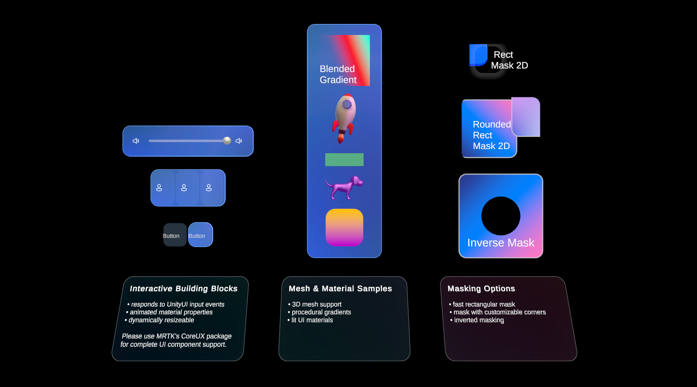

# UnityUI Elements

UnityUI elements provide interaction models that are intuitive and easily readable for the user.

## Interactive Elements

Buttons and sliders, for example, give the user a way to trigger an immediate action, they're two of the most foundational components in Mixed Reality.
In Graphics Tools, there are already button and slider prefabs available with many customization options.
When you enter the scene in Unity's Play mode, you'll be able to interact with the samples.

In the above example, from top to bottom there are:

* the standard slider prefab, below an example of grouped standard buttons with a backplate as  

Button and slider templates are also heavily featured in the Mixed Reality Toolkit. For more details have a look at these pages:

* [Sliders in the MRTK](/windows/mixed-reality/mrtk-unity/mrtk2/features/ux-building-blocks/sliders)
* [Buttons in the MRTK](/windows/mixed-reality/mrtk-unity/mrtk2/features/ux-building-blocks/button)

## Masking Options

When building user interfaces, you might want to mask out certain areas or restrict visibility for user guidance.
In Graphics Tools, there are several options to achieve that: A fast rectangular masking option, a mask with options for rounded corners that is a little more expensive on performance, and it's also possible to make use of 3D meshes to be used as masking objects.

## 3D Mesh Integration and Animations

This example is a combination of several UI components. Several properties are also animatable, for example, position and the amount of corner roundness described above. 
It's possible to integrate 3D meshes in your UI builds too.

> [!NOTE]
> Only static models can be integrated, animations as in FBX exports aren't supported at the moment.

## Related articles

* [Mixed Reality Toolkit on GitHub](https://github.com/microsoft/MixedRealityToolkit-Unity)
* [Graphics Tools Standard Shader sample scene](../standard-shader.md)
