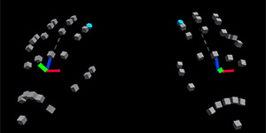

# Input simulation &#8212; MRTK3

This article contains the most essential input simulations. These instructions are also listed in the first module of the MRTK3 In-Editor Tutorial.

## Change the view in the scene

**To move the camera forward/left/back/right**:
press the W/A/S/D keys.

**To move the camera vertically**:
Press the Q and E keys.

**To rotate the camera**:
Press the right mouse button and then drag left/right or up/down.

**To tilt the camera left or right**:
Press the right mouse button and then rotate the mouse scroll wheel forward and back.

## Use the simulated hands

A simulated hand appears as a pattern of cubes shaped to indicate a hand.

**To enable the simulated hands**:
Press T (for left hand) or Y (for right hand). To remove the hand, press the same key again.

**To move a hand left/right/up/down**:
Press and hold the left shift key (for left hand) or space bar (for right hand) and then drag left/right/up/down in the scene.

**To move a hand forward into the scene or back out towards you**:
Press and hold the left shift key (for left hand) or space bar (for right hand) and then rotate the mouse scroll wheel forward or back.

**To rotate a hand**:
Press and hold the left ALT key (for left hand) or left CTRL (for right hand) and then drag left/right/up/down in the scene or rotate the mouse scroll wheel forward or back.

## Grab and move an object

After you enable a hand, notice that it has a ray (or what we call a "pointer") extending out from one of its fingers, and that there's a small circle at the end of the pointer.

1. Move a hand around in the scene until the circle at the end of its pointer is on top of the object.
2. Press and hold the left mouse button--this "grabs" the object--and then drag left/right/up/down. If you want to move the object towards you or away from you, while holding down the left mouse button, rotate the mouse scroll wheel forward or back.

You can also grab an object with the hand itself, instead of the pointer, by moving the hand close to the object and then pressing the left mouse button. However, we find that in these tutorials, grabbing and moving objects with the pointer is easier.

## Tips:

**"Stuck" or "lost" hands**

If you find that a hand gets "stuck" or lost out of view, press T (for left hand) or Y (for right hand) to remove the hand, and then press that same key again to re-enable it in its original position.

**Grabbing an object**

An alternate (and slightly more efficient) way to grab and move an object is to press and hold the left SHIFT key (for left hand) or space bar (for right hand), then move the hand's pointer on the top of the object, and then drag.
