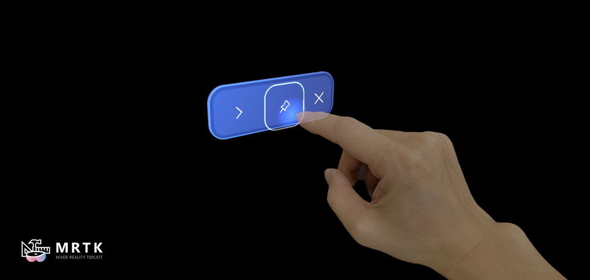
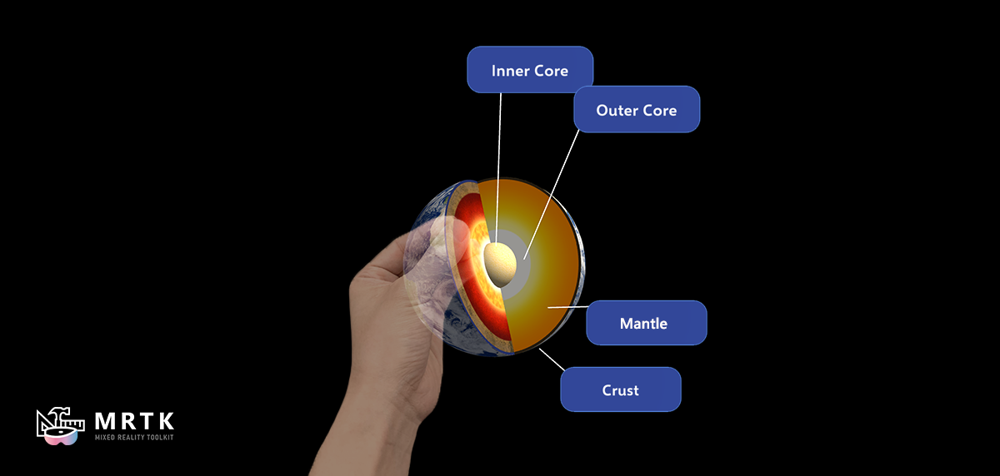
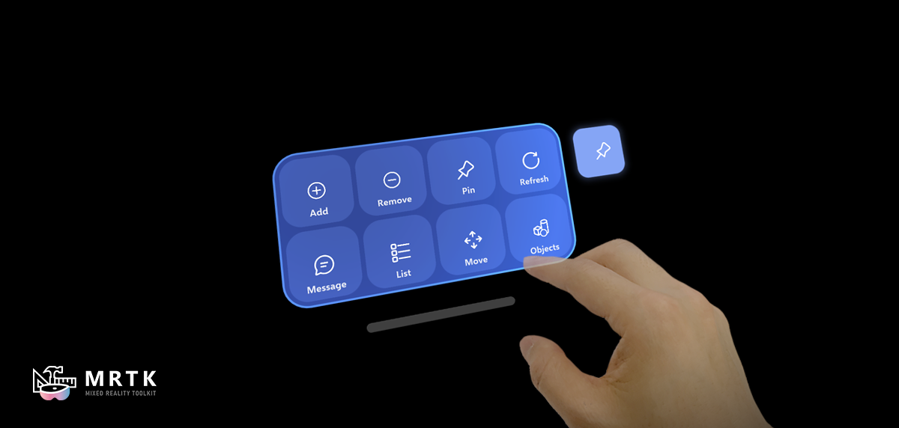
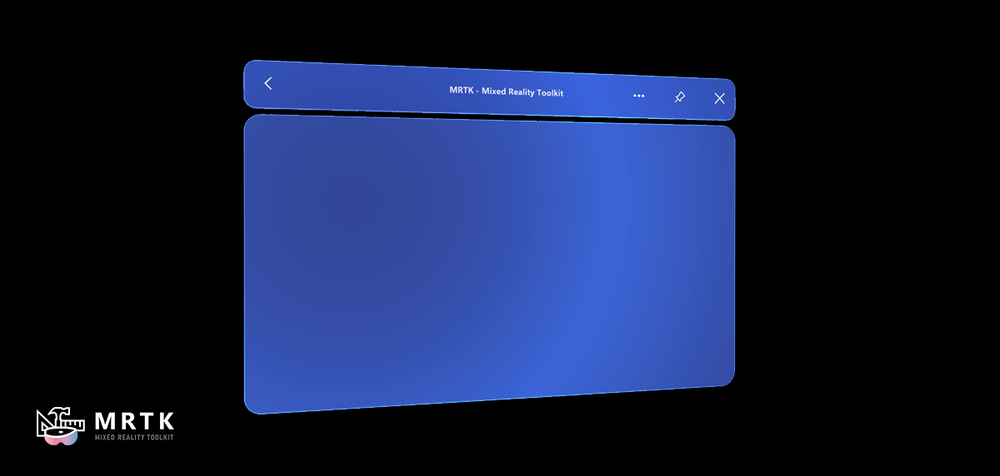

# Mixed Reality Toolkit 3

# Welcome to the MRTK3 Public Preview!

We hear your excitement, and we want to give you early access to our newest features and invite you to take part in shaping our future iterations through your feedback. This public preview represents an early snapshot in development. Some features are still missing, broken, or otherwise not at parity with MRTK 2.x. We appreciate your patience while we shape the future of MRTK and look forward to your feedback and suggestions. We’re excited to give you a glimpse of what is to come!

## What should this private preview be used for?

* Try out our newest features and build prototypes
* Familiarize yourself with XRI and the Unity infrastructure on top of which MRTK3 is built
* Evaluate the new packaging strategy and the a la carte dependency model
* Explore OpenXR compatibility and features
* Learn about our new UX systems and visual design language

## What should this private preview _not_ be used for?

* Migrating any existing projects from 2.x to MRTK3. The API instability of these early releases may make a migration effort frustrating.
* Writing production-ready code that expects a stable API
* Evaluate performance for your applications (Full release may have significant performance differences compared to the codebase today)

## **Head to the docs!**
Head over to [the Wiki tab for the welcome page (this page)](https://mixedrealitycloud.visualstudio.com/MRTK/_wiki/wikis/MRTK.wiki/216/Welcome-to-MRTK3), instructions on setup, additional information about our features, and feedback/bug reporting options.

## What is MRTK3?

MRTK3 is a Microsoft-driven project that provides a set of components and features used to accelerate cross-platform MR app development in Unity. Here are some of its functions:

* Provides the **cross-platform input system and building blocks for spatial interactions and UI**.
* Enables **rapid prototyping** via in-editor simulation that allows you to see changes immediately.
* Operates as an **extensible framework** that allows developers the ability to swap out core components.
* **Supports a wide range of platforms:**.

### Supported platforms

| Platform | Supported Devices |
|---|---|
| OpenXR (Unity 2020.3.30+) | Microsoft HoloLens 2   Meta Quest (experimental)   Windows Mixed Reality (experimental)   SteamVR (experimental)   Oculus Rift on OpenXR (experimental) |
| Windows | Traditional flat-screen desktop (experimental)
| And more coming soon! |

## Key improvements

**Architecture**

* Built on Unity XR Interaction Toolkit and the Unity Input System
* OpenXR focused
* Open-ended and flexible interaction paradigms

**Performance**

* Rewrote and redesigned most features and systems, from UX to input, to subsystems
* Zero per-frame memory allocation
* Tuned for maximum performance on HL2 and other resource-constrained mobile platforms

**User Interface**

* New interaction models (gaze-pinch indirect manipulation)
* Updated Mixed Reality Design Language
* Unity Canvas + 3D UX: production-grade dynamic auto-layout
* Unified 2D & 3D input for gamepad, mouse, and accessibility support
* Data binding for branding, theming, dynamic data, and complex lists

**Accessibility**

* Low vision aids
* Input assistance

**Long Term Support**

* OpenXR, Unity 2020.3 LTS, Unity’s XR Interaction Toolkit as minimum requirements

## UX building blocks

|  **[Button](features/ux-building-blocks/Button)** A volumetric button optimized for a wide range of input modalities, including poking, gaze-pinch, ray interactions, mouse click, and gamepad. |  **[Bounds Control](features/ux-building-blocks/Bounds-control)** Intent feedback and precision manipulation affordances. |  **[Object Manipulator](features/ux-building-blocks/Object-manipulator)** Move and manipulate objects with one or two hands with a wide variety of input modalities. |
|--|--|--|
|  **[Hand Menu](features/ux-building-blocks/Hand-menu)** A hand-anchored collection of UX controls for easy access to quick actions. |  **[Near Menu](features/ux-building-blocks/Near-menu)** Collection of UX controls can be manipulated, pinned, and set to follow the user. |  **[Slider](features/ux-building-blocks/Slider)** Adjust a value along a one-dimensional axis. |
|  **[Solver](features/ux-building-blocks/solvers/solver)** Various object positioning behaviors such as tag-along, body-lock, constant view size, and surface magnetism. |  **[Dialog](features/ux-building-blocks/Dialog)** Prompt for user action. |  **[Slate](features/ux-building-blocks/Slate)** A flat panel for displaying large-format interfaces and content. |
