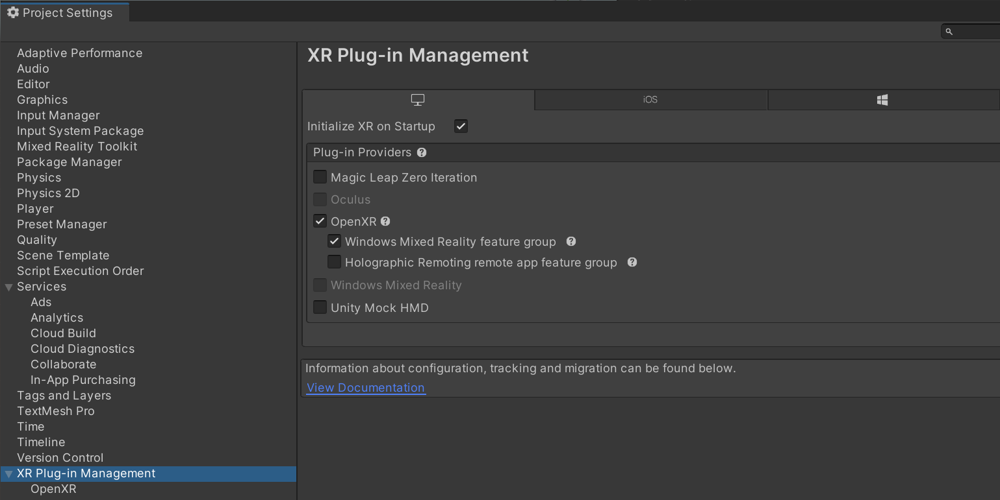
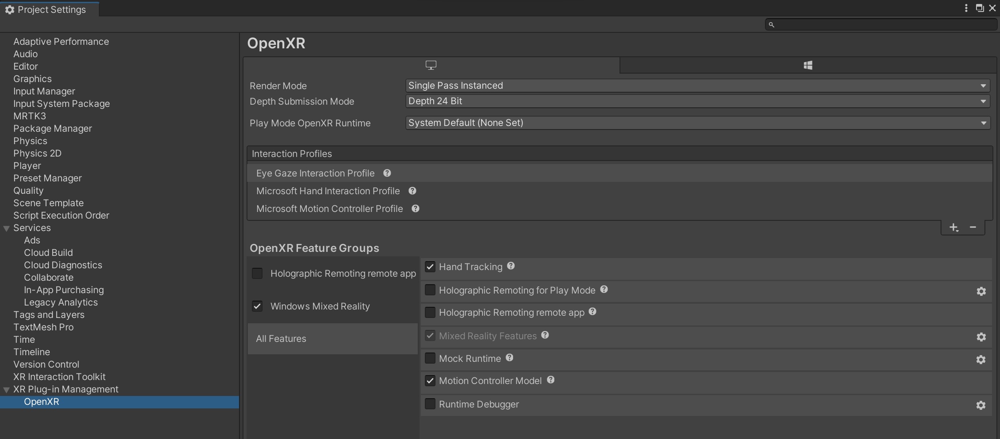

# Initial Setup for MRTK3

Welcome to the MRTK3 public preview! Since MRTK3 is a collection of loosely coupled packages, consuming MRTK3 is done differently than the way you consume MRTK 2.x. We don't ship MRTK as a Unity project, so you're expected to either use our example template project, which is preconfigured to consume all MRTK packages (easier to get started), or start fresh with a new project (gives you more control, recommended).

You're not expected to consume every MRTK package. See [which features are useful to you](packages/packages-overview.md) and add only the dependencies that matter.

## Install the tools

Make sure you have all the tools in this link before starting:

> [!div class="nextstepaction"]
> [Install the tools](/windows/mixed-reality/develop/install-the-tools?tabs=unity)

>[!NOTE]
>Please make sure to check out [known issues in certain Unity versions](/windows/mixed-reality/develop/unity/known-issues) before choosing a Unity version.

## Path 1: Clone the repository and try out the sample Unity Project

The easiest way of acquiring and trying out MRTK3 is to do so by way of our preconfigured project with references to all of the current MRTK3 packages. Please clone our project at [our GitHub repo](https://github.com/microsoft/MixedRealityToolkit-Unity/tree/mrtk3) and check out the `mrtk3` branch. After that you can simply launch Unity (2020.3.33f1 or newer) on the `MRTKDevTemplate` project under `UnityProjects` and start playing with the [sample scenes](scenes.md) in the Editor via remoting or deployment to devices.

For information on the sample scenes included in the preview, please see [Using and creating scenes](scenes.md).

## Path 2: Adding MRTK3 to a new Unity project

### 1. Create a new Unity project

Create a new Unity project with Unity 2020.3.35f1 or newer / Unity 2021.3.4f1 or newer. Close the Unity project before proceeding to the next step.

### 2. Import required dependencies and MRTK3 packages with Mixed Reality Feature Tool

There are a handful of packages that MRTK3 uses that aren't part of this preview. To obtain these, please use the [`Mixed Reality Feature Tool`](/windows/mixed-reality/develop/unity/welcome-to-mr-feature-tool) and select the latest versions of the following in the Discover Features step. 

**Since MRTK3 is in early preview release, you need to check 'Show preview releases' under Settings > Feature tab.** 

- **Platform Support → Mixed Reality OpenXR Plugin**
- **Spatial Audio → Microsoft Spatializer** (Optional)

For MRTK3 packages, we highly recommend the following two packages to help you get started quickly:

- **MRTK3 → MRTK Input** (Required for this setup)
- **MRTK3 → MRTK UX Components**

These two packages, along with their dependencies (automatically added by the Feature Tool), will enable you to explore most of our UX offerings and create projects ready to be deployed to various XR devices. Remember you can always come back to the Feature Tool and add more packages to your project later.

>[!NOTE]
>For more information on MRTK3 packages, please refer to the [package overview page](packages/packages-overview.md).

When you're finished selecting packages, click **Get features** and then follow the instructions in the Mixed Reality Feature Tool to import the selected packages into your Unity project.

### 3. Open the Unity project

Open the Unity project and wait for Unity to finish importing the newly added packages. There may be two pop-ups in this process:

1. The first pop-up asks whether you want to enable the new input backend. Select **yes**.
1. The second pop-up asks whether you want to update XR InteractionLayerMask. Select **No Thanks**.

Unity might restart a few times during this process--wait for it to finish before proceeding.

### 4. Configure MRTK profile after import

Once imported, MRTK3 requires a profile to be set for standalone and each additional target platform.

1. Navigate to **Edit > Project Settings**.
1. Under **Project Settings**, navigate to **MRTK3** and switch to the standalone tab. Note that the profile is initially unspecified.
1. Populate the field with the default MRTK profile that ships wih the core package. You can type in the keyword "MRTKprofile" in the search bar of the project window; make sure you search in `All`. Alternatively you can find the profile under `Packages/com.microsoft.mrtk.core/Configuration/Default Profiles/MRTKProfile.asset`.
   >[!NOTE]
   > Not all of the MRTK subsystems are shown in the screenshot below. The MRTK subsystems that you see may be different depending on the MRTK3 packages you've added to your project.

   
1. Switch to the tabs of other build target(s) you want to use (for example, UWP, Android) and check to see if the profile is assigned. If not, repeat the previous step on the current tab.

### 5. Configure OpenXR-related settings

Once imported, MRTK3 requires some configuration on OpenXR if you're targeting an XR device such as HoloLens 2 or Quest.

> [!NOTE]
> The following instructions apply to HoloLens 2 or WMR headsets. If you're targeting Quest, please refer to the instructions on the [Quest deployment page](deployment/quest-deployment.md#deployment-prerequisites).

1. Navigate to **Edit > Project Settings**.

1. Under **Project Settings**, navigate to **XR Plug-in Management** and enable **OpenXR** under both the Standalone and UWP tabs. Under each tab, ensure that **Initialize XR on Startup** is selected and that the **Windows Mixed Reality feature group under Standalone** and the **Microsoft HoloLens feature group under UWP** are enabled.

    > [!NOTE]
    > A yellow warning icon may appear after checking the **OpenXR** option. Click on that icon to open the **OpenXR Project Validation** tool. Click **Fix all** and ignore the interaction profile issue that cannot be auto fixed. The profiles will be added in the step below.

   For standalone:

   

   For UWP:

   

1. Under **Project Settings**, navigate to **XR Plug-in Management > OpenXR > Interaction Profiles** and add the following three profiles for UWP and Standalone:

    * **Eye Gaze Interaction Profile**
    * **Microsoft Hand Interaction Profile**
    * **Microsoft Motion Controller Profile**

    > [!NOTE]
    > You might need to use the **OpenXR Project Validation** tool to eliminate the yellow triangle.

   > [!NOTE]
   > You may need to use the **OpenXR Project Validation** tool to eliminate the yellow triangle.

   For standalone:

   

   For UWP:

   

1. For HoloLens 2, we recommend that you set **Depth Submission Mode** to 16-bit in the settings above. For immersive headsets, you can use 24-bit depth submission. See the [Microsoft development docs for Unity](/windows/mixed-reality/develop/unity/recommended-settings-for-unity#enable-depth-buffer-sharing) for more info.

### 6. Congratulations, the project setup is now finished!

Please proceed to [create a new MRTK3 scene](scenes.md#creating-a-new-scene-with-mrtk3).

## Next steps

* [Try out our sample scenes or create your own](scenes.md)
