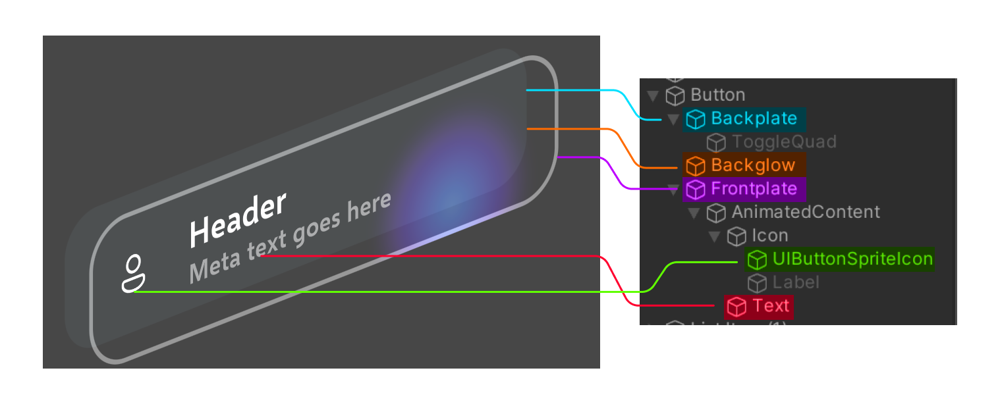
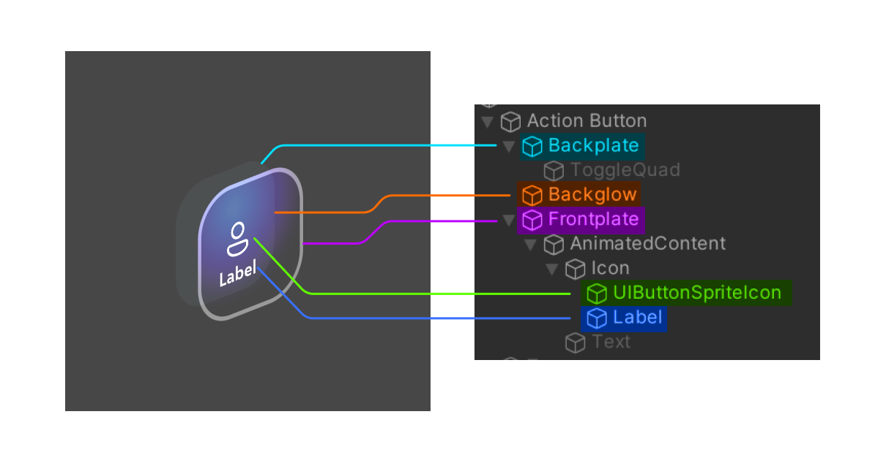
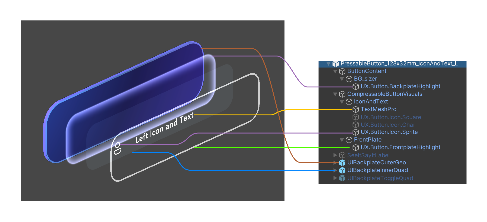

# Buttons

A button gives the user a way to trigger an immediate action. It's one of the most foundational components in mixed reality, and providing satisfying and reliable button interactions is essential to a quality mixed reality experience. MRTK provides two categories of button prefabs: Canvas-based and non-Canvas-based. Both configurations use the `PressableButton` script, a subclass of [`StatefulInteractable`](../../../mrtk3-overview/architecture/interactables.md) extended to include behaviors specific to buttons.

[Learn more about how the hybrid Canvas UI system works.](../../../mrtk3-uxcore/packages/uxcore/canvas-ui.md).

## Example scenes

If you're using the development template project, several example scenes are available that demonstrate the available button prefabs.

**CanvasUITearSheet.unity** shows all available Canvas-based button prefab variants in MRTK.

**CanvasExample.unity** shows some examples of building larger layouts using the Canvas-based components.

**UITearSheet.unity** shows all available non-Canvas-based button prefab variants in MRTK.

## Prefabs (Canvas)

[Canvas-based](../../../mrtk3-uxcore/packages/uxcore/canvas-ui.md) buttons are flexible and configurable, and can be resized to any dimension or proportion. As such, only a small number of button prefabs are provided.

- **EmptyButton** provides the pressable surface/frontplate, holographic backplate, and glow effect. There's no text, icon, label, or other content; this is so that more abstract button-like controls can be built as a variant of this prefab without interfering with the text or icon content.
- **ActionButton** is a simple button that includes an icon, text, and a label. These individual components can be enabled or disabled, and the layout system will adapt accordingly.

Additional enhancements can be added to the button, such as the toggle switch indicator. Features that aren't intended to move with the frontplate should be attached to the backplate component.

## Prefabs (Non-Canvas)

Non-canvas buttons are not resizable; as a result, a large number of button prefabs are provided in many permutations of size and features. These prefabs are named in the format: **PressableButton_SIZE_STYLE**. For example,

- **PressableButton_32x32mm_IconAndText**: 32x32mm size button with icon and text
- **PressableButton_128x32mm_SinglelineTextWithSubtitle**: 128x32mm size wide button with single line text + subtitle text

## Structure (Canvas)

The different parts of an **ActionButton** can be turned on/off to customize how the button looks and behaves. We've dissected two different possible configurations to show the different parts of the button prefab. Note that the "backglow" is not visible in these screenshots since the button is not actively being pressed.

First, a larger configuration where the main Text object is active and uses inline styles to display both a header and sub-text.

Second, a smaller configuration where the Label is active to show a description of the action below the icon. The main Text object is disabled.

## Structure (Non-Canvas)

The follow screenshot shows the structure of a non-canvas-based button.

## `PressableButton` class

The `PressableButton` class is derived from `StatefulInteractable` with new and overridden functions specific to buttons. In the inspector you can configure settings related to the volumetric press besides all other configurable settings from `StatefulInteractable`.

