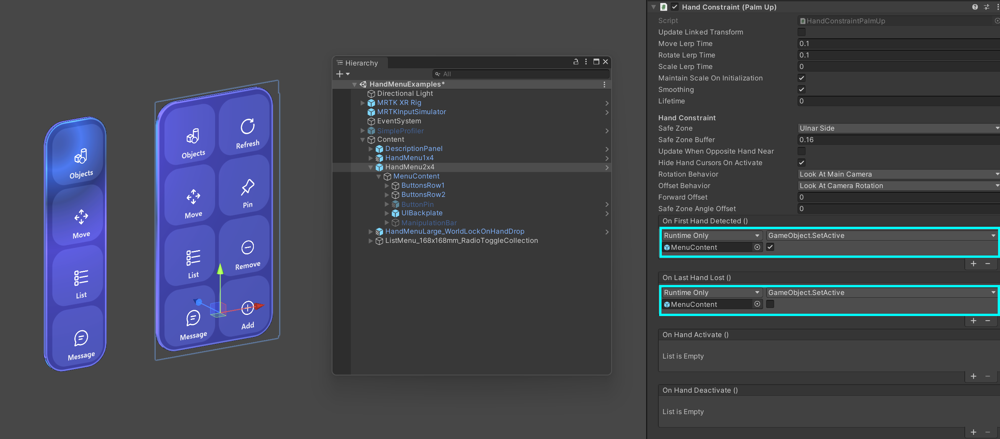
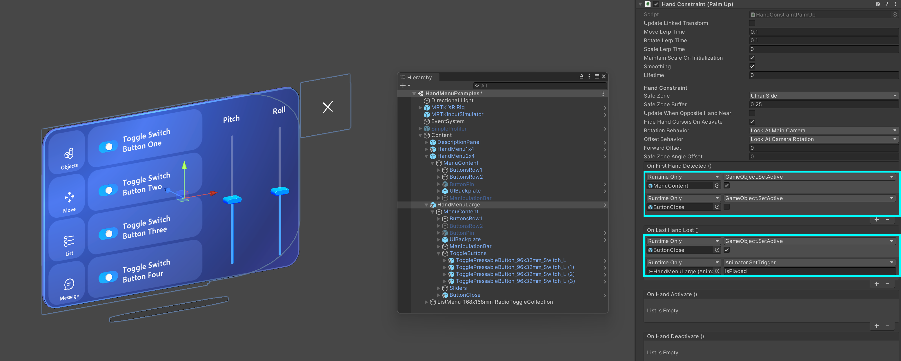

# Hand menu -- MRTK3

Hand menus allow users to bring up hand-attached UI for frequently used functions. These are usually small [button groups](button-group.md) that offer quick actions. However, sometimes more complex layouts for displaying information or settings are provided to the user as a hand menu, often with the option to "tear away" the menu from the hand and anchor it in the world.

The Hand menu provides 'Require Flat Hand' and 'Use Gaze Activation' options to prevent false activation while interacting with other objects. It's recommended to use these options to prevent unwanted activation.

## Example scene and Prefabs

> [!NOTE]
> The hand menu prefabs are currently built using the non-Canvas controls. They'll soon be rebuilt using the [Canvas components](../../../mrtk3-uxcore/packages/uxcore/canvas-ui.md) and auto-layout system as detailed in the [Button Group](button-group.md) documentation.

If you're using the template project, `HandMenuExamples.unity` demonstrates several common configurations for hand menus, all using the `HandConstraintPalmUp` script.

### HandMenu1x4 and HandMenu2x4

The menu becomes visible and invisible in these prefabs by activating and deactivating the MenuContent object on **OnFirstHandDetected()** and **OnLastHandLost()** events. This behavior is recommended for the menu with a small UI, which requires a short amount of interaction time.

### HandMenuLarge

This prefab demonstrates the example of a large or complex UI that requires extended interaction time. For this type of UI, it's recommended to world-lock the menu on hand drop to improve usability and avoid arm fatigue. This example also supports 'grab and pull' to world-lock the menu.

In this example, the menu becomes visible and invisible by activating the MenuContent object on **OnFirstHandDetected()** event. With the **OnLastHandLost()** event, the close button is activated, and placement animation is triggered. The animation is a simple scaling fluctuation. Because we didn't hide the MenuContent on **OnLastHandLost()** event, the menu will be automatically world-locked when the hand isn't visible. The values in the **Palm Up** section have been optimized to make the menu world-locked without being dragged down too much on hand drop.

This example provides the grabbable bar on the bottom area of the menu and the automatic world-locking behavior. The user can explicitly detach the menu from the hand and place it in the world by grabbing this. To achieve this, on **ManipulationStarted()** event in ObjectManipulator, we disable **SolverHandler.UpdateSolvers**. Otherwise, the menu won't be able to be detached since HandConstraint solver will try to position the menu near the hand position. We also use **HandConstraintPalmUp.StartWorldLockReattachCheckCoroutine** to allow the user to raise the hand to reattach the menu to the hand.

Lastly, the close button needs to reactivate the **SolverHandler.UpdateSolvers** to restore HandConstraint solver's functionality.

## Scripts

The `HandConstraint` behavior provides a solver that constrains the tracked object to a region safe for hand constrained content (such as hand UI, menus, etc.) Safe regions are considered areas that don't intersect with the hand. A derived class of `HandConstraint` called `HandConstraintPalmUp` is also included to demonstrate a common behavior of activating the solver-tracked object when the palm is facing the user.

See the tooltips available for each `HandConstraint` property for additional documentation. A few properties are defined in more detail below.

- **Safe Zone**: The safe zone specifies where on the hand to constrain content. It's recommended that content be placed on the Ulnar Side to avoid overlap with the hand and improved interaction quality. Safe zones are calculated by the hands' orientation projected into a plane orthogonal to the camera's view and raycasting against a bounding box around the hands. Safe zones are defined to work with `XRNode`. Exploring what each safe zone represents on different controller types is recommended.

- **Follow Hand Until Facing Camera** With this active, the solver will follow hand rotation until the menu is sufficiently aligned with the gaze when it faces the camera. To make this work, change the `SolverRotationBehavior` in the `HandConstraintSolver`, from `LookAtTrackedObject` to `LookAtMainCamera` as the `GazeAlignment` angle with the solver varies.

- **Activation Events**: Currently, the `HandConstraint` triggers four activation events. These events can be used in many different combinations to create unique `HandConstraint` behaviors.

  - _OnHandActivate_: triggers when a hand satisfies the IsHandActive method.
  - _OnHandDeactivate_: triggers when the IsHandActive method is no longer satisfied.
  - _OnFirstHandDetected_: occurs when the hand tracking state changes from no hands in view to the first hand in view.
  - _OnLastHandLost_: occurs when the hand tracking state changes from at least one hand in view to no hands in view.

- **Solver Activation/Deactivation Logic**: Currently, the recommendation for activating and deactivating `HandConstraintPalmUp` logic is to do so by using the `SolverHandler`'s `UpdateSolver` value rather than by disabling/enabling the object. This can be seen in the example scene through the editor-based hooks triggered after the attached menu's ManipulationHandler "OnManipulationStarted/Ended" events.

  * *Stopping the hand-constraint logic*: When trying to set the hand-constrained object to stop (and not run the activation/deactivation logic), set UpdateSolver to False rather than disabling HandConstraintPalmUp.
    * If you want to enable the gaze-based (or even non-gaze-based) Reattach logic, this is then followed by calling the `HandConstraintPalmUp.StartWorldLockReattachCheckCoroutine()` function. This will trigger a coroutine that continues to check if the "`IsValidController`" criteria are met and will set UpdateSolver to True once it is (or the object is disabled).
  * *Starting the hand-constraint logic*: When trying to set the hand constrained object to begin following your hand again (based on whether it meets the activation criteria), set the SolverHandler's UpdateSolver to true.

* **Reattach Logic**: Currently, the `HandConstraintPalmUp` can automatically reattach the target object to the tracked point, regardless of whether the `SolverHandler`'s `UpdateSolver` is True. This is done by calling the `HandConstraintPalmUp`'s `StartWorldLockReattachCheckCoroutine()` function after it has been world-locked (which in this case, is effectively setting the SolverHandler's UpdateSolver to False).
