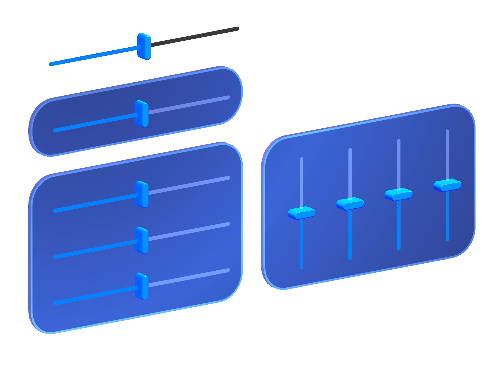

# Slider

Sliders are UI components that allow you to continuously change a value by moving a slider on a track. Sliders can be interacted with using Poke, Grab, Ray, Gaze-Pinch, or any other valid interaction in XRI or MRTK3.

As with other interactables in MRTK, the main Slider interactable does not render any visuals. You must combine the Slider script with a visuals script. We provide two scripts in MRTK3, `CanvasSliderVisuals` for the unified RectTransform-based sliders and `SliderVisuals` for non-RectTransform-based sliders.

## Layout

When using Sliders in a RectTransform context, the start and end positions are calculated by the RectTransform layout system. The `CanvasSliderVisuals` script will allow you to make these visuals horizontal or vertical.

Outside of a RectTransform context, the start and end positions can be manually adjusted. 

## Audio

Sounds are currently provided by a dedicated audio driver script, `SliderSounds`. This script hooks into the Slider's events in order to play the audio clips at the appropriate times.