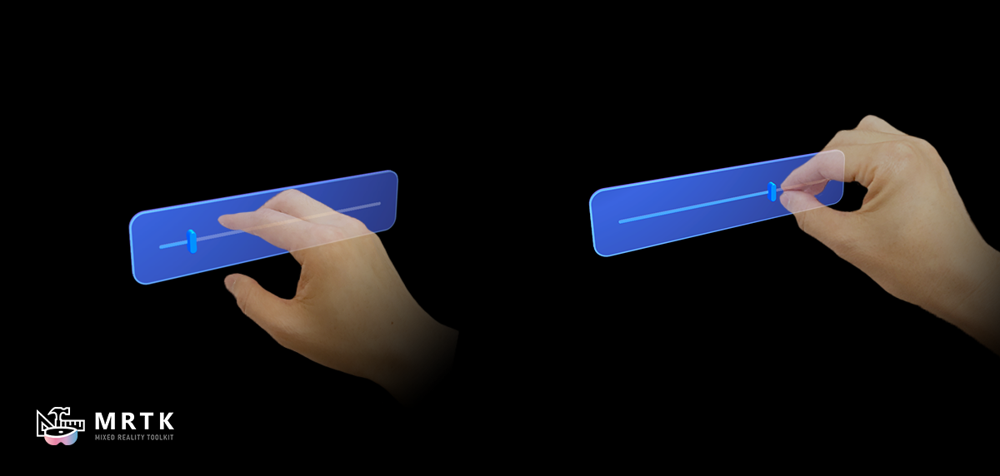

# Slider | MRTK3

Sliders are UI components that allow you to continuously change a value by moving a slider on a track. Sliders can be interacted with using Poke, Grab, Ray, Gaze-Pinch, or any other valid interaction in XRI or MRTK3.

As with other interactables in MRTK, the main Slider interactable does not render any visuals. You must combine the Slider script with a visuals script. We provide two scripts in MRTK3, `CanvasSliderVisuals` for the unified RectTransform-based sliders and `SliderVisuals` for non-RectTransform-based sliders.

## Layout

When using Sliders in a RectTransform context, the start and end positions are calculated by the RectTransform layout system. The `CanvasSliderVisuals` script will allow you to make these visuals horizontal or vertical.

Outside of a RectTransform context, the start and end positions can be manually adjusted. 

## Slider Configurations

**Is Touchable** Whether or not this slider is controllable via a poke interactor.

**Snap To Position** Whether or not this slider snaps to interaction point. 

**Use Slider Step Divisions** Controls whether this slider is increments in steps or continuously.

**Slider Step Divisions** Number of subdivisions the slider is split into when Use Slider Step Divisions is enabled.

**Slider Events** The slider raises and **OnValueUpdated** event whenever its value changes

## Example Slider Configurations

>[!NOTE]
> The following are gifs recorded in v2. New ones coming soon.

Continuous Sliders with Snap To Position

Step Sliders with Snap To Position

Touch Sliders

## Audio

Sounds are currently provided by a dedicated audio driver script, `SliderSounds`. This script hooks into the Slider's events in order to play the audio clips at the appropriate times.