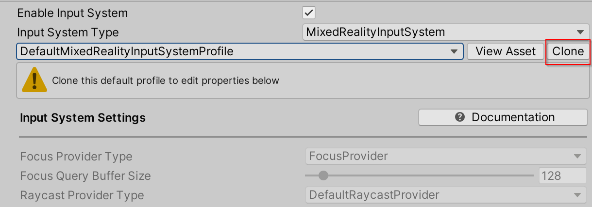
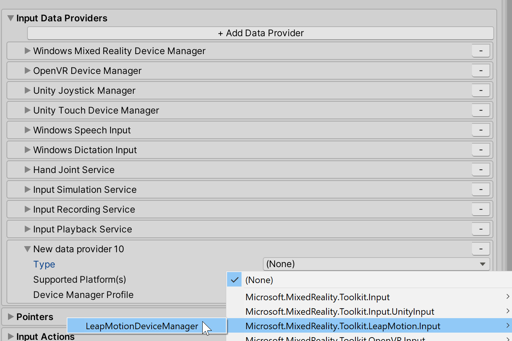
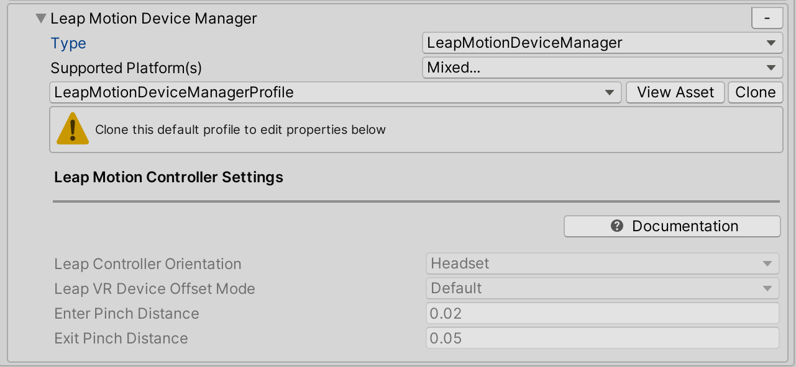
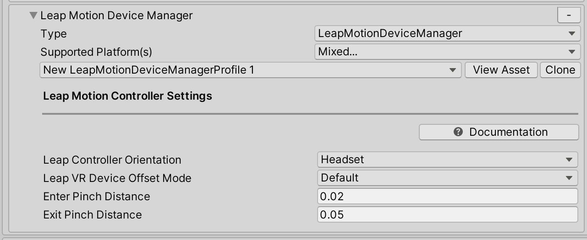

# Using Leap Motion

A [Leap Motion Controller](https://www.ultraleap.com/product/leap-motion-controller/) is required to use this data provider.

The Leap Motion Data Provider enables articulated hand tracking for VR and could be useful for rapid prototyping in the editor.  The data provider can be configured to use the Leap Motion Controller mounted on a headset or placed on a desk face up.


This provider can be used in editor and on device while on the Standalone platform.  It can also be used in editor while on the UWP platform but NOT in a UWP build.

| MRTK Version | Leap Motion Unity Modules Versions Supported |
| --- | --- |
|2.6.x | 4.5.0, 4.5.1|
|2.7.0 - 2.7.2| 4.5.0, 4.5.1, 4.6.0, 4.7.0, 4.7.1, 4.8.0|
|2.7.3| 4.5.0, 4.5.1, 4.6.0, 4.7.0, 4.7.1, 4.8.0, 4.9.1 (see note below) |

> [!NOTE]
> Unity Modules 4.9.1 require the [Gemini 5.2](https://developer.leapmotion.com/tracking-software-download) tracking service or higher. The Unity plugin V4.9.1 is only officially supported on Unity 2019.  See [release notes for 4.9.1](https://github.com/leapmotion/UnityModules/releases/tag/UM-4.9.1).

The Unity Modules were renamed the The Unity Plugin in V5.0.0.

| MRTK Version | Ultraleap Unity Plugin Versions Supported |
| --- | --- |
|2.7.3| 5.3.0 (see note below) |

> [!NOTE]
> The Unity Plugin versions 5.0.0, 5.1.0 and 5.2.0 are **not** supported in any version of MRTK. Users are recommended to upgrade to 5.3.0. Unity Plugin 5.3.0 requires the [Gemini 5.2](https://developer.leapmotion.com/tracking-software-download) tracking service or higher. 

## Using Leap Motion (by Ultraleap) hand tracking in MRTK

1. Importing MRTK and the Leap Motion Unity Modules / Unity Plugin
    - Install the latest [Leap Motion Tracking Software](https://developer.leapmotion.com/tracking-software-download) to get the Tracking Service if it is not already installed
    - Import the **Microsoft.MixedReality.Toolkit.Foundation** package into the Unity project.
    - Download and import the latest version of the [Leap Motion Unity Modules / Unity Plugin](https://developer.leapmotion.com/unity) into the project
        - For Unity Modules: only import the **Core** package within the project
        - For Unity Plugin: only import the **Tracking** package within the project. Only .unitypackages are supported for now.

    > [!IMPORTANT]
    > Unity deprecated SelectionMode.OnlyUserModifiable after Unity 2019.4.19 which results in the following error coming from the Ultraleap Hotkeys.cs script:
    > Assets\Plugins\LeapMotion\Core\Editor\Hotkeys.cs(24,91): error CS0619: 'SelectionMode.OnlyUserModifiable' is obsolete: ''OnlyUserModifiable' is obsolete. Use 'Editable' instead. (UnityUpgradeable) -> Editable'.
      
    > To resolve the issues, change the SelectionMode.OnlyUserModifiable to SelectionMode.Editable in the Hotkeys.cs script located in Plugins/LeapMotion/Core/Editor/Hotkeys.cs.

1. Integrate the Leap Motion Unity Modules / Unity Plugin with MRTK
    - After the Unity Modules / Unity Plugin are in the project, navigate to **Mixed Reality Toolkit** > **Leap Motion** > **Integrate Leap Motion Unity Modules**
    > [!NOTE]
    > Integrating the **Unity Modules** to MRTK adds 10 assembly definitions to the project and adds references to the **Microsoft.MixedReality.Toolkit.Providers.LeapMotion** assembly definition. Make sure Visual Studio is closed.

     

1. Adding the Leap Motion Data Provider
    - Create a new Unity scene
    - Add MRTK to the scene by navigating to **Mixed Reality Toolkit** > **Add to Scene and Configure**
    - Select the MixedRealityToolkit game object in the hierarchy and select **Copy and Customize** to clone the default mixed reality profile.

    

    - Select the **Input** Configuration Profile

    

    - Select **Clone** in the input system profile to enable modification.

    

    - Open the **Input Data Providers** section, select **Add Data Provider** at the top, a new data provider will be added at the end of the list.  Open the new data provider and set the **Type** to **Microsoft.MixedReality.Toolkit.LeapMotion.Input > LeapMotionDeviceManager**

    

    - Select **Clone** to change the default Leap Motion settings.

    

    - The Leap Motion Data Provider contains the `LeapControllerOrientation` property which is the location of the Leap Motion Controller. `LeapControllerOrientation.Headset` indicates the controller is mounted on a headset. `LeapControllerOrientation.Desk` indicates the controller is placed flat on desk. The default value is set to `LeapControllerOrientation.Headset`.
    - Each controller orientation contains offset properties:
      - The **Headset** orientation offset properties mirror the offset properties in the LeapXRServiceProvider component.  The `LeapVRDeviceOffsetMode` has three options: Default, Manual Head Offset and Transform.  If the offset mode is Default, then an offset will not be applied to the Leap Motion Controller.  The Manual Head Offset mode allows for the modification of three properties: `LeapVRDeviceOffsetY`, `LeapVRDeviceOffsetZ` and `LeapVRDeviceTiltX`.  The axis offset property values are then applied to default controller placement.  The Transform offset mode contains the `LeapVRDeviceOrigin` Transform property which specifies a new origin for the Leap Motion Controller.
      - The **Desk** orientation contains the `LeapControllerOffset` property which defines the anchor position of the desk leap hands.  The offset is calculated relative to the main camera position and the default value is (0,-0.2, 0.35) to make sure the hands appear in front and in view of the camera.

        > [!NOTE]
        > The offset properties in the profile are applied once when the application starts.  To modify the values during runtime, get the Leap Motion Service Provider from the Leap Motion Device Manager:
        >```
        >LeapMotionDeviceManager leapMotionDeviceManager = CoreServices.GetInputSystemDataProvider<LeapMotionDeviceManager>();
        >LeapXRServiceProvider leapXRServiceProvider = leapMotionDeviceManager.LeapMotionServiceProvider as LeapXRServiceProvider; 
        >```

    - `EnterPinchDistance` and `ExitPinchDistance` are the distance thresholds for pinch/air tap gesture detection.  The pinch gesture is calculated by measuring the distance between the index finger tip and the thumb tip.  To raise an on input down event, the default `EnterPinchDistance` is set to 0.02.  To raise an on input up event (exiting the pinch), the default distance between the index finger tip and the thumb tip is 0.05.

    `LeapControllerOrientation`: Headset (Default) |  `LeapControllerOrientation`: Desk
    :-------------------------:|:-------------------------:
      |  
     |     

1. Testing the Leap Motion Data Provider
    - After Leap Motion Data Provider has been added to the input system profile, press play, move your hand in front of the Leap Motion Controller and you should see the joint representation of the hand.

1. Building your project
    - Navigate to **File > Build Settings**
    - Only Standalone builds are supported if using the Leap Motion Data Provider.
    - For instructions on how to use a Windows Mixed Reality headset for Standalone builds, see [Building and deploying MRTK to WMR Headsets (Standalone)](wmr-mrtk.md#building-and-deploying-mrtk-to-wmr-headsets-standalone).

## Getting the hand joints

Getting joints using the Leap Motion Data Provider is identical to hand joint retrieval for an MRTK Articulated Hand.  For more information, see [Hand Tracking](../features/input/hand-tracking.md#polling-joint-pose-from-handjointutils).

With MRTK in a unity scene and the Leap Motion Data Provider added as an Input Data Provider in the Input System profile, create an empty game object and attach the following example script.

This script is a simple example of how to retrieve the pose of the palm joint in a Leap Motion Hand.  A sphere follows the left Leap hand while a cube follows the right Leap hand.

```c#
using Microsoft.MixedReality.Toolkit;
using Microsoft.MixedReality.Toolkit.Input;
using Microsoft.MixedReality.Toolkit.Utilities;
using System.Collections.Generic;
using UnityEngine;

public class LeapHandJoints : MonoBehaviour, IMixedRealityHandJointHandler
{
    private GameObject leftHandSphere;
    private GameObject rightHandCube;

    private void Start()
    {
        // Register the HandJointHandler as a global listener
        CoreServices.InputSystem.RegisterHandler<IMixedRealityHandJointHandler>(this);

        // Create a sphere to follow the left hand palm position
        leftHandSphere = GameObject.CreatePrimitive(PrimitiveType.Sphere);
        leftHandSphere.transform.localScale = Vector3.one * 0.03f;

        // Create a cube to follow the right hand palm position
        rightHandCube = GameObject.CreatePrimitive(PrimitiveType.Cube);
        rightHandCube.transform.localScale = Vector3.one * 0.03f;
    }

    public void OnHandJointsUpdated(InputEventData<IDictionary<TrackedHandJoint, MixedRealityPose>> eventData)
    {
        if (eventData.Handedness == Handedness.Left)
        {
            Vector3 leftHandPalmPosition = eventData.InputData[TrackedHandJoint.Palm].Position;
            leftHandSphere.transform.position = leftHandPalmPosition;
        }

        if (eventData.Handedness == Handedness.Right)
        {
            Vector3 rightHandPalmPosition = eventData.InputData[TrackedHandJoint.Palm].Position;
            rightHandCube.transform.position = rightHandPalmPosition;
        }
    }
```

## Unity editor workflow tip

Using the Leap Motion Data Provider does not require a VR headset.  Changes to an MRTK app can be tested in the editor with the Leap hands without a headset.

The Leap Motion Hands will show up in the editor, without a VR headset plugged in.  If the `LeapControllerOrientation` is set to **Headset**, then the Leap Motion controller will need to be held up by one hand with the camera facing forward.

> [!NOTE]
> If the camera is moved using WASD keys in the editor and the `LeapControllerOrientation` is **Headset**, the hands will not follow the camera. The hands will only follow camera movement if a VR headset is plugged in while the `LeapControllerOrientation` is set **Headset**.  The Leap hands will follow the camera movement in the editor if the `LeapControllerOrientation` is set to **Desk**.

## Removing Leap Motion from the Project

1. Navigate to the **Mixed Reality Toolkit** > **Leap Motion** > **Separate Leap Motion Unity Modules**
    - Let Unity refresh as references in the **Microsoft.MixedReality.Toolkit.Providers.LeapMotion.asmdef** file are modified in this step
1. Close Unity
1. Close Visual Studio, if it's open
1. Open File Explorer and navigate to the root of the MRTK Unity project
    - Delete the **UnityProjectName/Library** directory
    - Delete the **UnityProjectName/Assets/Plugins/LeapMotion** directory
    - Delete the **UnityProjectName/Assets/Plugins/LeapMotion.meta** file
1. Reopen Unity

In Unity 2018.4, you might notice that errors still remain in the console after deleting the Library and the Leap Motion Core Assets.
If errors are logged after reopening, restart Unity again.

## Common Errors

### Leap Motion has not integrated with MRTK

To test if the Leap Motion Unity Modules have integrated with MRTK:

- Navigate to **Mixed Reality Toolkit > Utilities > Leap Motion > Check Integration Status**
  - This will display a pop up window with a message about whether or not the Leap Motion Unity Modules have integrated with MRTK.
- If the message says that the assets have not been integrated:
  - Make sure the Leap Motion Unity Modules are in the project
  - Make sure that the version added is supported, see the table at the top of the page for versions supported.
  - Try **Mixed Reality Toolkit > Utilities > Leap Motion > Integrate Leap Motion Unity Modules**

### Copying assembly Multiplayer HLAPI failed

On import of the Leap Motion Unity Core Assets this error might be logged:

```
Copying assembly from 'Temp/com.unity.multiplayer-hlapi.Runtime.dll' to 'Library/ScriptAssemblies/com.unity.multiplayer-hlapi.Runtime.dll' failed
```

**Solution**

- A short term solution is to restart Unity. See [Issue 7761](https://github.com/microsoft/MixedRealityToolkit-Unity/issues/7761) for more information.

## Leap Motion Example Scene

The example scene uses the DefaultLeapMotionConfiguration profile and determines if the Unity project has been configured correctly to use the Leap Motion Data Provider.

The example scene is contained in the **Microsoft.MixedReality.Toolkit.Examples** package in the **MRTK/Examples/Demos/HandTracking/** directory.  

## See also

- [Input Providers](../features/input/input-providers.md)
- [Hand Tracking](../features/input/hand-tracking.md)
