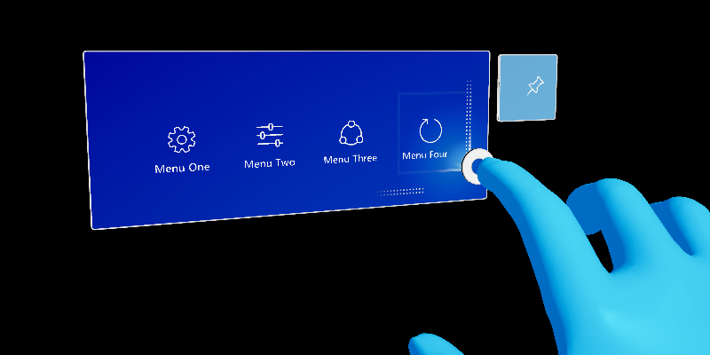
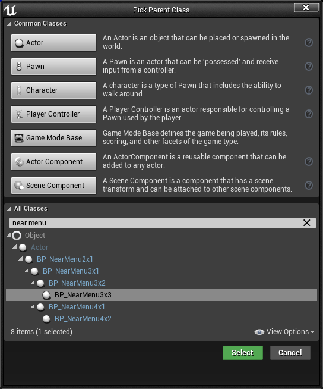
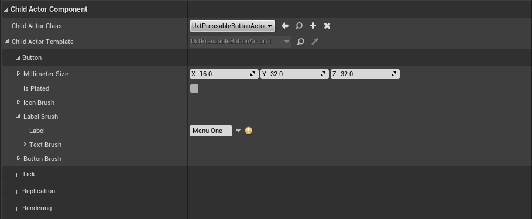

# Near Menu

Near Menu is a UX control which provides a collection of buttons or other UI components. It floats around the user's body using the [follow component](follow-component.md) and is easily accessible anytime. Since it is loosely coupled with the user, it does not disturb the user's interaction with the target content. The user can use the 'Pin' button to world-lock/unlock the menu. The menu can be grabbed and placed at a specific position.

## Interaction behavior

- **Tag-along**: The menu follows you and stays within 30-60cm range from the user for the near interactions.
- **Pin**: Using the 'Pin' button, the menu can be world-locked and released.
- **Grab and move**: The menu is always grabbable and movable. Regardless of the previous state, the menu will be pinned (world-locked) when grabbed and released. There are visual cues for the grabbable area. They are revealed on hand proximity.

## Blueprints

Near Menu blueprints are designed to demonstrate how to use UX Tool's various components to build menus for near interactions. It is recommended to derive from these blueprints when creating new or custom near menus.

- **BP_NearMenu2x1.uasset**
- **BP_NearMenu3x1.uasset**
- **BP_NearMenu3x2.uasset**
- **BP_NearMenu3x3.uasset**
- **BP_NearMenu4x1.uasset**
- **BP_NearMenu4x2.uasset**

## Example level

There are some examples of various near menus within the `\UXToolsGame\Plugins\UXToolsExamples\Content\NearMenu\NearMenuExample.umap` level.

## Creating a near menu
When creating a near menu for your application it is recommended to copy the near menu you need from the above Blueprints into your project to derive from.

1. Create a new blueprint class, select one of the `BP_NearMenu*` blueprints as a parent class.
    * In this example we will derive from `BP_NearMenu3x3` and call our blueprint `BP_ExampleNearMenu`.

    

2. Now that we have our foundation, we can customize the menu.
    * Any button may be customized by selecting a button `ChildActorComponent` and modifying settings within the child actor template.
    * The [UxtFollow](follow-component.md) and [UxtGenericManipulator](manipulator.md) components can be altered to change follow and manipulation behavior respectively.
    * A handful of properties exist on the near menu blueprint root to adjust the auto follow behavior.

    

3. Finally, to tie logic to buttons on the menu we need to bind to the `On Button Pressed` event. The below blueprint graph will print "Hello" when "Menu One" is pressed:
    * The `Get Component by Class` method is looking for a [UxtPressableButton](pressable-button.md) component.

    

## More information
* [FollowComponent](follow-component.md)
* [Manipulator](manipulator.md)
* [PressableButton](pressable-button.md)
